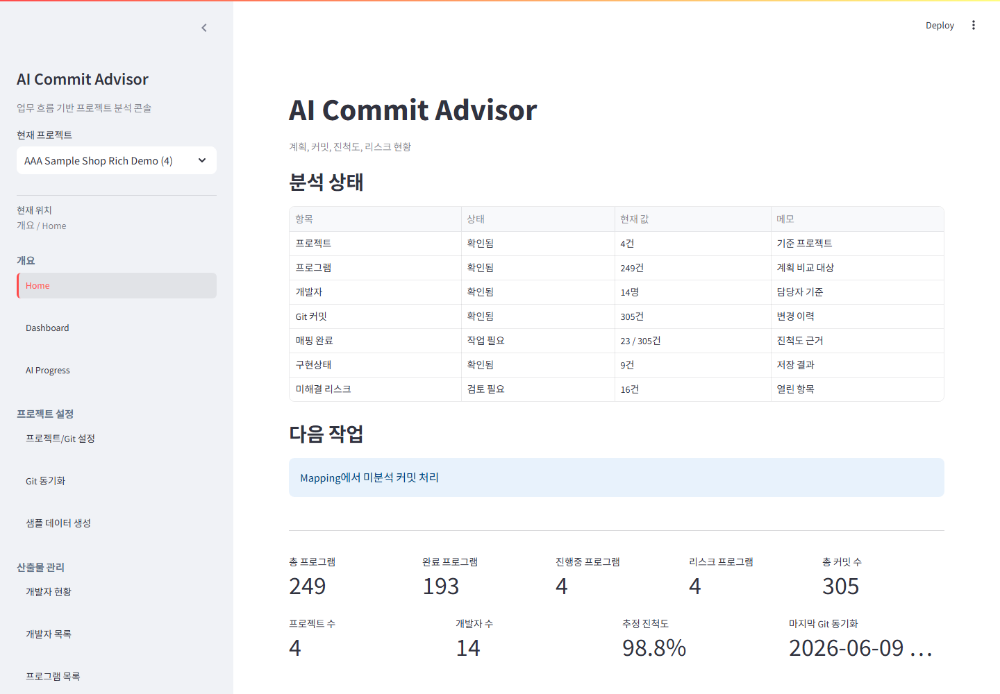
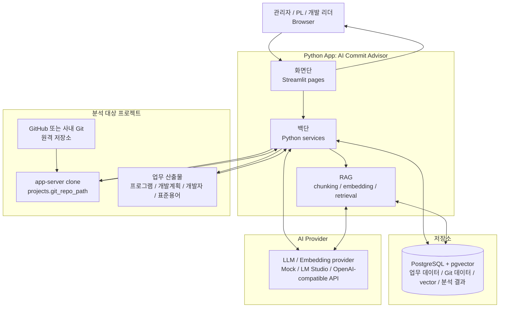

# AI Commit Advisor

AI Commit Advisor는 앱 서버에서 접근 가능한 Git 저장소의 커밋, 변경 파일, diff, 개발계획 데이터를 연결해 프로그램-커밋 매핑, 영향도 분석, 리스크 탐지, RAG 검색, Project Chat, AI 코드리뷰를 지원하는 Streamlit 기반 PoC입니다.

기본값은 mock 분석이며, LM Studio 같은 OpenAI-compatible 로컬 LLM/embedding 서버를 연결하면 Mapping, AI Code Review, Project Chat, RAG 검색에서 실제 AI 기반 분석을 실행할 수 있습니다.



## 아키텍처 요약

AI Commit Advisor는 Python App 안의 화면단, 백단, RAG 계층이 분석 대상 프로젝트와 저장소, AI Provider를 연결하는 구조입니다. 자세한 모듈과 데이터 흐름은 [아키텍처](docs/architecture.md)에서 확인할 수 있습니다.



## 주요 기능

- 앱 서버 Git 저장소 커밋, 변경 파일, diff 수집과 증분 동기화
- 개발자, 프로그램 목록, 개발계획 Excel 업로드와 화면 기반 직접 관리
- LLM 기반 프로그램-커밋 Mapping과 사용자 피드백 보정
- Commit Impact, Program Detail, AI Progress 기반 구현 현황 추적
- Git History 화면에서 프로젝트별 커밋 목록, 변경 파일, diff 탐색
- 규칙 기반 Risk Analysis로 누락, 지연, 불확실한 프로그램 탐지
- Dashboard에서 개발자별 업무량, 난이도, 예상 지연 프로그램, 고객가치 참고 지표와 저장형 추세 확인
- 현재 소스 검증형 RAG Search와 저장형 Project Chat
- 표준용어/표준단어 Excel 업로드 기반 한글 질문 검색 확장
- 앱 서버 Git 저장소의 최신/특정 커밋 중심 AI Code Review
- 데모용 샘플 프로젝트와 Excel 데이터 생성으로 전체 기능 확인 가능

## Git 저장소 접근 모델

AI Commit Advisor는 브라우저 사용자 PC의 Git 저장소를 직접 읽지 않습니다. 앱이 실행 중인 서버에서 접근 가능한 Git 저장소 경로를 기준으로 커밋, 변경 파일, diff, 현재 소스 파일을 분석합니다.

사내 서버에서 앱을 실행한다면 분석 대상 저장소는 사내 서버의 `/srv/ai-commit-advisor/repos/...` 같은 경로에 clone되어 있어야 합니다. 팀원들은 브라우저로 앱에 접속해 서버가 수집한 Git 이력과 분석 결과를 함께 사용합니다.

자세한 사내 서버 운영 방식과 경로 제한 정책은 [Git 저장소 운영 모델](docs/git-repository-operating-model.md)을 참고하세요.

## 빠른 시작

가볍게 앱 흐름만 확인하려면 mock 설정을 사용합니다.

로컬 Python으로 실행할 때는 내 PC가 앱 서버입니다. 따라서 프로젝트/Git 설정에 입력하는 Git 저장소 경로도 내 PC에서 접근 가능한 경로입니다. 같은 앱을 사내 서버에서 실행하면 사내 서버에 clone된 저장소 경로를 입력해야 합니다.

```powershell
Copy-Item .env.example .env
docker compose up -d postgres
python -m venv .venv
.\.venv\Scripts\python.exe -m pip install -r requirements.txt
.\.venv\Scripts\python.exe -m src.db.init_db
.\.venv\Scripts\python.exe -m streamlit run app.py
```

Docker만으로 PostgreSQL과 앱을 함께 실행하려면 다음 명령을 사용합니다.

```powershell
docker compose up -d --build
```

Docker 앱은 `http://localhost:8501`에서 열립니다. 로컬 Python 실행과 Docker 앱 실행을 동시에 켜면 같은 port를 사용할 수 있으므로 한 방식만 선택하세요.

실제 LLM/RAG/Project Chat 품질을 검증하려면 로컬 LLM 설정 예시를 사용합니다.

```powershell
Copy-Item .env.local-llm.example .env
```

local LLM 모드에서는 LM Studio에서 chat 모델과 embedding 모델을 먼저 로드해야 합니다. RAG/Project Chat 사용 전에는 현재 embedding 모델 기준으로 source_file embedding을 생성하세요.

가상환경 활성화 명령은 터미널마다 다릅니다. PowerShell은 `.\.venv\Scripts\Activate.ps1`, cmd.exe는 `.venv\Scripts\activate`, Git Bash는 `source .venv/Scripts/activate`를 사용합니다. 위 Quick Start는 터미널 차이와 PowerShell 실행 정책에 덜 영향을 받도록 가상환경 활성화 없이 실행합니다.

이미 의존성이 설치되어 있고 앱만 다시 실행하려면:

```powershell
.\.venv\Scripts\python.exe -m streamlit run app.py
```

자세한 설치, DB migration, LLM/embedding 설정, 운영 주의사항은 [Setup and Operations](docs/setup-and-operations.md)를 참고하세요.

## 샘플 프로젝트

실제 업무 프로젝트를 건드리지 않고 전체 흐름을 검증하려면 데모용 샘플 프로젝트를 생성합니다.

```powershell
.\.venv\Scripts\python.exe scripts\create_sample_target_repo.py
```

기본 생성 위치는 `C:\dev\ai-advisor-sample-shop`입니다. 샘플 프로젝트는 8개 프로그램, 48개 commit, Spring MVC + MyBatis 예제 소스, 업로드용 Excel 3종을 포함합니다.

전체 데모 흐름과 LLM/embedding 작업을 과도하게 실행하지 않는 방법은 [샘플 프로젝트 검증 가이드](docs/rich-sample-demo-walkthrough.md)를 먼저 확인하세요. 샘플 프로젝트 구성과 기능별 확인 포인트는 [샘플 프로젝트 설계](docs/sample-target-repo-demo-design.md)에서 관리합니다.

## 스크린샷

대표 화면은 README 상단에서 바로 확인할 수 있습니다. 주요 화면과 상세 workflow 상태는 [Application Preview](docs/application-preview.md)에서 확인할 수 있습니다.

## 문서

- [AI Agent 작업 안내](docs/agent-onboarding.md): 이 프로젝트에서 Agent로 작업할 때 참고할 흐름, 문서 규칙, 프롬프트 예시를 정리합니다.
- [사용 가이드](docs/demo-user-guide.md): 샘플 프로젝트를 예시로 AI Commit Advisor의 주요 화면과 분석 흐름을 따라가는 사용자용 가이드입니다.
- [사용 가이드 검증 결과](docs/sample-project-usage-verification.md): local LLM/embedding 환경에서 사용 가이드를 실제 실행한 결과와 화면 증거입니다.
- [기능 가이드](docs/feature-guide.md): 사이드바 메뉴 구조, 주요 화면, 기능 흐름, 분석 결과가 무엇을 의미하는지 설명합니다.
- [Git 저장소 운영 모델](docs/git-repository-operating-model.md): 앱 서버 기준 Git 저장소 접근 방식, 사내 서버 운영 구조, 경로 제한 정책을 설명합니다.
- [서버 Git 저장소 갱신 Runbook](docs/server-repository-update-runbook.md): 사내 서버에 준비된 Git 저장소를 fetch/reset한 뒤 앱 Git 동기화를 실행하는 절차입니다.
- [Application Preview](docs/application-preview.md): 샘플 프로젝트 기준 주요 화면과 기능 상태를 미리 확인할 수 있습니다.
- [설치와 운영](docs/setup-and-operations.md): 설치, 실행, 환경 변수, DB migration, LLM/embedding 운영 가이드입니다.
- [샘플 프로젝트 검증 가이드](docs/rich-sample-demo-walkthrough.md): 샘플 프로젝트로 주요 기능을 확인할 때 참고하는 권장 실행 흐름입니다.
- [샘플 프로젝트 설계](docs/sample-target-repo-demo-design.md): 데모용 샘플 프로젝트의 구성, commit 시나리오, 기능별 확인 포인트입니다.
- [AI 기술 개요](docs/ai-technical-overview.md): Mapping, RAG, Project Chat, Code Review, Risk Analysis 등 AI 동작 방식입니다.
- [소스 인덱싱과 임베딩 운영 계획](docs/source-indexing-and-embedding-plan.md): Project Chat source_file 증분 인덱싱, embedding 비용 제어, cloud 운영 계획입니다.
- [아키텍처](docs/architecture.md): 모듈 구조, 데이터 흐름, 서비스 책임입니다.
- [DB 마이그레이션](docs/db-migrations.md): Alembic 기반 DB schema 관리 기준입니다.
- [Engineering Decisions](docs/engineering-decisions.md): 주요 설계, 운영, 검증, 자동화 결정의 배경과 tradeoff를 기록합니다.
- [실패 이력](docs/failure-history.md): 프로젝트 전반의 실패 원인, 수정 내용, 재발 방지 기준을 기록합니다.
- [AI 변경 이력](AI_CHANGELOG.md): AI 에이전트가 수행한 변경 이력입니다.
- [에이전트 작업 규칙](AGENTS.md): 코딩 에이전트 작업 규칙입니다.

## 프로젝트 구조

```text
app.py
src/
  db/
  rag/
  services/
  ui/
  utils/
scripts/
docs/
docker-compose.yml
requirements.txt
.env.example
.env.local-llm.example
```

## 참고 사항

- RAG/embedding은 mock과 OpenAI-compatible 서버를 모두 지원합니다. 실제 검색 품질 평가는 embedding 모델과 `PGVECTOR_DIMENSION` 설정이 맞아야 합니다.
- Project Chat은 현재 소스 검증을 통과한 `source_file` chunk만 기본 답변 근거로 사용하며, 프로젝트별 대화 이력과 답변 근거를 저장합니다.
- 현재 소스 파일을 수정하거나 브랜치/HEAD가 바뀐 뒤에는 RAG 또는 Project Chat 화면의 인덱스 상태를 확인하고 필요 시 현재 소스를 다시 인덱싱하세요.
- LLM 매핑 분석과 AI 코드리뷰는 `.env`의 `LLM_PROVIDER` 설정에 따라 mock 또는 로컬 LLM을 사용합니다.
