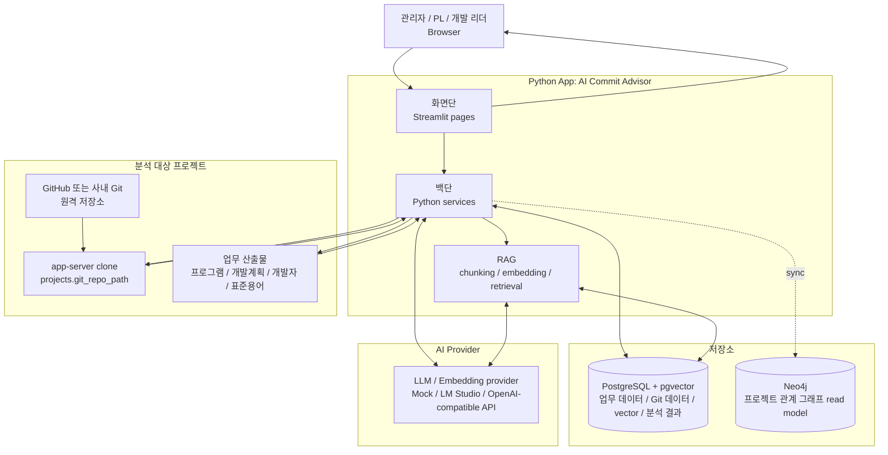

# AI Commit Advisor

AI Commit Advisor는 앱 서버에서 접근 가능한 Git 저장소의 커밋, 변경 파일, diff, 개발계획 데이터를 연결해 프로그램-커밋 매핑, 영향도 분석, 리스크 탐지, RAG 검색, Project Chat, AI 코드리뷰를 지원하는 Streamlit 기반 분석 도구입니다.

로컬 Python용 `.env.example`은 가벼운 mock 설정입니다. Docker 앱은 현재 검증된 시연 환경과 같게 LM Studio의 실제 OpenAI-compatible LLM/embedding을 기본으로 사용하며, Mapping, AI Code Review, Project Chat, RAG 검색 결과를 기본 DB 하나에 저장합니다.


## Application Preview

대표 화면은 README 상단에서 바로 확인할 수 있습니다. 주요 화면과 상세 workflow 상태는 [Application Preview](docs/application-preview.md)에서 먼저 훑어볼 수 있습니다.

모바일에서는 사이드바 메뉴로 다른 화면을 선택하면 메뉴가 자동으로 닫힙니다. 데스크톱에서는 연속 탐색을 위해 열린 상태를 유지하며, 화면 크기와 관계없이 사이드바를 아래로 스크롤해도 상단 닫기 버튼은 고정됩니다.

## 빠른 시작

가볍게 앱 흐름만 확인하려면 mock 설정을 사용합니다.

로컬 Python으로 실행할 때는 내 PC가 앱 서버입니다. 따라서 기존 경로 방식에 입력하는 Git 저장소 경로도 내 PC에서 접근 가능한 경로입니다. Docker 앱이나 외부 링크에서는 `Git URL에서 가져오기`를 선택하면 서버가 전용 경로를 자동 배정하고 공개 HTTPS 저장소를 clone합니다.

```powershell
Copy-Item .env.example .env
docker compose up -d postgres neo4j
python -m venv .venv
.\.venv\Scripts\python.exe -m pip install -r requirements.txt
.\.venv\Scripts\python.exe -m src.db.init_db
.\.venv\Scripts\python.exe -m streamlit run app.py
```

### 검증된 시연 서버 재기동

현재 저장된 시연 결과를 그대로 사용할 때는 아래 한 명령을 기준으로 합니다.

```powershell
.\scripts\demo_start.ps1
```

스크립트는 현재 상태를 먼저 읽고 필요한 서비스만 시작합니다. LM Studio port `12345`, Chat model context length `8192`, embedding model, Docker 8501 health, project `1`, preflight를 확인합니다. 실행 중인 Quick Tunnel이 있으면 `ai_commit_advisor_demo_tunnel`과 기존 이름 `ai_commit_advisor_quick_tunnel`을 모두 찾아 현재 URL을 재사용하며, 기본 실행만으로 새 Tunnel을 만들지 않습니다.

상황별 옵션은 다음과 같습니다.

```powershell
# 어떤 서비스도 시작하지 않고 현재 상태만 검증
.\scripts\demo_start.ps1 -CheckOnly

# 앱 source나 Docker image가 바뀐 경우에만 rebuild
.\scripts\demo_start.ps1 -Build

# 실행 중인 Tunnel이 없고 새 외부 URL이 필요한 경우에만 생성
.\scripts\demo_start.ps1 -StartTunnel
```

일반 재기동은 image를 다시 만들지 않는 `docker compose up -d app`과 같습니다. `docker compose down`이나 `docker compose down -v`는 기존 DB와 Tunnel network를 불필요하게 건드리므로 시연 재기동에 사용하지 않습니다. Docker 앱은 `http://127.0.0.1:8501/?project_id=1`에서 열며 local 8502를 동시에 실행하지 않습니다.

Docker에서 AI 호출 없이 화면과 DB 연결만 확인하려면 실행 전에 `.env`에 `DOCKER_LLM_PROVIDER=mock`, `DOCKER_EMBEDDING_PROVIDER=mock`, `DOCKER_PGVECTOR_DIMENSION=768`을 명시합니다. 실제 분석 결과를 확인할 때는 이 override를 제거합니다. host의 `127.0.0.1`은 컨테이너 자신을 가리키므로 Docker LM Studio 주소는 기본값 `http://host.docker.internal:12345/v1`을 유지하세요.

Quick Tunnel만 따로 확인할 때는 상태 명령부터 실행합니다.

```powershell
.\.venv\Scripts\python.exe scripts\quick_tunnel.py status
```

상태가 정상이면 출력된 URL을 그대로 사용합니다. 새 URL이 필요할 때만 `start`를 실행합니다. 스크립트가 새로 만드는 Tunnel은 `restart=unless-stopped`를 사용하므로 명시적으로 `stop`하지 않으면 Docker daemon 재시작 뒤에도 다시 올라옵니다. 이때 Quick Tunnel URL은 바뀔 수 있으므로 `status`가 표시한 현재 실행의 URL을 다시 전달해야 합니다. Quick Tunnel 주소에는 자체 로그인이 없고 가동 시간도 보장되지 않으므로 샘플 데이터 기반의 짧은 시연에만 사용하세요. 전체 순서와 장애 대응은 [시연 Runbook](docs/demo-runbook.md#기동-절차)과 [하루 시연용 Cloudflare Quick Tunnel](docs/setup-and-operations.md#하루-시연용-cloudflare-quick-tunnel)을 따릅니다.

로컬 Python Quick Start도 기본적으로 Neo4j를 함께 켭니다. Neo4j는 첫 image pull 때만 시간이 더 걸릴 수 있고, 이후에는 기존 Docker volume/image를 재사용합니다. 아주 가볍게 PostgreSQL만 켜고 싶다면 `docker compose up -d postgres`만 실행하고 `.env`에서 `NEO4J_ENABLED=false`로 바꾸세요. 이 경우 `Knowledge Graph` 화면은 PostgreSQL 데이터를 기준으로 preview만 보여주며, Neo4j 저장 동기화는 건너뜁니다.

실제 LLM/RAG/Project Chat 품질을 검증하려면 로컬 LLM 설정 예시를 사용합니다.

```powershell
Copy-Item .env.local-llm.example .env
```

local LLM 모드의 현재 기본 조합은 `qwen2.5-coder-7b-instruct`와 768차원 `text-embedding-nomic-embed-text-v2-moe`입니다. LM Studio에서 두 모델을 먼저 로드하고, RAG/Project Chat 사용 전에는 새 embedding model key 기준으로 source_file embedding을 생성하세요.

가상환경 활성화 명령은 터미널마다 다릅니다. PowerShell은 `.\.venv\Scripts\Activate.ps1`, cmd.exe는 `.venv\Scripts\activate`, Git Bash는 `source .venv/Scripts/activate`를 사용합니다. 위 Quick Start는 터미널 차이와 PowerShell 실행 정책에 덜 영향을 받도록 가상환경 활성화 없이 실행합니다.

이미 의존성이 설치되어 있고 앱만 다시 실행하려면:

```powershell
.\.venv\Scripts\python.exe -m streamlit run app.py
```

자세한 설치, DB migration, LLM/embedding 설정, 운영 주의사항은 [Setup and Operations](docs/setup-and-operations.md)를 참고하세요.

## 샘플 프로젝트

실제 업무 프로젝트를 건드리지 않고 전체 흐름을 검증하려면 데모용 샘플 프로젝트를 생성합니다.

```powershell
.\.venv\Scripts\python.exe scripts\create_sample_target_repo.py
```

기본 생성 위치는 `C:\dev\ai-advisor-sample-shop`입니다. 샘플 프로젝트는 8개 프로그램, 48개 commit, Spring MVC + MyBatis 예제 소스, 업로드용 Excel 4종을 포함합니다. 개발자 목록, 프로그램 목록, 개발계획, 표준용어/표준단어 화면의 `Excel 업로드` 탭에서도 같은 샘플 Excel을 바로 내려받을 수 있습니다.

서버 경로 없이 관리형 clone 흐름을 확인하려면 공개 저장소 [ino5/ai-advisor-sample-shop](https://github.com/ino5/ai-advisor-sample-shop)을 사용합니다. `프로젝트/Git 설정`에서 `Git URL에서 가져오기`를 선택하고 프로젝트명 `Sample Shop Demo (github)`, URL `https://github.com/ino5/ai-advisor-sample-shop.git`, branch `main`을 입력하세요. 등록 후 `Git 동기화 > 전체 수집`을 실행할 수 있습니다. 같은 commit hash도 프로젝트마다 별도 행으로 저장되며, 같은 프로젝트에서 다시 수집한 commit만 중복으로 건너뜁니다.

전체 데모 흐름과 LLM/embedding 작업을 과도하게 실행하지 않는 방법은 [샘플 프로젝트 검증 가이드](docs/rich-sample-demo-walkthrough.md)를 먼저 확인하세요. 샘플 프로젝트 구성과 기능별 확인 포인트는 [샘플 프로젝트 설계](docs/sample-target-repo-demo-design.md)에서 관리합니다.

## 주요 기능

- 앱 서버 Git 저장소 커밋, 변경 파일, diff 수집과 증분 동기화
- 기존 서버 경로 read-only 분석과 공개 HTTPS Git URL 관리형 clone을 분리한 프로젝트 등록
- 개발자, 프로그램 목록, 개발계획 Excel 업로드와 화면 기반 직접 관리
- LLM 기반 프로그램-커밋 Mapping과 사용자 피드백 보정
- Commit Impact, Program Detail, AI Progress 기반 구현 현황 추적
- Git History 화면에서 프로젝트별 커밋 목록, 변경 파일, diff 탐색
- 규칙 기반 Risk Analysis로 누락, 지연, 불확실한 프로그램 탐지
- Home과 AI 운영 현황에서 프로젝트/Git/프로그램/Mapping/소스 근거/검색 준비/Knowledge Graph 상태별 다음 준비 작업 확인
- Dashboard에서 개발자별 업무량, 난이도, 예상 지연 프로그램, 고객가치 참고 지표와 저장형 추세 확인
- AI 운영 현황에서 LLM/embedding/Neo4j 연결 상태, GraphRAG 준비 상태, AI 분석 근거, 품질 점검, graph impact가 포함된 주간 보고서, 호출 기록 확인
- Neo4j Knowledge Graph에서 프로젝트, 프로그램, 커밋, 파일, 클래스, 도메인 관계를 저장하고 Graph HEAD 최신성, 선택 node 주변 관계, 영향 경로 탐색. Java parser는 annotation type, static import, nested member type을 반영하고 generated/build/test fixture 제외 경고를 표시합니다.
- 현재 소스 검증형 RAG Search와 Neo4j graph 관계 근거를 보조로 쓰는 저장형 Project Chat. Knowledge Graph가 최신이면 프로그램/커밋/파일/class/domain 관계 질문 템플릿으로 바로 시작하고, 답변 아래에서 GraphRAG 관계도를 함께 확인할 수 있습니다.
- 표준용어/표준단어 Excel 업로드 기반 한글 질문 검색 확장
- 앱 서버 Git 저장소의 최신 커밋 또는 최근 커밋 목록에서 대상을 고르는 AI Code Review
- 데모용 샘플 프로젝트와 Excel 데이터 생성으로 전체 기능 확인 가능

## Git 저장소 접근 모델

AI Commit Advisor는 브라우저 사용자 PC의 Git 저장소를 직접 읽지 않습니다. 앱이 실행 중인 서버에서 접근 가능한 Git 저장소 경로를 기준으로 커밋, 변경 파일, diff, 현재 소스 파일을 분석합니다.

프로젝트 등록 방식은 두 가지입니다. 운영자가 미리 준비한 저장소는 `서버에 이미 있는 저장소 사용`으로 연결하고 read-only 분석 경로로 유지할 수 있습니다. 외부 사용자가 공개 GitHub·GitLab·Bitbucket 저장소를 등록할 때는 `Git URL에서 가져오기`를 선택하고 URL과 branch만 입력합니다. 서버는 별도의 쓰기 가능한 관리형 폴더를 자동 배정해 clone/fetch합니다. private repository 인증과 브라우저 사용자 PC의 폴더 직접 등록은 이 흐름에서 지원하지 않습니다.

같은 원격 저장소를 여러 프로젝트로 등록해도 Git 수집 데이터, Mapping, RAG/vector, Knowledge Graph는 `project_id` 기준으로 분리됩니다. 프로젝트명 뒤의 `(github)`는 사람이 출처를 알아보기 위한 권장 표기일 뿐 데이터 격리 키는 아닙니다. 프로젝트를 삭제하면 해당 프로젝트의 PostgreSQL 분석 데이터와 Neo4j read model은 정리되지만, 서버의 관리형 clone 폴더는 자동 삭제하지 않습니다.

자세한 사내 서버 운영 방식과 경로 제한 정책은 [Git 저장소 운영 모델](docs/git-repository-operating-model.md)을 참고하세요.

## 아키텍처 요약

AI Commit Advisor는 Python App 안의 화면단, 백단, RAG/Knowledge Graph 계층이 분석 대상 프로젝트와 저장소, AI Provider를 연결하는 구조입니다. 자세한 모듈과 데이터 흐름은 [아키텍처](docs/architecture.md)에서 확인할 수 있습니다.



## 문서

- [샘플 프로젝트 처음 시작 가이드](docs/sample-project-first-run-guide.md): 현재 준비된 프로젝트에서 바로 질문하는 방법과 빈 DB에서 눌러야 할 메뉴·버튼 순서를 짧게 정리했습니다.
- [Application Preview](docs/application-preview.md): 샘플 프로젝트 기준 주요 화면과 기능 상태를 미리 확인할 수 있습니다.
- [사용 가이드](docs/demo-user-guide.md): 샘플 프로젝트를 예시로 AI Commit Advisor의 주요 화면과 분석 흐름을 따라가는 사용자용 가이드입니다.
- [기능 가이드](docs/feature-guide.md): 사이드바 메뉴 구조, 주요 화면, 기능 흐름, 분석 결과가 무엇을 의미하는지 설명합니다.
- [설치와 운영](docs/setup-and-operations.md): 설치, 실행, 환경 변수, DB migration, LLM/embedding 운영 가이드입니다.
- [Git 저장소 운영 모델](docs/git-repository-operating-model.md): 앱 서버 기준 Git 저장소 접근 방식, 사내 서버 운영 구조, 경로 제한 정책을 설명합니다.
- [서버 Git 저장소 갱신 Runbook](docs/server-repository-update-runbook.md): 사내 서버에 준비된 Git 저장소를 fetch/reset한 뒤 앱 Git 동기화를 실행하는 절차입니다.
- [사용 가이드 검증 결과](docs/sample-project-usage-verification.md): local LLM/embedding 환경에서 사용 가이드를 실제 실행한 결과와 화면 증거입니다.
- [전체 시연 E2E 증적](docs/end-to-end-demo-evidence-2026-07-21.md): 기본 DB에서 수집부터 Docker 8501·외부 접속 확인까지 재현한 40개 화면과 검증 수치입니다.
- [시연 Runbook](docs/demo-runbook.md): 권장 동선, 예상 질문, 장애 대체 동선, 당일 점검 절차입니다.
- [Local LLM Verification](docs/local-llm-verification.md): mock이 아닌 local OpenAI-compatible LLM/embedding으로 주요 AI 기능을 실행하고 증거를 확인하는 절차입니다.
- [샘플 프로젝트 검증 가이드](docs/rich-sample-demo-walkthrough.md): 샘플 프로젝트로 주요 기능을 확인할 때 참고하는 권장 실행 흐름입니다.
- [샘플 프로젝트 설계](docs/sample-target-repo-demo-design.md): 데모용 샘플 프로젝트의 구성, commit 시나리오, 기능별 확인 포인트입니다.
- [AI 기술 개요](docs/ai-technical-overview.md): AX Use Case 기준으로 적용된 LLM, embedding/RAG, Neo4j Knowledge Graph, source verification, AI-derived analytics와 화면별 AI 동작 방식입니다.
- [소스 인덱싱과 임베딩 운영 계획](docs/source-indexing-and-embedding-plan.md): Project Chat source_file 증분 인덱싱, embedding 비용 제어, cloud 운영 계획입니다.
- [아키텍처](docs/architecture.md): 모듈 구조, 데이터 흐름, 서비스 책임입니다.
- [DB 마이그레이션](docs/db-migrations.md): Alembic 기반 DB schema 관리 기준입니다.
- [Engineering Decisions](docs/engineering-decisions.md): 주요 설계, 운영, 검증, 자동화 결정의 배경과 tradeoff를 기록합니다.
- [실패 이력](docs/failure-history.md): 프로젝트 전반의 실패 원인, 수정 내용, 재발 방지 기준을 기록합니다.
- [AI 변경 이력](AI_CHANGELOG.md): AI 에이전트가 수행한 변경 이력입니다.
- [AI Agent 작업 안내](docs/agent-onboarding.md): 이 프로젝트에서 Agent로 작업할 때 참고할 흐름, 문서 규칙, 프롬프트 예시를 정리합니다.
- [에이전트 작업 규칙](AGENTS.md): 코딩 에이전트 작업 규칙입니다.

## 프로젝트 구조

```text
app.py
src/
  db/
  rag/
  services/
  ui/
  utils/
scripts/
docs/
docker-compose.yml
requirements.txt
.env.example
.env.local-llm.example
```

## 참고 사항

- RAG/embedding은 mock과 OpenAI-compatible 서버를 모두 지원합니다. 실제 검색 품질 평가는 embedding 모델과 `PGVECTOR_DIMENSION` 설정이 맞아야 하며, Nomic model은 애플리케이션이 query/document task profile을 구분합니다.
- Project Chat은 현재 소스 검증을 통과한 `source_file` chunk만 기본 답변 근거로 사용하며, Neo4j graph가 준비된 경우 관계 근거를 보조로 붙이고 프로젝트별 대화 이력과 답변 근거를 저장합니다. Graph 관계 질문 템플릿은 Knowledge Graph가 최신일 때만 실행되며, 답변의 graph evidence는 작은 node-edge 관계도와 표로 나누어 표시됩니다.
- Git Sync 이후에는 `Git 동기화` 화면의 `동기화 후 다음 작업`에서 현재 소스 근거, 검색 준비, Mapping, Risk Analysis, Knowledge Graph 갱신 순서를 확인하세요.
- 현재 소스 파일을 수정하거나 브랜치/HEAD가 바뀐 뒤에는 RAG 또는 Project Chat 화면의 인덱스 상태를 확인하고 필요 시 현재 소스를 다시 인덱싱하세요.
- Git Sync나 Mapping 이후 Knowledge Graph가 `갱신 필요`로 표시되면 `최신 변경분만 Neo4j 반영`을 먼저 실행하고, 처음 저장하거나 관계가 크게 어긋난 경우 `전체 재동기화`를 사용하세요. 대형 저장소에서는 `NEO4J_WRITE_BATCH_SIZE`와 retry 설정으로 Neo4j write 부하를 조절할 수 있습니다.
- LLM 매핑 분석과 AI 코드리뷰는 `.env`의 `LLM_PROVIDER` 설정에 따라 mock 또는 로컬 LLM을 사용합니다.
