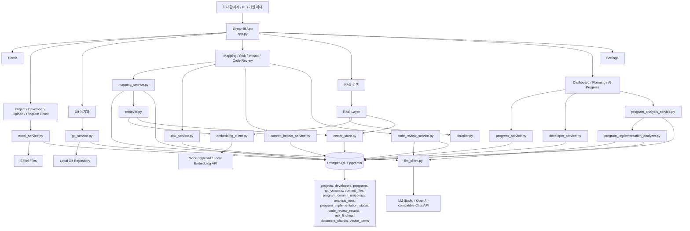
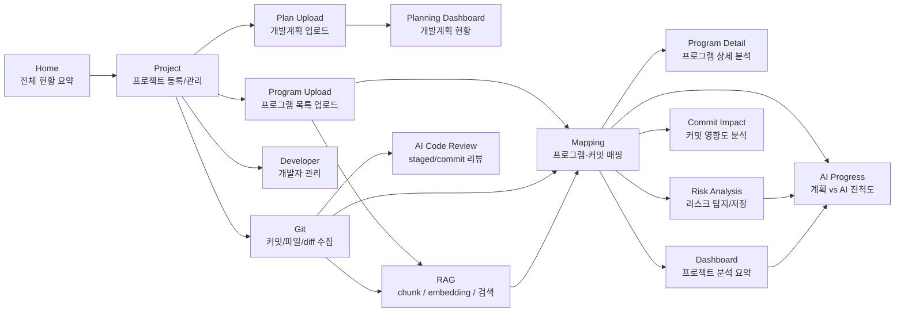
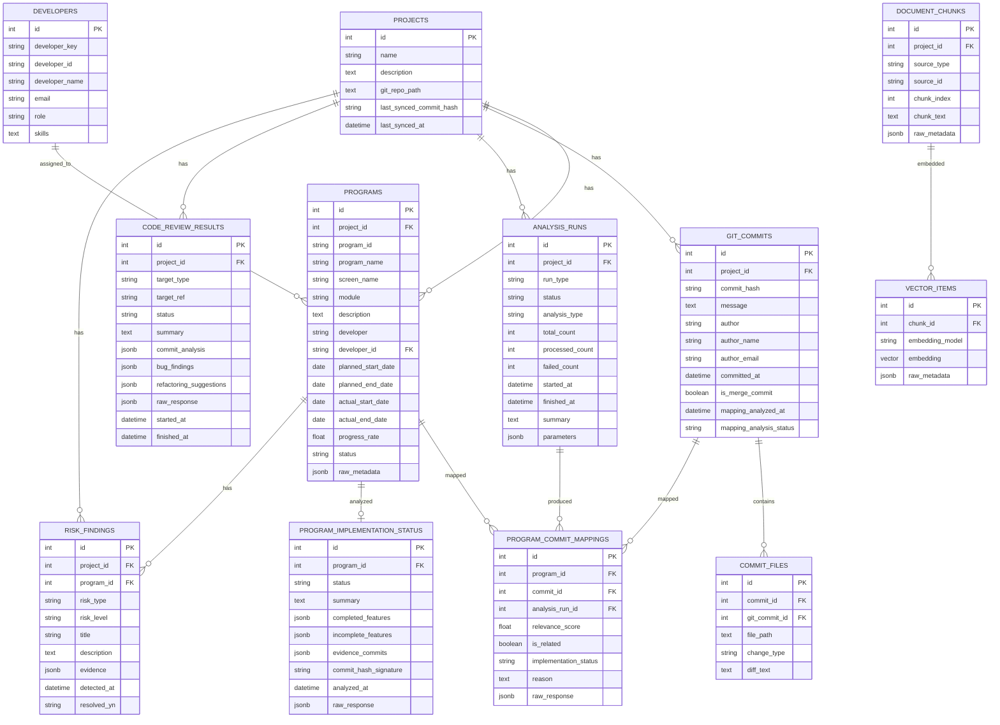
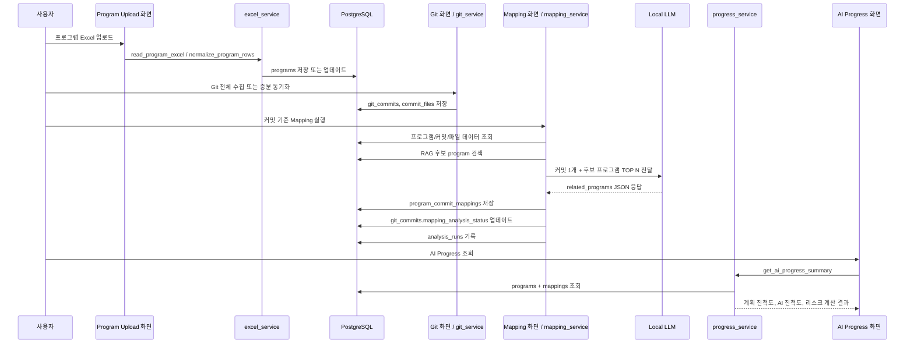
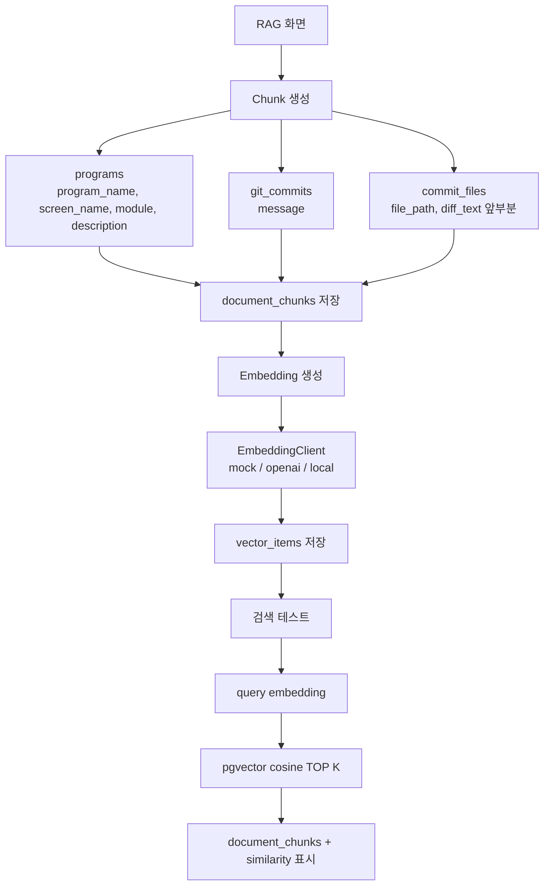
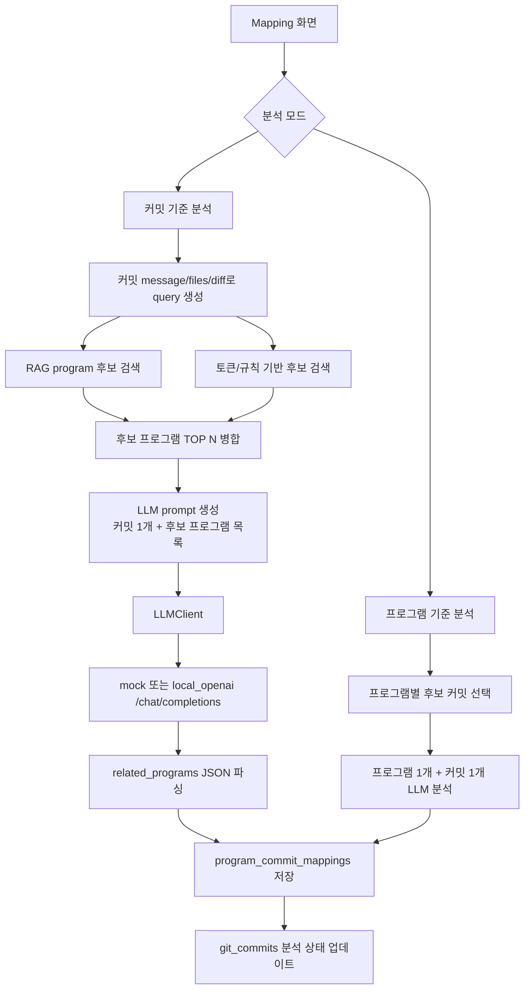
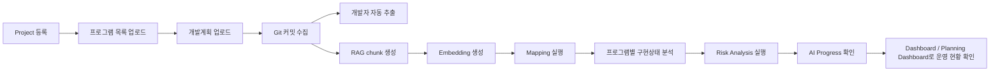

# AI Commit Advisor Architecture

이 문서는 `ai-commit-advisor` 프로젝트 작성자가 전체 구조와 처리 흐름을 빠르게 이해할 수 있도록 정리한 아키텍처 문서입니다.

## 1. 전체 아키텍처 다이어그램



## 2. 화면 흐름도



### 주요 화면 역할

- `Home`: 전체 프로젝트 현황, KPI, AI 진척도, 리스크 프로그램 요약.
- `Project`: 프로젝트 이름, 설명, 로컬 Git 저장소 경로 관리.
- `Program`: 프로그램 목록 Excel 업로드 및 컬럼 매핑.
- `Plan Upload`: 개발계획 Excel 업로드 및 일정/진척도 갱신.
- `Program Detail`: 특정 프로그램의 계획, AI 구현상태, 관련 커밋, 파일 diff, 리스크를 상세 조회.
- `Git`: 로컬 Git 저장소에서 커밋, 변경 파일, diff 수집.
- `Mapping`: 프로그램과 커밋의 관련성을 LLM으로 분석해 `program_commit_mappings`에 저장.
- `Risk Analysis`: 계획, 매핑, 커밋 활동 기반 리스크를 탐지하고 `risk_findings`에 저장/해결 처리.
- `Commit Impact`: 특정 커밋이 영향을 주는 프로그램, 파일, 개발자 범위를 요약.
- `AI Code Review`: staged 변경, 최근 커밋, 특정 커밋을 LLM으로 리뷰하고 결과를 저장.
- `Dashboard`: 프로젝트별 계획/AI/Git 활동 요약.
- `Planning Dashboard`: 개발계획 기준 일정, 담당자, 완료/지연 현황 표시.
- `AI Progress`: 계획 진척도와 AI 판단 진척도 비교, 리스크 프로그램 추적.
- `RAG`: chunk 생성, embedding 생성, pgvector 검색 테스트.

## 3. DB ERD



## 4. 테이블별 역할 설명

| 테이블 | 역할 |
|---|---|
| `projects` | 프로젝트 단위의 최상위 엔티티. Git 저장소 경로와 마지막 동기화 상태를 가진다. |
| `developers` | 개발자 목록. Git author 또는 업로드 데이터 기반으로 생성되며 role/skills를 관리한다. |
| `programs` | 프로그램 목록과 개발계획 정보를 저장한다. 계획 진척도(`progress_rate`)와 일정, 담당자 정보의 기준 테이블이다. |
| `git_commits` | Git 커밋 메타데이터를 저장한다. 커밋 기준 매핑 분석 상태도 가진다. |
| `commit_files` | 커밋별 변경 파일, 변경 유형, diff 일부를 저장한다. |
| `program_commit_mappings` | 프로그램-커밋 관련성 분석 결과. LLM 판단 결과, 관련도 점수, 구현 상태, 판단 근거를 저장한다. |
| `program_implementation_status` | 프로그램별 관련 커밋 묶음을 기반으로 LLM이 판단한 구현 상태, 완료/미완료 기능, 근거 커밋을 저장한다. |
| `analysis_runs` | Mapping 분석 실행 이력. 실행 상태, 처리 수, 실패 수, 파라미터, 요약을 저장한다. |
| `code_review_results` | AI Code Review 실행 결과. 리뷰 대상, 요약, 커밋 분석, 버그 발견, 리팩토링 제안을 저장한다. |
| `risk_findings` | 리스크 분석 결과. 리스크 유형/등급, 설명, 근거, 해결 여부를 저장한다. |
| `document_chunks` | RAG 검색용 chunk 저장소. program, commit, commit_file 원문을 검색 가능한 텍스트 단위로 저장한다. |
| `vector_items` | `document_chunks`의 embedding vector를 저장한다. pgvector cosine 검색에 사용된다. |

## 5. 서비스별 역할 설명

| 서비스 | 역할 |
|---|---|
| `excel_service.py` | 프로그램/개발자 Excel 파일 읽기, 컬럼 매핑, 정규화, DB 저장. |
| `git_service.py` | 로컬 Git 저장소에서 commit hash, message, author, changed files, diff 수집 및 DB 저장. |
| `developer_service.py` | Git author 기반 개발자 자동 추출, role/skills 추정, 개발자 통계 생성. |
| `llm_client.py` | mock 또는 OpenAI-compatible local LLM 호출. `/chat/completions` 기반. |
| `mapping_service.py` | 프로그램-커밋 매핑 분석의 핵심 서비스. 프로그램 기준 분석과 커밋 기준 분석을 모두 지원한다. |
| `progress_service.py` | `programs.progress_rate`와 `program_commit_mappings.implementation_status`를 결합해 AI 진척도와 리스크를 계산한다. |
| `program_analysis_service.py` | 프로그램 상세 화면용 분석 데이터 구성. 관련 커밋, 파일 diff, 개발자 기여, 리스크 요약을 제공한다. |
| `program_implementation_analyzer.py` | 프로그램별 관련 커밋을 LLM으로 재분석해 구현 상태와 근거를 `program_implementation_status`에 저장한다. |
| `risk_service.py` | 계획 일정, 담당자, 커밋/매핑 상태를 기반으로 리스크를 탐지하고 `risk_findings`에 저장/해결 처리한다. |
| `commit_impact_service.py` | 특정 커밋이 영향을 줄 가능성이 있는 프로그램, 파일, 개발자 범위를 계산한다. |
| `code_review_service.py` | staged 변경, 최근 커밋, 특정 커밋 diff를 LLM으로 리뷰하고 `code_review_results`에 저장한다. |
| `chunker.py` | program, commit, commit_file 데이터를 `document_chunks`로 생성한다. |
| `embedding_client.py` | mock/openai/local embedding provider를 추상화한다. |
| `vector_store.py` | embedding 저장, 중복 방지, embedding 실패 기록, pgvector cosine 검색. |
| `retriever.py` | query embedding 생성 후 vector 검색 결과를 반환한다. Mapping 후보 프로그램 검색에도 사용된다. |

## 6. 프로그램 업로드부터 AI 진척도 계산까지의 처리 흐름



### AI 진척도 계산 규칙

- `구현됨` 또는 `구현완료`: 100
- `일부구현`: 50
- `판단불가`: 0
- 매핑 결과 없음: 0

프로그램별 AI 진척도는 해당 프로그램의 mapping 중 가장 높은 구현 상태를 사용한다.

리스크 조건:

- 계획 종료일이 지났지만 AI 진척도 < 100
- 계획 진척도 - AI 진척도 >= 30
- mapping이 있지만 `판단불가`만 존재
- 관련 커밋이 없음

## 7. RAG 처리 흐름



### RAG 안전장치

- 이미 같은 `source_type + source_id + chunk_index` chunk가 있으면 생성하지 않는다.
- 같은 `chunk_id + embedding_model` vector가 있으면 중복 저장하지 않는다.
- `commit_files.diff_text`는 길이를 잘라 chunk로 만든다.
- embedding 실패 시 chunk metadata에 실패 상태와 오류 메시지를 남기고 다음 chunk로 진행한다.

## 8. LLM 처리 흐름



LLM 출력 예시:

```json
{
  "related_programs": [
    {
      "program_id": "P001",
      "relevance_score": 85,
      "implementation_status": "일부구현",
      "reason": "커밋 메시지와 변경 파일이 해당 프로그램의 서비스/화면과 관련됨"
    }
  ]
}
```

## 9. 현재 구현된 기능

- Streamlit 기반 업무 흐름형 메뉴.
- 프로젝트 등록 및 Git 저장소 경로 관리.
- 프로그램 Excel 업로드, 컬럼 매핑, DB 저장/업데이트.
- 개발자 Excel 업로드.
- 개발계획 Excel 업로드 및 계획 대시보드.
- Git 커밋 전체 수집 및 증분 동기화.
- 커밋별 변경 파일과 diff 저장.
- Git author 기반 개발자 자동 추출 및 개발자 통계.
- 프로그램 상세 분석 화면.
- 프로그램 기준 Mapping 분석.
- 커밋 기준 Mapping 분석.
- 커밋 기준 Mapping에서 RAG 후보 + 토큰 후보 병합.
- 프로그램별 관련 커밋 기반 AI 구현상태 분석 및 저장.
- LLM mock 및 OpenAI-compatible local chat 호출.
- Mapping 실행 이력 저장.
- 커밋별 mapping 분석 상태 저장.
- AI Progress 계산 및 리스크 프로그램 표시.
- Risk Analysis 실행, 리스크 저장, 미해결 리스크 조회 및 해결 처리.
- Commit Impact 분석.
- AI Code Review 실행 및 리뷰 이력 저장.
- Home/Dashboard/Planning Dashboard/AI Progress 운영 대시보드.
- RAG chunk 생성.
- mock/openai/local embedding client 구조.
- pgvector vector 저장 및 cosine 검색.
- RAG 검색 테스트 화면.
- 설정 화면에서 DB/LLM/Embedding 설정 확인.

## 10. 아직 미구현 기능

현재 코드 기준으로 아직 PoC 또는 제한적인 부분은 다음과 같다.

- 인증/권한 관리가 없다.
- 운영용 마이그레이션 도구는 없고 `init_db.py`의 보강 SQL 중심이다.
- RAG 검색 품질은 embedding 모델에 크게 의존하며, mock embedding은 테스트용이다.
- local/openai embedding은 OpenAI-compatible `/embeddings` 형식을 가정하지만 실제 모델별 검증은 별도 필요하다.
- LLM 응답 JSON 스키마 검증은 엄격한 validator가 아니라 기본 파싱 중심이다.
- Mapping 실패 재처리 정책은 기본 상태 기록 수준이며 상세 재시도 큐는 없다.
- Dashboard 일부 기존 보조 페이지에는 아직 오래된 한글 깨짐 문자열이 남아 있을 수 있다.
- 테스트 코드가 체계적으로 구성되어 있지 않고 현재는 `py_compile` 및 수동 smoke test 중심이다.
- 배포 설정, CI, 환경별 설정 분리, 로그 수집/모니터링이 없다.
- vector index 생성 튜닝(HNSW/IVFFlat 등)은 아직 없다.

## 11. 핵심 진입점

### `app.py`

- Streamlit 앱의 시작점.
- `PAGE_GROUPS`에서 업무 흐름 기준 메뉴를 정의한다.
- 각 메뉴 항목은 `src/ui/*_page.py`의 render 함수로 연결된다.

주요 메뉴 그룹:

- `개요`: Home
- `프로젝트 관리`: Project, Developer, Program Detail, Developer Upload, Program Upload, Development Plan Upload
- `데이터 수집`: Git, Sample Data
- `AI 분석`: Mapping, Risk Analysis, Commit Impact, RAG, AI Code Review
- `분석 결과`: Dashboard, 개발계획 대시보드, AI Progress
- `관리`: Settings

### 주요 UI 파일

| 파일 | 역할 |
|---|---|
| `src/ui/home_page.py` | 전체 현황 KPI와 리스크 요약. |
| `src/ui/project_page.py` | 프로젝트 등록/수정. |
| `src/ui/developer_page.py` | 개발자 목록, Git author 기반 추출, 개발자 통계. |
| `src/ui/developer_upload_page.py` | 개발자 목록 업로드. |
| `src/ui/upload_page.py` | 프로그램 목록 업로드. |
| `src/ui/development_plan_upload_page.py` | 개발계획 업로드. |
| `src/ui/program_detail_page.py` | 프로그램별 계획, AI 구현상태, 관련 커밋, diff, 리스크 상세 조회. |
| `src/ui/git_page.py` | Git 커밋 수집. |
| `src/ui/mapping_page.py` | 프로그램-커밋 Mapping 분석 실행. |
| `src/ui/risk_page.py` | 프로젝트 리스크 분석, 미해결 리스크 조회 및 해결 처리. |
| `src/ui/commit_impact_page.py` | 특정 커밋의 영향도 분석. |
| `src/ui/rag_page.py` | RAG chunk/embedding/search 관리. |
| `src/ui/code_review_page.py` | AI 코드 리뷰 실행 및 이력 조회. |
| `src/ui/dashboard_page.py` | 프로젝트 운영 요약. |
| `src/ui/planning_dashboard_page.py` | 개발계획 기준 일정/진척 현황. |
| `src/ui/ai_progress_page.py` | 계획 진척도와 AI 진척도 비교. |
| `src/ui/settings_page.py` | DB/LLM/Embedding 설정 확인. |

### 주요 서비스

| 파일 | 핵심 함수/클래스 |
|---|---|
| `src/services/excel_service.py` | `read_program_excel`, `normalize_program_rows`, `save_programs_with_result` |
| `src/services/git_service.py` | `sync_git_repository`, `collect_commits` |
| `src/services/developer_service.py` | `extract_developers_from_git_commits`, `get_developer_stats` |
| `src/services/llm_client.py` | `LLMClient.generate` |
| `src/services/mapping_service.py` | `MappingService.analyze_commits`, `MappingService.analyze_project` |
| `src/services/progress_service.py` | `get_ai_progress_summary`, `get_program_commit_details` |
| `src/services/program_analysis_service.py` | `list_program_options`, `get_program_detail_analysis`, `get_commit_file_details` |
| `src/services/program_implementation_analyzer.py` | `ProgramImplementationAnalyzer.analyze_program`, `ProgramImplementationAnalyzer.analyze_project` |
| `src/services/risk_service.py` | `run_risk_analysis`, `get_unresolved_findings`, `resolve_findings` |
| `src/services/commit_impact_service.py` | `list_commit_options`, `get_commit_impact_analysis` |
| `src/services/code_review_service.py` | `get_review_target`, `CodeReviewService.review_project`, `get_recent_code_reviews` |
| `src/rag/chunker.py` | `build_project_chunks` |
| `src/rag/embedding_client.py` | `EmbeddingClient.embed_text` |
| `src/rag/vector_store.py` | `embed_missing_chunks`, `search_similar` |
| `src/rag/retriever.py` | `retrieve`, `retrieve_program_ids` |

### 주요 DB 모델

모든 모델은 `src/db/models.py`에 정의되어 있다.

- `Project`: 프로젝트 기준 엔티티.
- `Developer`: 개발자 마스터.
- `Program`: 프로그램 목록 및 계획 정보.
- `GitCommit`: Git 커밋 메타데이터.
- `CommitFile`: 커밋별 변경 파일/diff.
- `ProgramCommitMapping`: LLM 매핑 분석 결과.
- `ProgramImplementationStatus`: 프로그램별 AI 구현상태 분석 결과.
- `AnalysisRun`: 분석 실행 이력.
- `CodeReviewResult`: AI 코드 리뷰 결과.
- `RiskFinding`: 프로젝트/프로그램 리스크 탐지 결과.
- `DocumentChunk`: RAG 원문 chunk.
- `VectorItem`: RAG embedding vector.

## 부록: 추천 운영 순서


