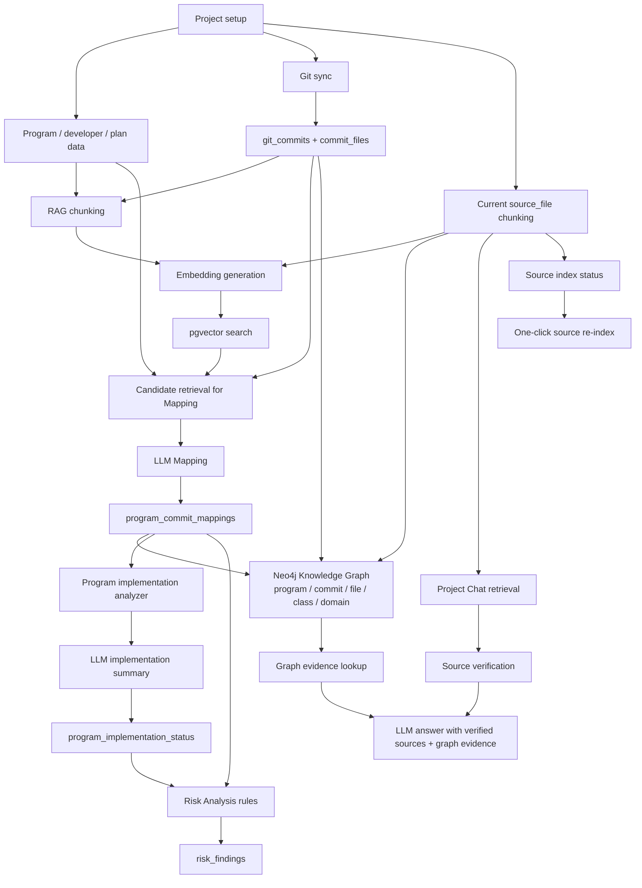

# AI 기술 개요

이 문서는 AI Commit Advisor가 AI를 어떻게 사용하는지 제품 관점과 기술 관점에서 설명합니다.

## 제품 포지셔닝

AI Commit Advisor는 개발계획 데이터와 실제 Git 활동을 연결합니다. 프로젝트 리더가 계획된 program이 구현되고 있는지, 어떤 commit이 어떤 program에 영향을 주는지, risk가 어디에 있는지, 현재 source code가 무엇을 말하는지 파악하도록 돕습니다.

이 프로젝트는 AI를 통제되지 않은 truth source가 아니라 분석과 검색을 보조하는 assistant로 사용합니다. 핵심 데이터는 program, commit, file, diff, source chunk, 저장된 analysis record로 추적 가능해야 합니다.

## AX Use Case 기준 AI 적용 요약

AI Commit Advisor의 AX Use Case는 "AI로 프로젝트 자원관리 판단을 보조한다"는 데 초점을 둡니다. 단일 chatbot이나 단순 코드리뷰 도구가 아니라, 개발계획과 Git 실행 데이터를 연결해 프로그램 구현상태, 일정 리스크, 개발자별 업무량, 코드 변경 위험, 현재 소스 근거를 함께 보는 구조입니다.

이 프로젝트에 접목된 AI 기술은 아래처럼 나눠 설명할 수 있습니다.

| AI 기술 | 실제 적용 위치 | 동작 방식 | AX 자원관리 의미 |
|---|---|---|---|
| LLM 기반 프로그램-커밋 매핑 | Mapping | commit message, changed files, diff, program metadata, RAG 후보를 함께 보고 commit이 어떤 program과 관련 있는지 판단합니다. | Git 이력을 업무 프로그램 단위로 연결해 AI Progress, Risk Analysis, Dashboard 자원관리 지표의 근거를 만듭니다. |
| LLM 기반 구현상태 분석 | Program Detail, AI Progress | 프로그램 계획과 관련 commit/mapping evidence를 보고 NOT_STARTED, IN_PROGRESS, COMPLETED, UNKNOWN과 검증 필요 항목을 보수적으로 산출합니다. | 계획 진척률과 실제 구현 근거의 차이를 PL이 검토할 수 있게 합니다. |
| LLM 기반 코드리뷰 | AI Code Review | 최신 commit, 특정 commit, 서버 clone local diff를 대상으로 변경 의도, 위험도, 버그 후보, 리팩토링 제안을 생성합니다. | 리뷰 부담을 줄이고 위험 변경을 자원관리 지표와 고객가치 참고 지표에 연결합니다. |
| JSON Schema Structured Output | Mapping, 구현상태, AI Code Review, PL Briefing | LM Studio `/v1/chat/completions`에 기능별 JSON Schema를 전달하고, 앱의 parsing·validation·fallback을 이어서 적용합니다. | 작은 local model의 JSON key·enum 이탈을 줄이고 저장 결과의 형태를 기능별로 일정하게 유지합니다. |
| Embedding/vector search | RAG Search, Project Chat, Mapping 후보 검색 | current source, program, commit, commit_file diff를 chunk로 만들고, Nomic query/document task profile을 구분해 embedding/vector search로 유사 근거를 찾습니다. | 한글 업무 질문과 코드 식별자, 변경 이력, 프로그램 정보를 이어 주어 근거 탐색 시간을 줄입니다. |
| Source-grounded RAG | Project Chat | 검색된 source_file chunk가 현재 checkout의 file/line/hash와 일치하는지 검증한 뒤 LLM 답변 근거로 사용합니다. | 오래된 코드나 삭제된 diff를 현재 사실처럼 말하는 위험을 줄이고, 회의/리뷰에 붙일 수 있는 citation을 제공합니다. |
| 한국어 업무용어 확장 | RAG Search, Project Chat | 표준용어/표준단어의 한글명, 영문명, 약어에서 camelCase, snake_case, compact form 등을 파생해 검색 질의를 확장합니다. | SI 산출물의 한글 업무 용어와 실제 코드/DB 식별자 사이의 검색 간극을 줄입니다. |
| Neo4j Knowledge Graph | Knowledge Graph | 프로젝트, 프로그램, 커밋, 파일, Java class, 도메인을 graph node/edge로 투영하고 저장된 class import, 선택 node 주변 path, commit 영향 경로를 탐색합니다. | 업무 계획, Git 실행, 코드 구조 사이의 관계를 한 화면에서 설명해 PL이 영향 범위와 도메인 묶음을 빠르게 이해하게 합니다. |
| GraphRAG 보조 근거 | Project Chat | 질문, 확장 쿼리, 검색된 source_file/commit 근거에서 seed를 뽑아 Neo4j의 program-commit-file-class 경로와 class import/domain 관계를 답변 context에 넣습니다. | vector 검색만으로 설명하기 어려운 프로그램, 커밋, 파일, class, domain 관계를 답변 근거로 함께 확인하게 합니다. |
| AI-derived risk analytics | Risk Analysis | LLM mapping, AI progress, 프로그램 계획, commit 활동을 규칙 기반 리스크 조건과 결합합니다. | LLM이 임의로 위험을 단정하지 않고, 추적 가능한 근거로 누락/지연/불확실성 리스크를 저장합니다. |
| AI-derived resource metrics | Dashboard | AI mapping/progress evidence, diff 규모, unresolved risk, AI Code Review 실행 기록을 계산형 지표로 집계합니다. | 개발자별 업무량, 난이도, 예상 지연, 리뷰 시간 절감 가능성, 추가 투입 예방 가능성을 PL 의사결정 신호로 보여줍니다. |
| AI Resource Radar | Dashboard | AI-derived resource/risk signal을 설명 가능한 우선순위 점수로 합산하고, 필요 시 LLM이 PL briefing을 생성합니다. | 흩어진 AI 분석 결과를 PL이 먼저 볼 프로그램, 확인 질문, 다음 action으로 바꿉니다. |
| AI 운영 현황/근거 추적 | AI 운영 현황 | 연결된 LLM/embedding/Neo4j 설정, Knowledge Graph 최신성, GraphRAG evidence, 저장된 AI 결과의 provider/model, fallback, validation, source evidence, raw metadata, 호출 latency를 추적합니다. | AI가 실제로 어떤 모델과 근거, graph 상태, 운영 상태로 동작했는지 설명할 수 있게 합니다. |
| Human-in-the-loop 보정 | Mapping feedback review queue | AI mapping 결과의 낮은 관련도, 판단불가, 근거 부족 항목을 사람이 검토하고 feedback으로 보정합니다. | AI 결과를 확정값으로 쓰지 않고, PL/리뷰어의 보정이 downstream 분석에 반영되게 합니다. |
| Local LLM/embedding 운영 제어 | Settings, RAG Search | mock provider와 OpenAI-compatible local provider를 지원하고, embedding batch limit과 예상 실행 시간을 보여줍니다. | 외부 AI service 없이도 로컬 환경에서 AI 흐름을 확인할 수 있고, 로컬 LLM/embedding 서버 과부하를 사용자가 통제할 수 있습니다. |

따라서 이 프로젝트의 AI 적용은 세 층으로 나뉩니다.

1. **생성/판단형 AI**: LLM이 mapping, 구현상태 분석, 코드리뷰, Project Chat 답변을 생성합니다.
2. **검색/근거형 AI**: embedding과 pgvector가 source, program, commit, diff 근거를 검색하고 Project Chat/RAG가 citation을 제공합니다.
3. **관계/그래프형 AI 기반**: Neo4j가 program, commit, file, class, domain의 연결을 read model로 만들고, Project Chat은 검증된 소스 근거가 있을 때 이 graph path를 보조 context로 사용합니다.
4. **의사결정 보조 AI**: LLM과 embedding이 만든 evidence를 Risk Analysis, AI Progress, Dashboard 자원관리 지표가 다시 조합해 PL이 볼 우선순위와 병목 신호를 만듭니다. Neo4j graph evidence는 Knowledge Graph 화면에서 검증할 수 있고, Project Chat 답변의 관계 근거로도 저장됩니다.

AX 검증에서는 "AI가 프로젝트를 자동으로 단정한다"보다 "AI가 Git 실행 데이터와 계획 산출물을 연결해 PL이 빨리 확인할 근거와 위험 신호를 만든다"는 관점으로 설명하는 것이 안전합니다.

## AI 기능 맵

| 영역 | AI 사용 방식 | 사용하는 근거 | 출력 |
|---|---|---|---|
| Program-Commit Mapping | LLM이 하나의 commit과 candidate program을 비교 | Program metadata, commit message, changed files, diff snippets, RAG candidates | Related programs, relevance score, implementation status, reason |
| Program Implementation Status | LLM이 program별 구현 상태를 보수적으로 추정 | Program plan, related commits, changed files, prior mapping analysis | NOT_STARTED, IN_PROGRESS, COMPLETED, UNKNOWN, evidence commits, 한국어 검증 안내 |
| Project Chat | RAG가 current source chunk를 검색하고, Neo4j graph path를 보조 context로 붙인 뒤 LLM이 사용자 질문에 답변 | verified `source_file` chunks, 선택적 graph evidence | 저장된 chat session/message, source citation, graph evidence가 포함된 answer |
| AI Code Review | LLM이 앱 서버 Git 저장소의 latest commit 또는 selected commit을 중심으로 review. 서버 clone에 local 변경이 있을 때만 working tree/staged changes review 사용. JSON key와 enum token은 안정적으로 유지하되, 사용자가 읽는 요약/문제/권장수정/제안 문장은 한국어로 작성하게 합니다. 경계값 validation 변경에서는 이미 추가된 테스트/class/service를 다시 제안하거나 bug fix와 같은 내용을 refactoring suggestion으로 반복하지 않도록 후처리합니다. | Git diff and commit message | 한국어 summary, risk level, bug findings, grounded refactoring suggestions |
| RAG Search | Embedding으로 관련 chunk 검색 | Current source, programs, commits, commit_file diffs | Metadata와 verification status가 있는 similar chunks |
| Knowledge Graph | PostgreSQL 분석 데이터와 Java source structure를 Neo4j graph로 동기화하고 저장 그래프를 재조회 | Projects, programs, commits, commit files, mappings, Java package/import | Domain summary, selected-node graph paths, class relationship graph, commit-program-class impact paths, node/edge 저장 상태 |
| AI Progress | 계획 진척도와 최신 program-level implementation analysis 비교, Mapping 기반 값은 참고 근거로 분리 | Program plan, program_commit_mappings, program_implementation_status | Progress gap, analysis-needed state, mapping reference, risk flags, implementation analysis summary |
| Risk Analysis | AI-derived mapping/progress evidence를 사용하는 rule-based analysis | Program plan, related mappings, commits, AI progress | Risk findings and evidence |
| Resource Metrics | AI-derived mapping/progress evidence와 Git/Risk/Review record를 계산형 지표로 집계 | Program plan, mappings, commits, diff metadata, risk findings, code review results | Forecast end date, workload score, difficulty score, developer aggregation, value reference metrics |
| AI Resource Radar / PL Briefing | AI-derived resource/risk signal을 우선순위화하고 LLM이 briefing 생성 | Resource Metrics, Risk Findings, related commit evidence | Priority score, reasons, recommended action, PL briefing |
| AI 운영 현황 | 연결된 LLM/embedding/Neo4j 설정, 저장된 AI 결과, 호출 기록을 추적하고 AI 분석 준비 상태와 GraphRAG 준비 상태를 점검 | PL Briefing history, Mapping raw response, Project Chat sources/graph evidence, Code Review result, AI invocation logs, source/vector status, graph sync state | Connected AI, graph status, readiness, evidence trace, quality check, weekly report, invocation log |

## 전체 AI 흐름



## RAG와 Project Chat 안전장치

Source-code chatbot에서 가장 중요한 위험은 오래된 코드를 현재 코드처럼 제시하는 것입니다. AI Commit Advisor는 이 위험을 줄이기 위해 evidence type을 분리합니다.

### Source Type

| source_type | 의미 | Current Code로 사용? |
|---|---|---|
| `source_file` | Current Git HEAD file content를 chunk로 index한 것 | verified일 때만 Yes |
| `program` | Planning/program metadata | No, planning evidence only |
| `commit` | Commit message history | No, historical evidence |
| `commit_file` | Commit의 file path와 diff | No, historical diff evidence |

Current source indexing은 Python, Java, JSP, JavaScript, CSS, Markdown, XML, SQL, JSON, YAML, configuration file 등 앱과 sample project에서 쓰는 일반 text/code asset을 포함합니다. Binary file, virtual environment, cache, image, Excel file은 제외합니다.

### 검증 상태

| State | 의미 | Project Chat 동작 |
|---|---|---|
| `verified` | indexed source chunk가 current file line range와 hash에 여전히 일치 | current source evidence로 사용 가능 |
| `stale` | repository HEAD가 바뀌었거나 file line range content가 바뀜 | current-code answer에서 제외 |
| `invalid` | file, line range, required metadata 누락 | 제외 |
| `historical` | commit/diff evidence이며 current file content가 아님 | current code로 취급하지 않음 |

각 `source_file` chunk는 다음과 같은 metadata를 저장합니다.

```json
{
  "file_path": "src/services/risk_service.py",
  "line_start": 120,
  "line_end": 180,
  "content_hash": "...",
  "chunk_content_hash": "...",
  "indexed_head_hash": "...",
  "source_snapshot": "HEAD"
}
```

Project Chat이 retrieved `source_file` chunk를 사용하기 전에, 애플리케이션은 current file과 line range를 확인합니다. Hash가 더 이상 일치하지 않으면 해당 chunk를 `stale`로 표시하고 answer context에서 제외합니다.

Project Chat 첫 화면은 이 답변 시점 검증과 분리되어 있습니다. 메뉴에 들어갈 때는 PostgreSQL에 저장된 source/vector 수, indexed HEAD, 마지막 근거 저장 시각과 현재 Repo HEAD만 읽는 `get_source_index_summary()`를 사용하며 repository source file을 scan하거나 hash하지 않습니다. 따라서 첫 화면의 `HEAD 일치 · 파일 확인 전`은 “commit HEAD metadata가 같다”는 뜻일 뿐 전체 파일 내용까지 검증했다는 뜻이 아닙니다. 사용자가 `근거 상태 새로고침`을 누르면 그때 전체 `source_file` chunk의 file/line/hash를 비교하고 검증 시각과 stale/invalid 수를 화면에 표시합니다. 질문을 보내면 전체 index를 다시 검사하는 대신 검색된 근거와 identifier로 보강한 관련 파일을 기존 정책대로 직접 검증한 뒤 답변 context에 넣습니다.

명시적 전체 파일 검증 결과는 같은 Streamlit session에서만 재사용합니다. Cache key는 project ID, Repo HEAD, DB Git Sync HEAD, embedding provider/model/dimension, source index count/max ID/저장 시각 signature를 포함합니다. 프로젝트 변경, Git Sync, Repo HEAD 변경, source refresh, embedding 설정 변경 중 하나라도 key를 바꾸면 이전 검증 결과를 사용하지 않습니다. 화면 진입만으로 LLM, embedding 생성, source re-index, Knowledge Graph sync가 실행되지는 않습니다.

Verified current source evidence가 없으면 Project Chat은 LLM에 추측을 요청하지 않고 insufficient-evidence answer를 반환합니다. UI는 verified `source_file` evidence와 commit 또는 commit diff 같은 historical/reference evidence를 분리해서, 삭제되었거나 오래된 line이 현재 코드 사실처럼 보이지 않게 합니다.

Project standard terms가 등록되어 있으면 Project Chat은 retrieval 전에 한국어 업무 질문을 확장합니다. 이 확장은 deterministic 방식이며 추가 LLM call을 만들지 않습니다. 업로드된 Korean term을 질문에서 찾은 뒤, English term, abbreviation, camelCase, PascalCase, snake_case, upper snake case, compact lowercase, token words 같은 derived identifier form을 additional retrieval query로 사용합니다. 이를 통해 `결제 금액` 같은 SI 용어 질문이 `paymentAmount`, `payment_amount`, `amount`, `PaymentService` 같은 code identifier와 연결됩니다.

Local embedding 기본값은 `nomic-embed-text-v2-moe` 768차원입니다. Nomic retrieval convention에 맞춰 저장할 문서에는 `search_document:`, 검색 질의에는 `search_query:`를 붙입니다. vector의 `embedding_model` 값에는 `retrieval-v1` profile suffix를 포함하므로, 같은 차원의 이전 Nomic vector라도 raw input 정책이 다르면 새 검색에 섞이지 않습니다. 모델이나 task profile을 바꾸면 새 model key 기준으로 missing vector를 다시 생성해야 합니다.

Neo4j가 활성화되어 있고 해당 프로젝트 graph가 동기화되어 있으면 Project Chat은 질문, 확장 쿼리, 검색된 source_file/commit 근거에서 seed를 뽑아 graph evidence를 조회합니다. 조회 대상은 `program -> commit -> file -> class` 영향 경로, `class -> imports -> class` 관계, domain summary입니다. 한국어 질문 안의 code identifier는 `PaymentService와`, `OrderMapper는`처럼 조사가 붙어도 graph label과 맞도록 대표 조사를 제거해 seed를 정규화합니다. 한 evidence type이 결과를 독점하지 않도록 class import, impact path, domain summary를 균형 있게 보관하되, Project Chat의 기본 `GraphRAG 관계도`와 기본 관계 표는 `class_import`와 `impact_path`를 함께 보여줍니다. 이렇게 하면 실제 코드 관계와 프로그램/커밋/파일 근거를 한 화면에서 볼 수 있습니다. 그래프 시각화에서는 `PaymentService.java`와 `PaymentService`처럼 file basename과 class label이 같은 경우 하나의 class 노드로 접어 중복을 줄이고, 표와 metadata에는 원래 file/class 근거를 유지합니다. 반면 `domain_summary`처럼 연결이 약하거나 단독 덩어리처럼 보이기 쉬운 요약 근거는 답변 context와 원본 metadata에는 남기되 기본 화면에서는 숨깁니다. 이 graph evidence는 관계를 설명하는 보조 근거이며, 현재 코드 사실을 말하기 위한 verified `source_file` evidence를 대체하지 않습니다. Verified current source evidence가 없으면 graph evidence만으로 답변을 만들지 않고 기존 insufficient-evidence 정책을 유지합니다.

관계 질문처럼 사용자가 class, file, method 이름을 직접 언급한 경우 Project Chat은 vector ranking만 따르지 않고 해당 identifier와 일치하는 verified `source_file` chunk를 추가로 보강합니다. `.java` 같은 확장자는 별도 identifier로 취급하지 않고 파일명과 stem의 정확한 일치를 우선합니다. Graph seed에서도 `java`, `src`, `main`, package root 같은 일반 경로 토큰을 제외해 특정 class보다 일반 단어가 관계 검색을 지배하지 않게 합니다.

질문에 Java 파일명이 명시되면 앱은 현재 저장소 파일을 다시 읽고, retrieved verified chunk가 덮는 행 안에서 method 선언, 직접 호출, 조건식과 결과를 메서드 단위 근거로 추출합니다. `A → B`, `B → C`를 `A → C`의 직접 호출로 합치지 않으며, import 관계와 실제 method call도 구분합니다. 이 경로는 `PaymentController.authorize → PaymentService.authorize`, `PaymentService.authorize → OrderStatusService.markPaid`, `OrderStatusService.changeStatus → OrderStatusMapper.updateStatus`처럼 caller와 callee 소유자를 보존합니다.

Local LLM context와 응답 시간을 통제하기 위해 Project Chat은 prompt에 current source 최대 6건, historical source 최대 2건, graph evidence 최대 4건만 넣습니다. UI의 `답변에 사용된 ... 근거` 수는 전체 검색 결과가 아니라 실제 prompt에 전달된 수를 표시합니다. 시연 기준 `qwen2.5-coder-7b-instruct`는 context length 8192로 실행하지만, 제한된 근거 우선순위는 긴 질문에서 prompt overflow와 불필요한 관계 혼합을 줄이기 위해 유지합니다.

Project Chat의 `관계 질문` 템플릿은 이 GraphRAG 경로를 사용자가 쉽게 시작하도록 돕는 UI입니다. 템플릿은 Knowledge Graph freshness가 `latest`일 때만 실행 버튼이 활성화되며, graph가 없거나 오래되었거나 실패 상태이면 사용자가 먼저 `Knowledge Graph`에서 graph를 갱신하도록 안내합니다.

Local LLM response는 생성 후 normalize되고 근거 규칙을 다시 검증합니다. fenced `{"response": "..."}` payload 같은 common JSON wrapper는 unwrap되며, 답변이 필수 직접 호출 단계를 빠뜨리거나 간접 관계를 직접 호출로 합치거나 조건식·결과·파일 인용을 어기면 그대로 저장하지 않습니다. Java method 근거가 충분한 경우에는 추가 LLM 호출 없이 검증된 호출 ledger와 조건 결과로 안전한 답변을 재구성하고 `validation_status=deterministic_repair`, `fallback_used=True`, `repair_attempted=True`를 남깁니다. 근거가 부족하면 기존 insufficient-evidence 정책을 유지합니다.

Project Chat 대화는 `project_chat_sessions`와 `project_chat_messages`에 저장됩니다. Session은 project별 대화 묶음과 제목, 마지막 메시지 시각을 보관하고, message는 user/assistant role, content, retrieved sources, expanded queries, matched standard terms, insufficient-evidence flag, excluded/used source count를 보관합니다. Graph evidence, provider/model, validation 상태와 repair 여부는 message `raw_metadata`에 저장하고 UI에서도 표시합니다. 이 저장 구조는 Streamlit session이 종료되어도 프로젝트별 질문 이력과 답변 근거를 다시 확인하기 위한 것입니다.

Assistant message의 source metadata는 copy-friendly Markdown export로 변환할 수 있습니다. Export는 답변 본문, verified current source evidence, historical/reference evidence, graph relationship evidence를 분리해서 회의록, 리뷰 기록, 이슈 설명에 붙여 넣을 수 있게 합니다.

RAG와 Project Chat은 project level에서 source index status도 보여줍니다.

- current Git HEAD
- latest indexed HEAD
- Repo HEAD 확인 시각과 마지막 근거 저장 시각
- 명시적 전체 파일 검증 시각 또는 아직 실행하지 않았다는 상태
- indexed HEAD hash variants
- `source_file` chunk/vector counts
- indexed HEAD가 current HEAD와 다른 chunk
- current repository state와 더 이상 일치하지 않는 chunk
- file 또는 metadata가 없어 verify할 수 없는 chunk

Source index refresh는 두 가지 경로로 나뉩니다.

| 경로 | 입력 | 처리 | Project Chat 의미 |
|---|---|---|---|
| 증분 source indexing | 최근 indexed HEAD 이후 Git Sync가 저장한 `CommitFile` changed path | 변경된 path만 chunk 교체/삭제, 새 chunk는 `embedding_status=pending` | 최신 sync 변경분을 빠르게 current source 후보로 반영 |
| 전체 source re-indexing | 현재 repository tree와 source include/exclude rule | source-like file 전체 scan, stale/invalid chunk cleanup | 최초 구축, 복구, branch/rule 변경 시 current source 기준 재구축 |

증분 source indexing은 `src/rag/source_index_service.py::refresh_changed_source_files`가 담당합니다. 이 service는 `Added`, `Modified`, `Copied` file을 단일 파일 단위로 다시 chunking하고, `Deleted` file의 chunk/vector를 제거하며, `Renamed` file은 old path 제거 후 new path를 새로 chunking합니다. 이 경로는 repository 전체를 scan하지 않으므로 대형 SI repository에서 일반 commit sync 후 사용할 수 있습니다.

증분 indexing과 Project Chat source refresh는 embedding을 자동 생성하지 않습니다. 새 chunk는 pending 상태로 남고, `RAG 검색 > 검색 준비`에서 현재 embedding model 기준 missing vector만 제한 수량으로 생성합니다. 이 분리는 cloud embedding 과금과 local LM Studio CPU/GPU 부하를 사용자가 통제하기 위한 안전장치입니다.

Git Sync 이후에는 `Git 동기화 > 동기화 후 다음 작업` 패널이 source index, embedding, Mapping, Risk Analysis, Knowledge Graph 갱신 필요성을 현재 프로젝트 상태로 계산합니다. 이 패널은 AI 근거 최신화 순서를 보여주지만, embedding이나 LLM 호출은 자동 실행하지 않습니다. 사용자가 각 화면으로 이동해 명시적으로 실행해야 비용과 local model 부하를 통제할 수 있습니다.

One-click full source refresh는 current HEAD에서 `source_file` chunk를 다시 만들고, 더 이상 verify할 수 없는 chunk/vector를 제거합니다. 이를 통해 이전 indexing run 뒤 삭제된 file의 evidence가 남는 문제를 줄입니다. Local embedding server 과부하를 피하기 위해 Project Chat refresh는 embedding을 자동 생성하지 않고, RAG 화면도 사용자가 명시적으로 선택한 경우 제한된 수량만 embedding을 생성합니다.

Local LLM/embedding 운영에서는 화면에서 한 번에 처리할 전체 수량을 의도적으로 제한합니다. 선택된 작업 안에서는 OpenAI-compatible `/embeddings` 배열 입력을 기본 32개씩 보내고 batch 요청이 실패하면 단건 호출로 되돌아가 실패 chunk를 분리합니다. RAG 화면은 실행 전에 남은 embedding work, current limit, estimated runtime을 보여주므로 사용자가 LM Studio나 workstation에 과부하를 주지 않고 긴 local run을 나눠 실행할 수 있습니다.

## LLM Provider 전략

프로젝트는 mock provider와 OpenAI-compatible local HTTP API를 지원합니다.

- `LLM_PROVIDER=mock`: development와 smoke test용 deterministic local fallback
- `LLM_PROVIDER=local_openai`: LM Studio 같은 local OpenAI-compatible `/chat/completions` endpoint
- Embedding은 mock과 OpenAI-compatible `/embeddings`를 지원

이 구조는 외부 AI service 없이도 앱을 사용할 수 있게 하면서, 실제 local model integration도 허용합니다.

Mapping, 프로그램 구현상태, AI Code Review, PL Briefing은 기능별 schema를 `response_format.type=json_schema`로 전달합니다. Structured Output은 downstream validation과 fallback을 대체하지 않습니다. 응답이 잘리거나 모델이 schema를 지원하지 않거나 의미 검증을 통과하지 못하면 각 service의 기존 error/fallback 정책이 계속 적용됩니다. Project Chat은 JSON 저장 형태보다 자연어 citation, 현재 source 검증, 직접 호출 ledger 검사가 중요하므로 schema 강제 대상이 아닙니다.

AI Code Review는 `summary`, 변경 의도, bug issue/recommendation, refactoring suggestion/benefit에서 한글 문자 수와 비율을 검사합니다. 영어 위주 결과는 동일한 JSON Schema로 한국어 보정을 한 번 요청하며, 보정본은 finding/suggestion 수와 순서, file, line, severity, impact scope, risk level이 최초 결과와 같을 때만 채택합니다. 언어 또는 구조 검증이 다시 실패하면 영어 최초 결과를 버리지 않고 `code_review_results.status=completed`로 저장해 사용자에게 보여줍니다. 대신 `raw_response.language_validation`, `ai_invocation_logs.validation_status=language_invalid`, `fallback_used=true`, application warning log로 추적합니다. 보정 성공은 `language_repaired`, 최초 결과가 이미 한국어면 `parsed`로 기록합니다. 이 정책은 설명 언어와 리뷰 내용의 유효성을 분리하며, 한글 비율 검사가 의미 정확성이나 자연스러운 번역을 보장하지는 않습니다.

Qwen3 계열 local model에는 `reasoning_effort=none`을 전달합니다. 8GB 장비에서 내부 reasoning이 제한된 completion token과 지연시간을 소비하지 않게 하기 위한 설정이며, 실제 LM Studio 응답의 `reasoning_tokens=0`으로 확인합니다. 현재 운영 기본값은 VRAM 여유와 기존 feature 검증량을 고려해 `qwen2.5-coder-7b-instruct` context length 8192, parallel 1로 유지합니다.

## 추적성

AI output은 가능한 경우 raw 또는 structured evidence와 함께 저장됩니다.

- `program_commit_mappings.raw_response`: mapping prompt/response metadata
- `program_implementation_status.raw_response`: implementation analysis evidence
- `code_review_results.raw_response`: code review model output
- `project_chat_messages.sources`: Project Chat retrieval evidence and citation export source
- `project_chat_messages.expanded_queries`, `matched_terms`: Korean query expansion trace
- `project_chat_messages.raw_metadata.graph_evidence`: Project Chat GraphRAG 관계 근거와 조회 metadata
- `document_chunks.raw_metadata`: RAG source metadata and embedding status
- `risk_findings.evidence`: risk finding 생성에 사용한 rule evidence
- `pl_briefing_history.evidence_payload`, `raw_response`: PL Briefing 생성에 사용한 Radar evidence와 구조화 validation/repair/fallback metadata
- `ai_invocation_logs`: AI 호출 provider/model, feature, latency, prompt/response length, validation/fallback/error metadata

Manual feedback도 `program_commit_mappings` feedback column에 저장되어 사람이 AI mapping result를 보정할 수 있습니다. Mapping 화면에는 missing feedback, unknown status, low relevance, unrelated decision, weak reason을 가진 mapping을 강조하는 review queue가 있어 reviewer가 human correction 우선순위를 정할 수 있습니다.

Commit-based Mapping은 LLM이 요구한 JSON shape을 지키지 못하더라도 전체 batch를 실패로 끝내지 않습니다. 후보 프로그램과 commit message, changed file path, diff snippet의 token similarity로 보수적인 fallback mapping을 만들고, fallback 사용 사실을 `raw_response`와 reason에 남깁니다. 이 fallback은 AI 판단을 대체하는 확정 근거가 아니라 demo와 검증에서 한 commit의 malformed response가 downstream Risk Analysis, AI Progress, screenshot verification 전체를 막지 않게 하는 안전장치입니다.

## Neo4j Knowledge Graph

Knowledge Graph는 LLM 호출을 새로 만드는 기능이 아니라, AI Commit Advisor가 이미 수집한 업무/커밋/코드 근거를 관계 구조로 바꾸는 AI 기반 데이터 계층입니다. PostgreSQL은 계속 source of truth이고, Neo4j는 관계 탐색과 이후 GraphRAG 확장을 위한 재생성 가능한 read model입니다.

현재 graph projection은 다음 데이터를 사용합니다.

- `projects`, `programs`, `git_commits`, `commit_files`, `program_commit_mappings`
- 앱 서버 Git 저장소의 Java source file
- Java `package`, `class/interface/enum/record`, annotation type, static import, nested member type 구문
- 프로그램 `module`, 파일 경로, package 경로에서 파생한 domain grouping

주요 node와 edge는 다음처럼 구성됩니다.

| 구분 | 예시 |
|---|---|
| Node | `project`, `program`, `commit`, `file`, `class`, `domain` |
| Edge | `HAS_PROGRAM`, `HAS_COMMIT`, `HAS_FILE`, `HAS_DOMAIN`, `OWNS_PROGRAM`, `MAPPED_TO_COMMIT`, `TOUCHES_FILE`, `TOUCHES_DOMAIN`, `CONTAINS_CLASS`, `IMPORTS_CLASS` |

제품 관점에서 이 기능은 "AI가 뭔가를 더 생성한다"보다 "AI 분석에 쓰이는 근거 관계를 눈으로 검증하고 설명 가능하게 만든다"는 역할입니다. 예를 들어 하나의 커밋이 어떤 프로그램과 매핑됐고, 어떤 파일과 class를 건드렸으며, 어느 domain 묶음에 영향을 주는지 Neo4j에 저장된 graph path로 확인할 수 있습니다. Knowledge Graph 화면은 동기화 대상 preview를 만든 뒤 Neo4j에 저장하고, 클래스 관계도, 영향 경로, node/edge 저장 상태를 저장된 graph read model에서 다시 조회해 보여줍니다. `관계 탐색`은 프로그램, class, domain, commit 중 선택한 node를 기준으로 최대 3-depth path만 읽어 대형 graph 전체를 한 번에 펼치지 않고도 연결 근거를 확인하게 합니다. Project Chat은 같은 저장 graph에서 관련 path를 조회해 "결제 변경이 주문 도메인에 왜 영향을 주나요?" 같은 질문의 보조 관계 근거로 사용할 수 있습니다.

GraphRAG가 오래된 관계를 근거처럼 보여주지 않도록 프로젝트별 graph sync 상태를 PostgreSQL에 저장합니다. `project_graph_sync_state`는 마지막 Graph HEAD, DB Sync HEAD, sync mode, node/edge count, 마지막 commit row, mapping update 기준을 기록합니다. Knowledge Graph 화면은 이 값을 현재 Repo HEAD와 비교해 `최신`, `갱신 필요`, `실패`, `저장 필요` 상태를 보여줍니다.

Neo4j write는 대형 저장소에서도 transaction memory와 timeout 위험을 줄이기 위해 node/edge를 batch 단위로 나누어 실행하고, 일시적 실패에는 retry/backoff를 적용합니다. 실패가 계속되면 일부 batch만 반영됐을 수 있으므로 `Knowledge Graph` 화면의 실행 세부에서 완료 batch와 실패 operation을 확인하고 `전체 재동기화`로 graph read model을 다시 만듭니다.

Java parser는 compiler가 아니라 graph read model을 만들기 위한 경량 구조 추출기입니다. 주석과 문자열을 먼저 제거해 가짜 선언 오탐을 줄이고, generated source, build output, test fixture, `package-info.java`, `module-info.java`는 class/import 근거에서 제외합니다. 제외되거나 type 선언을 찾지 못한 파일 수는 `Knowledge Graph`의 `동기화 준비 경고`로 표시해 graph coverage를 운영자가 확인할 수 있게 합니다.

증분 반영은 graph를 세 성격으로 나눠 다룹니다.

- `current_source`: 현재 checkout 기준 Java file, class, import, domain 관계입니다. 변경/삭제/rename된 Java 파일은 해당 path의 class node를 먼저 삭제한 뒤 현재 파일을 다시 읽어 관계를 만듭니다.
- `historical_git`: commit과 file 변경 이력입니다. 삭제된 파일이라도 과거 commit이 그 file을 건드렸다는 `TOUCHES_FILE` 관계는 보존합니다.
- `analysis`: program mapping처럼 PostgreSQL 분석 결과에서 온 관계입니다. 증분 반영 때 `MAPPED_TO_COMMIT` edge를 현재 DB 기준으로 다시 맞춰 `is_related=false`나 삭제된 mapping이 graph에 남지 않게 합니다.

현재 버전의 경계도 분명합니다.

- Neo4j 동기화는 사용자가 `Knowledge Graph` 화면에서 실행합니다. 처음에는 `전체 재동기화`, Git Sync 이후에는 `최신 변경분만 Neo4j 반영`을 사용합니다.
- Project Chat graph evidence는 저장된 Neo4j graph가 있을 때만 조회됩니다. Graph가 없거나 Neo4j가 꺼져 있으면 기존 RAG-only 답변 흐름을 유지합니다.
- Project Chat의 GraphRAG 관계도는 답변에 쓰인 제한된 주변 evidence를 시각화하는 compact view입니다. 전체 graph 탐색, depth/filter 조정, 저장 node detail 확인은 `Knowledge Graph` 화면의 역할로 유지합니다.
- Graph evidence는 관계 보조 근거입니다. 현재 코드 사실은 계속 verified `source_file` evidence가 있어야 답변합니다.
- Java class/import 추출은 정규식과 brace depth를 조합한 경량 parser입니다. annotation type, static import, nested member type은 다루지만, annotation processing 결과물이나 compiler-level type resolution을 보장하지 않습니다.
- Neo4j가 꺼져 있어도 PostgreSQL 기반 preview와 기존 AI/RAG 기능은 계속 동작합니다.

## 구현상태 분석 안전장치

Program implementation status는 업무 검증을 위한 추정값으로 취급합니다. Prompt는 LLM에게 program plan, description, related commits, changed files, existing mapping evidence를 사용하라고 지시하지만, commit count만으로 판단하지 않도록 합니다.

`COMPLETED`는 core implementation evidence가 program scope를 충분히 덮고 명확한 incomplete signal이 없을 때만 선택해야 합니다. Commit evidence만으로는 deployment, testing, exception handling, screen integration, production verification을 증명할 수 없습니다. 이런 항목이 보이지 않으면 `incomplete_features`에 verification item으로 남습니다.

AI Progress는 프로그램 단위 `program_implementation_status`가 현재 관련 commit 묶음과 일치할 때만 확정 진척도로 표시합니다. `COMPLETED`는 100%, `IN_PROGRESS`는 50%, `NOT_STARTED`와 `UNKNOWN`은 0%로 수치화합니다. 분석 결과가 없거나 `commit_hash_signature`가 현재 관련 commit 묶음과 다르면 숫자를 확정하지 않고 `분석 필요` 또는 `재분석 필요`로 표시합니다.

기존 `program_commit_mappings` 기반 0/50/100 값은 버리지 않고 `Mapping 참고 진척도`로 남깁니다. 이 값은 관련 commit evidence를 빠르게 점검하기 위한 보조 신호이며, AI Progress 평균, progress gap, forecast delay, Radar priority에서 확정 진척도처럼 사용하지 않습니다.

## 자원관리 metric

`resource_metrics_service.py`는 AX 자원관리 기능을 위한 metric layer입니다. 이 layer는 새 LLM 판단을 만들지 않고, 이미 저장된 Mapping, AI Progress 근거, Git commit/file/diff metadata, unresolved risk, AI Code Review 실행 기록을 조합합니다. 계산 결과는 Dashboard의 자원관리 지표와 Risk Analysis의 `FORECAST_DELAY` 리스크에서 사용되며, 사용자가 저장한 기준 시점은 `resource_metric_snapshots`에 보관됩니다.

`ai_resource_radar_service.py`는 이 metric layer 위에서 PL 우선 검토 목록을 만듭니다. Radar 점수는 HIGH risk, 예상 지연, 계획 대비 AI 진척도 차이, 난이도, cross-program commit, 관련 commit 부재, workload point를 설명 가능한 방식으로 합산합니다. LLM은 이 점수를 직접 결정하지 않고, 사용자가 `PL Briefing 생성`을 누를 때 Radar evidence를 PL 회의에서 바로 읽을 수 있는 점검 브리핑 데이터로 요약하는 역할을 맡습니다. LLM 응답은 `summary`, `priority_items`, `meeting_questions`, `next_actions` 구조로 받고, 앱이 일관된 Markdown을 조립합니다. 구조화 validation에 실패하면 repair prompt를 한 번 시도하고, 그래도 실패하거나 LLM provider가 `mock`이면 deterministic fallback briefing을 보여줍니다. 생성 결과는 `pl_briefing_history`에 provider/model/mode, 구조화 섹션, rendered text, Radar evidence payload와 함께 저장되고, `ai_invocation_logs`에는 validation/fallback/latency metadata가 남습니다.

`AI 운영 현황` 화면은 흩어진 AI 실행 결과를 하나의 운영 상태 흐름으로 묶습니다. 이 화면의 목적은 새 분석을 만드는 것이 아니라, 현재 연결된 LLM/embedding/Neo4j 설정이 무엇인지, 이미 생성된 AI 결과가 준비됐는지, 어떤 근거와 provider/model/fallback 상태로 만들어졌는지, 운영 점검에 가져갈 수 있는 산출물과 호출 기록이 남아 있는지 확인하는 것입니다. 상단의 연결 상태 영역은 LLM provider/model/base URL, embedding provider/model/dimension, Neo4j 연결, Knowledge Graph freshness, 저장 graph readback, 최근 Project Chat GraphRAG evidence 상태, 최근 AI 호출, source/vector 준비 상태, 호출 요약을 보여줍니다. Graph가 저장되지 않았거나 오래되었거나 readback에 실패하면 `Knowledge Graph` 화면으로 이동해 graph를 갱신할 수 있습니다. 운영 준비 영역은 DB, Git, 산출물, LLM/embedding 설정, source index, PL Briefing, 호출 기록 상태를 점검하고, Mapping, Risk Analysis, PL Briefing, 검색 준비를 같은 화면에서 바로 실행할 수 있게 합니다. `다음 준비 작업`은 프로젝트/Git/프로그램/Mapping/source/vector/Knowledge Graph 중 비어 있거나 미완료인 상태를 같은 기준으로 읽어 Home과 AI 운영 현황에서 같은 순서로 안내합니다. 근거 추적은 PL Briefing, Mapping, Project Chat, AI Code Review의 저장 근거를 읽기 전용으로 보여주며, Project Chat은 source metadata와 graph evidence metadata를 함께 확인할 수 있습니다. 품질 점검은 현재 프로젝트의 Mapping 품질 신호, Project Chat 근거 사용률, PL Briefing fallback/validation, Code Review 결과 분포, Knowledge Graph freshness를 함께 읽어 AI 결과를 신뢰할 수 있는 상태인지 확인합니다. 실제 LLM 검증은 `ai_invocation_logs`에서 mock이 아닌 provider의 fallback 없는 성공 호출을 확인해 local provider 실행 증거를 보여줍니다. 주의/실패 항목은 관련 화면으로 이동해 보정할 수 있습니다. 주간 보고서 export는 Radar, 최신 PL Briefing, 미해결 리스크, AI Progress gap, Knowledge Graph impact path, Project Chat GraphRAG 사용 metadata, 호출 기록 요약을 Markdown으로 묶습니다.

주요 산출물:

- 프로그램별 난이도 점수: 관련 commit 수, 변경 파일 수, diff line 수, touched area 수, 여러 프로그램에 걸친 commit 수, unresolved risk 수를 합산합니다.
- 프로그램별 업무량 근거: 미완료 여부, 계획 대비 AI 진척도 차이, unresolved risk, 난이도 점수를 사용합니다.
- 프로그램별 예상 종료 상태: 계획 시작/종료일, AI 진척도, 관련 commit 수를 사용해 예상 종료일, 예상 지연일, 신뢰도를 계산합니다. 예상 지연일이 7일 이상이면 `DELAY_EXPECTED`로 표시하고 Risk Analysis는 `FORECAST_DELAY` 리스크를 저장합니다.
- 개발자별 집계: 담당 프로그램 기준으로 업무량, 미완료 프로그램 수, 리스크 프로그램 수, 평균 계획/AI 진척도, 평균 난이도를 계산합니다.
- 고객가치 참고 지표: HIGH risk 노출, 예상 지연 프로그램, AI Code Review 실행 기록을 기반으로 리뷰 시간 절감 가능성과 추가 투입 예방 가능성을 계산합니다. 이 값은 확정 비용 절감액이 아니라 현재 계산 기준으로 산출한 의사결정 보조 추정값입니다.
- AI Resource Radar: 자원관리 metric과 unresolved risk를 조합해 PL이 먼저 확인할 프로그램을 랭킹하고, evidence 기반 권장 action과 저장형 PL briefing을 제공합니다.
- 저장형 snapshot: PL이 Dashboard에서 현재 지표를 저장하면 핵심 지표와 raw summary를 함께 보관해 이후 추세 차트와 테이블에서 비교합니다.

이 지표는 일정과 병목을 보는 참고 신호입니다. 현재 화면의 값은 조회 시점 계산 결과이고, 저장된 snapshot은 사용자가 기준 시점을 남긴 기록입니다. 따라서 "업무 난이도"나 "업무량"은 코드와 산출물에서 관측 가능한 신호를 요약한 값이지, 개발자 개인의 실제 역량이나 성과를 확정하는 AI 판단이 아닙니다. 예상 종료일도 일정 관리 보조 신호이며, 계획 변경·배포 범위·테스트 완료 여부는 PL이 함께 검토해야 합니다.

## 현재 한계

- Mapping, 프로그램 구현상태, AI Code Review, PL Briefing은 LM Studio JSON Schema Structured Output을 요청하지만 의미 정확성까지 보장하지 않습니다. 앱의 parsing·validation은 계속 적용되고, commit-based Mapping은 JSON 파싱/호출 실패 시 token-similarity fallback을 사용합니다.
- RAG 품질은 embedding model과 configured vector dimension에 크게 의존합니다.
- Source verification과 re-index warning은 outdated source chunk가 current code evidence로 쓰이는 것을 막지만, LLM answer의 semantic correctness를 증명하지는 않습니다.
- Commit diff는 historical evidence이며 deleted line을 포함할 수 있습니다.
- Resource Metrics snapshot은 사용자가 저장한 시점만 남깁니다. 자동 배치나 webhook 기반 주기 저장은 아직 제공하지 않습니다.
- AI Resource Radar의 priority score는 운영 의사결정 보조 점수이며, 확정 일정 판단이나 개인 평가 지표가 아닙니다. PL Briefing은 Radar evidence를 요약하지만, 근거에 없는 사실을 추가하지 않도록 구조화 prompt, 앱 조립 Markdown, fallback 정책으로 제한합니다.
- AI 운영 현황의 품질 점검은 현재 프로젝트에 저장된 AI 결과와 근거 충분성을 보는 운영 점검표이며, 모델 품질을 통계적으로 평가하는 benchmark는 아닙니다.
- GraphRAG는 Neo4j에 동기화된 Java class/import와 commit-program-file 관계에 의존합니다. Graph가 오래되었거나 Java 외 구조가 필요한 질문에서는 source evidence와 graph evidence가 충분하지 않을 수 있습니다.
- Project Chat의 직접 호출 검증은 현재 Java 파일의 메서드 본문과 verified chunk 행 범위를 비교하는 경량 추출 방식입니다. compiler 수준 type resolution, reflection, framework runtime dispatch까지 직접 호출로 증명하지는 않습니다.

## 공개 소개 요약

AI Commit Advisor는 개발계획, Git history, current source code를 연결하는 AI-assisted project analysis tool입니다. Local LLM-compatible API, embedding, pgvector retrieval, Neo4j Knowledge Graph, source verification, rule-based risk detection을 사용해 팀이 implementation progress, code impact, project risk, source-level answer를 traceable evidence와 함께 이해하도록 돕습니다.
