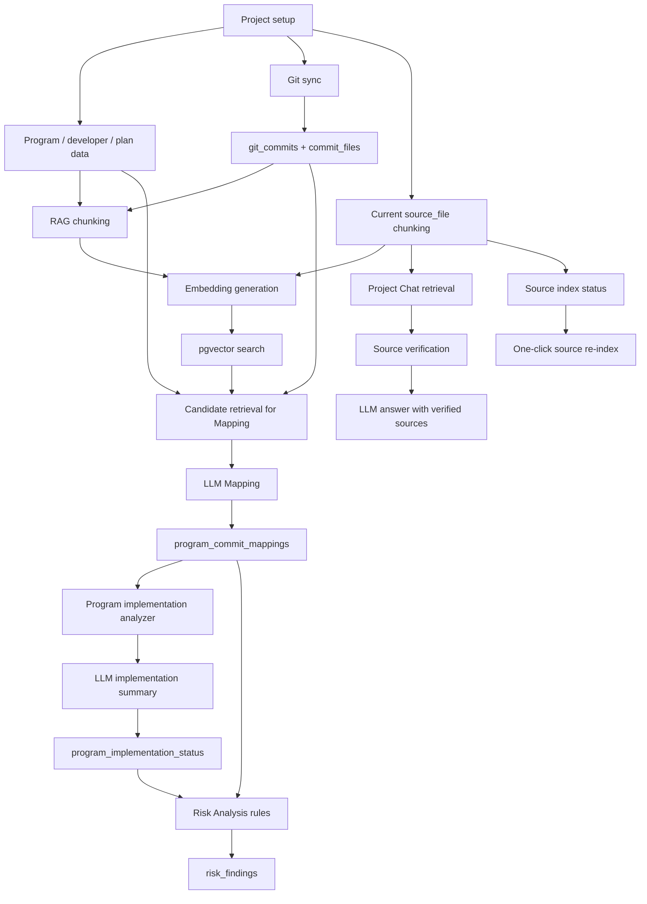

# AI Technical Overview

This document explains how AI is used in AI Commit Advisor from a product and technical perspective.

## Product Positioning

AI Commit Advisor connects development planning data with real Git activity. It helps project leads understand whether planned programs are being implemented, which commits affect which programs, where risks exist, and what the current source code says.

The project uses AI as an assistant for analysis and retrieval, not as an uncontrolled source of truth. Core data remains traceable to programs, commits, files, diffs, source chunks, and stored analysis records.

## AI Capability Map

| Area | AI Usage | Evidence Used | Output |
|---|---|---|---|
| Program-Commit Mapping | LLM compares one commit with candidate programs | Program metadata, commit message, changed files, diff snippets, RAG candidates | Related programs, relevance score, implementation status, reason |
| Program Implementation Status | LLM conservatively estimates implementation state per program | Program plan, related commits, changed files, prior mapping analysis | NOT_STARTED, IN_PROGRESS, COMPLETED, UNKNOWN with evidence commits and Korean verification guidance |
| Project Chat | RAG retrieves current source chunks and LLM answers user questions | Verified `source_file` chunks by default | Chat answer with source citations |
| AI Code Review | LLM reviews working tree, staged changes, latest commit, or selected commit | Git diff and commit message | Summary, risk level, bug findings, refactoring suggestions |
| RAG Search | Embeddings retrieve relevant chunks | Current source, programs, commits, commit_file diffs | Similar chunks with metadata and verification status |
| AI Progress | Compares planned progress with mapping-derived AI progress and saved implementation analysis | Program plan, program_commit_mappings, program_implementation_status | Progress gap, risk flags, implementation analysis summary |
| Risk Analysis | Rule-based analysis using AI-derived mapping/progress evidence | Program plan, related mappings, commits, AI progress | Risk findings and evidence |

## End-to-End AI Flow



## RAG And Project Chat Safety

The most important risk in a source-code chatbot is presenting outdated code as current code. AI Commit Advisor separates evidence types to reduce that risk.

### Source Types

| source_type | Meaning | Used As Current Code? |
|---|---|---|
| `source_file` | Current Git HEAD file content indexed into chunks | Yes, only if verified |
| `program` | Planning/program metadata | No, planning evidence only |
| `commit` | Commit message history | No, historical evidence |
| `commit_file` | File path and diff from a commit | No, historical diff evidence |

Current source indexing includes common text/code assets used by the app and sample projects, including Python, Java, JSP, JavaScript, CSS, Markdown, XML, SQL, JSON, YAML, and configuration files. Binary files, virtual environments, caches, images, and Excel files are excluded.

### Verification States

| State | Meaning | Project Chat Behavior |
|---|---|---|
| `verified` | The indexed source chunk still matches the current file line range and hash | Can be used as current source evidence |
| `stale` | The repository HEAD changed or the file line range content changed | Excluded from current-code answers |
| `invalid` | File, line range, or required metadata is missing | Excluded |
| `historical` | Commit/diff evidence, not current file content | Not treated as current code |

Each `source_file` chunk stores metadata such as:

```json
{
  "file_path": "src/services/risk_service.py",
  "line_start": 120,
  "line_end": 180,
  "content_hash": "...",
  "chunk_content_hash": "...",
  "indexed_head_hash": "...",
  "source_snapshot": "HEAD"
}
```

Before Project Chat uses a retrieved `source_file` chunk, the application checks the current file and line range. If the hash no longer matches, the chunk is marked `stale` and excluded from the answer context.

When no verified current source evidence is available, Project Chat returns an insufficient-evidence answer instead of asking the LLM to guess. The UI separates verified `source_file` evidence from historical/reference evidence such as commits or commit diffs, so deleted or outdated lines are not presented as current code facts.

RAG and Project Chat also show source index status at the project level:

- current Git HEAD
- latest indexed HEAD
- indexed HEAD hash variants
- `source_file` chunk/vector counts
- chunks whose indexed HEAD differs from the current HEAD
- chunks that no longer match the current repository state
- chunks that cannot be verified because the file or metadata is missing

The one-click source refresh rebuilds `source_file` chunks from the current HEAD and then removes chunks/vectors that can no longer be verified. This removes evidence for files that were deleted after a previous indexing run without clearing the old index before a successful rebuild. To avoid overloading local embedding servers, Project Chat does not automatically create embeddings during refresh, and the RAG screen only creates a limited number of embeddings when explicitly selected.

For local LLM/embedding operation, batch execution is intentionally bounded. The RAG screen shows remaining embedding work, the current batch limit, and an estimated runtime before execution so users can split long local runs instead of overloading LM Studio or the workstation.

## LLM Provider Strategy

The project supports a mock provider and OpenAI-compatible local HTTP APIs.

- `LLM_PROVIDER=mock`: deterministic local fallback for development and smoke tests
- `LLM_PROVIDER=local_openai`: local OpenAI-compatible `/chat/completions` endpoint, such as LM Studio
- Embeddings support mock and OpenAI-compatible `/embeddings`

This keeps the app usable without external AI services while allowing real local model integration.

## Traceability

AI outputs are stored with raw or structured evidence where practical.

- `program_commit_mappings.raw_response`: mapping prompt/response metadata
- `program_implementation_status.raw_response`: implementation analysis evidence
- `code_review_results.raw_response`: code review model output
- `document_chunks.raw_metadata`: RAG source metadata and embedding status
- `risk_findings.evidence`: rule evidence used to create risk findings

Manual feedback is also captured in `program_commit_mappings` feedback columns so human corrections can override AI mapping results. The Mapping screen includes a review queue that highlights mappings with missing feedback, unknown status, low relevance, unrelated decisions, or weak reasons so reviewers can prioritize human correction.

## Implementation Status Guardrails

Program implementation status is treated as an estimate for business verification. The prompt tells the LLM to use the program plan, description, related commits, changed files, and existing mapping evidence, but not to decide from commit count alone.

`COMPLETED` should be selected only when the core implementation evidence sufficiently covers the program scope and no clear incomplete signal exists. Commit evidence alone cannot prove deployment, testing, exception handling, screen integration, or production verification. When those items are not visible, they remain in `incomplete_features` as verification items.

AI Progress keeps two concepts separate: AI progress rate is still calculated from `program_commit_mappings`, while saved `program_implementation_status` records are displayed as program-level analysis summaries for review. The saved implementation status does not replace the existing progress-gap or risk calculations.

## Current Limits

- LLM JSON validation is pragmatic parsing, not strict schema validation.
- Project Chat currently keeps chat history in Streamlit session state, not the database.
- RAG quality depends heavily on the embedding model and configured vector dimension.
- Source verification and re-index warnings prevent outdated source chunks from being used as current code evidence, but they do not prove semantic correctness of the LLM answer.
- Commit diffs are historical evidence and may contain deleted lines.

## Suggested Public Summary

AI Commit Advisor is an AI-assisted project analysis tool that links development plans with Git history and current source code. It uses local LLM-compatible APIs, embeddings, pgvector retrieval, source verification, and rule-based risk detection to help teams understand implementation progress, code impact, project risk, and source-level answers with traceable evidence.
