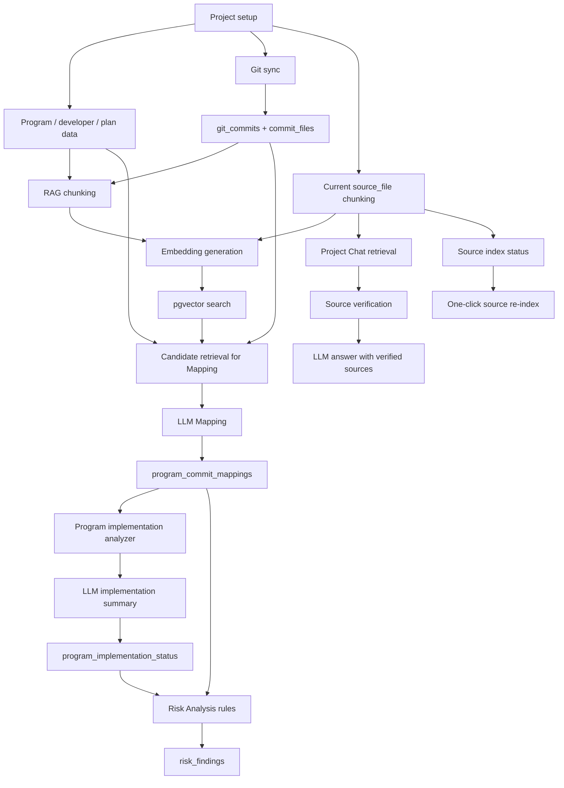

# AI 기술 개요

이 문서는 AI Commit Advisor가 AI를 어떻게 사용하는지 제품 관점과 기술 관점에서 설명합니다.

## 제품 포지셔닝

AI Commit Advisor는 개발계획 데이터와 실제 Git 활동을 연결합니다. 프로젝트 리더가 계획된 program이 구현되고 있는지, 어떤 commit이 어떤 program에 영향을 주는지, risk가 어디에 있는지, 현재 source code가 무엇을 말하는지 파악하도록 돕습니다.

이 프로젝트는 AI를 통제되지 않은 truth source가 아니라 분석과 검색을 보조하는 assistant로 사용합니다. 핵심 데이터는 program, commit, file, diff, source chunk, 저장된 analysis record로 추적 가능해야 합니다.

## AI 기능 맵

| 영역 | AI 사용 방식 | 사용하는 근거 | 출력 |
|---|---|---|---|
| Program-Commit Mapping | LLM이 하나의 commit과 candidate program을 비교 | Program metadata, commit message, changed files, diff snippets, RAG candidates | Related programs, relevance score, implementation status, reason |
| Program Implementation Status | LLM이 program별 구현 상태를 보수적으로 추정 | Program plan, related commits, changed files, prior mapping analysis | NOT_STARTED, IN_PROGRESS, COMPLETED, UNKNOWN, evidence commits, 한국어 검증 안내 |
| Project Chat | RAG가 current source chunk를 검색하고 LLM이 사용자 질문에 답변 | 기본값은 verified `source_file` chunks | 저장된 chat session/message와 source citation이 포함된 answer |
| AI Code Review | LLM이 앱 서버 Git 저장소의 latest commit 또는 selected commit을 중심으로 review. 서버 clone에 local 변경이 있을 때만 working tree/staged changes review 사용 | Git diff and commit message | Summary, risk level, bug findings, refactoring suggestions |
| RAG Search | Embedding으로 관련 chunk 검색 | Current source, programs, commits, commit_file diffs | Metadata와 verification status가 있는 similar chunks |
| AI Progress | 계획 진척도와 mapping-derived AI progress, 저장된 implementation analysis 비교 | Program plan, program_commit_mappings, program_implementation_status | Progress gap, risk flags, implementation analysis summary |
| Risk Analysis | AI-derived mapping/progress evidence를 사용하는 rule-based analysis | Program plan, related mappings, commits, AI progress | Risk findings and evidence |
| Resource Metrics | AI-derived mapping/progress evidence와 Git/Risk/Review record를 계산형 지표로 집계 | Program plan, mappings, commits, diff metadata, risk findings, code review results | Forecast end date, workload score, difficulty score, developer aggregation, PoC value KPI |

## 전체 AI 흐름



## RAG와 Project Chat 안전장치

Source-code chatbot에서 가장 중요한 위험은 오래된 코드를 현재 코드처럼 제시하는 것입니다. AI Commit Advisor는 이 위험을 줄이기 위해 evidence type을 분리합니다.

### Source Type

| source_type | 의미 | Current Code로 사용? |
|---|---|---|
| `source_file` | Current Git HEAD file content를 chunk로 index한 것 | verified일 때만 Yes |
| `program` | Planning/program metadata | No, planning evidence only |
| `commit` | Commit message history | No, historical evidence |
| `commit_file` | Commit의 file path와 diff | No, historical diff evidence |

Current source indexing은 Python, Java, JSP, JavaScript, CSS, Markdown, XML, SQL, JSON, YAML, configuration file 등 앱과 sample project에서 쓰는 일반 text/code asset을 포함합니다. Binary file, virtual environment, cache, image, Excel file은 제외합니다.

### 검증 상태

| State | 의미 | Project Chat 동작 |
|---|---|---|
| `verified` | indexed source chunk가 current file line range와 hash에 여전히 일치 | current source evidence로 사용 가능 |
| `stale` | repository HEAD가 바뀌었거나 file line range content가 바뀜 | current-code answer에서 제외 |
| `invalid` | file, line range, required metadata 누락 | 제외 |
| `historical` | commit/diff evidence이며 current file content가 아님 | current code로 취급하지 않음 |

각 `source_file` chunk는 다음과 같은 metadata를 저장합니다.

```json
{
  "file_path": "src/services/risk_service.py",
  "line_start": 120,
  "line_end": 180,
  "content_hash": "...",
  "chunk_content_hash": "...",
  "indexed_head_hash": "...",
  "source_snapshot": "HEAD"
}
```

Project Chat이 retrieved `source_file` chunk를 사용하기 전에, 애플리케이션은 current file과 line range를 확인합니다. Hash가 더 이상 일치하지 않으면 해당 chunk를 `stale`로 표시하고 answer context에서 제외합니다.

Verified current source evidence가 없으면 Project Chat은 LLM에 추측을 요청하지 않고 insufficient-evidence answer를 반환합니다. UI는 verified `source_file` evidence와 commit 또는 commit diff 같은 historical/reference evidence를 분리해서, 삭제되었거나 오래된 line이 현재 코드 사실처럼 보이지 않게 합니다.

Project standard terms가 등록되어 있으면 Project Chat은 retrieval 전에 한국어 업무 질문을 확장합니다. 이 확장은 deterministic 방식이며 추가 LLM call을 만들지 않습니다. 업로드된 Korean term을 질문에서 찾은 뒤, English term, abbreviation, camelCase, PascalCase, snake_case, upper snake case, compact lowercase, token words 같은 derived identifier form을 additional retrieval query로 사용합니다. 이를 통해 `결제 금액` 같은 SI 용어 질문이 `paymentAmount`, `payment_amount`, `amount`, `PaymentService` 같은 code identifier와 연결됩니다.

Local LLM response는 생성 후 normalize됩니다. fenced `{"response": "..."}` payload 같은 common JSON wrapper는 unwrap되고, answer가 direct source citation을 빠뜨리면 retrieved file path와 line range를 사용해 verified `source_file` metadata citation을 덧붙입니다.

Project Chat 대화는 `project_chat_sessions`와 `project_chat_messages`에 저장됩니다. Session은 project별 대화 묶음과 제목, 마지막 메시지 시각을 보관하고, message는 user/assistant role, content, retrieved sources, expanded queries, matched standard terms, insufficient-evidence flag, excluded/used source count를 보관합니다. 이 저장 구조는 Streamlit session이 종료되어도 프로젝트별 질문 이력과 답변 근거를 다시 확인하기 위한 것입니다.

Assistant message의 source metadata는 copy-friendly Markdown export로 변환할 수 있습니다. Export는 답변 본문, verified current source evidence, historical/reference evidence를 분리해서 회의록, 리뷰 기록, 이슈 설명에 붙여 넣을 수 있게 합니다.

RAG와 Project Chat은 project level에서 source index status도 보여줍니다.

- current Git HEAD
- latest indexed HEAD
- indexed HEAD hash variants
- `source_file` chunk/vector counts
- indexed HEAD가 current HEAD와 다른 chunk
- current repository state와 더 이상 일치하지 않는 chunk
- file 또는 metadata가 없어 verify할 수 없는 chunk

Source index refresh는 두 가지 경로로 나뉩니다.

| 경로 | 입력 | 처리 | Project Chat 의미 |
|---|---|---|---|
| 증분 source indexing | 최근 indexed HEAD 이후 Git Sync가 저장한 `CommitFile` changed path | 변경된 path만 chunk 교체/삭제, 새 chunk는 `embedding_status=pending` | 최신 sync 변경분을 빠르게 current source 후보로 반영 |
| 전체 source re-indexing | 현재 repository tree와 source include/exclude rule | source-like file 전체 scan, stale/invalid chunk cleanup | 최초 구축, 복구, branch/rule 변경 시 current source 기준 재구축 |

증분 source indexing은 `src/rag/source_index_service.py::refresh_changed_source_files`가 담당합니다. 이 service는 `Added`, `Modified`, `Copied` file을 단일 파일 단위로 다시 chunking하고, `Deleted` file의 chunk/vector를 제거하며, `Renamed` file은 old path 제거 후 new path를 새로 chunking합니다. 이 경로는 repository 전체를 scan하지 않으므로 대형 SI repository에서 일반 commit sync 후 사용할 수 있습니다.

증분 indexing과 Project Chat source refresh는 embedding을 자동 생성하지 않습니다. 새 chunk는 pending 상태로 남고, `RAG 검색 > 검색 준비`에서 현재 embedding model 기준 missing vector만 제한 수량으로 생성합니다. 이 분리는 cloud embedding 과금과 local LM Studio CPU/GPU 부하를 사용자가 통제하기 위한 안전장치입니다.

One-click full source refresh는 current HEAD에서 `source_file` chunk를 다시 만들고, 더 이상 verify할 수 없는 chunk/vector를 제거합니다. 이를 통해 이전 indexing run 뒤 삭제된 file의 evidence가 남는 문제를 줄입니다. Local embedding server 과부하를 피하기 위해 Project Chat refresh는 embedding을 자동 생성하지 않고, RAG 화면도 사용자가 명시적으로 선택한 경우 제한된 수량만 embedding을 생성합니다.

Local LLM/embedding 운영에서는 batch execution을 의도적으로 제한합니다. RAG 화면은 실행 전에 남은 embedding work, current batch limit, estimated runtime을 보여주므로 사용자가 LM Studio나 workstation에 과부하를 주지 않고 긴 local run을 나눠 실행할 수 있습니다.

## LLM Provider 전략

프로젝트는 mock provider와 OpenAI-compatible local HTTP API를 지원합니다.

- `LLM_PROVIDER=mock`: development와 smoke test용 deterministic local fallback
- `LLM_PROVIDER=local_openai`: LM Studio 같은 local OpenAI-compatible `/chat/completions` endpoint
- Embedding은 mock과 OpenAI-compatible `/embeddings`를 지원

이 구조는 외부 AI service 없이도 앱을 사용할 수 있게 하면서, 실제 local model integration도 허용합니다.

## 추적성

AI output은 가능한 경우 raw 또는 structured evidence와 함께 저장됩니다.

- `program_commit_mappings.raw_response`: mapping prompt/response metadata
- `program_implementation_status.raw_response`: implementation analysis evidence
- `code_review_results.raw_response`: code review model output
- `project_chat_messages.sources`: Project Chat retrieval evidence and citation export source
- `project_chat_messages.expanded_queries`, `matched_terms`: Korean query expansion trace
- `document_chunks.raw_metadata`: RAG source metadata and embedding status
- `risk_findings.evidence`: risk finding 생성에 사용한 rule evidence

Manual feedback도 `program_commit_mappings` feedback column에 저장되어 사람이 AI mapping result를 보정할 수 있습니다. Mapping 화면에는 missing feedback, unknown status, low relevance, unrelated decision, weak reason을 가진 mapping을 강조하는 review queue가 있어 reviewer가 human correction 우선순위를 정할 수 있습니다.

Commit-based Mapping은 LLM이 요구한 JSON shape을 지키지 못하더라도 전체 batch를 실패로 끝내지 않습니다. 후보 프로그램과 commit message, changed file path, diff snippet의 token similarity로 보수적인 fallback mapping을 만들고, fallback 사용 사실을 `raw_response`와 reason에 남깁니다. 이 fallback은 AI 판단을 대체하는 확정 근거가 아니라 demo와 운영 검증에서 한 commit의 malformed response가 downstream Risk Analysis, AI Progress, screenshot verification 전체를 막지 않게 하는 안전장치입니다.

## 구현상태 분석 안전장치

Program implementation status는 업무 검증을 위한 추정값으로 취급합니다. Prompt는 LLM에게 program plan, description, related commits, changed files, existing mapping evidence를 사용하라고 지시하지만, commit count만으로 판단하지 않도록 합니다.

`COMPLETED`는 core implementation evidence가 program scope를 충분히 덮고 명확한 incomplete signal이 없을 때만 선택해야 합니다. Commit evidence만으로는 deployment, testing, exception handling, screen integration, production verification을 증명할 수 없습니다. 이런 항목이 보이지 않으면 `incomplete_features`에 verification item으로 남습니다.

AI Progress는 두 개념을 분리합니다. AI progress rate는 여전히 `program_commit_mappings`에서 계산하고, 저장된 `program_implementation_status` record는 review용 program-level analysis summary로 표시합니다. 저장된 implementation status는 기존 progress-gap 또는 risk calculation을 대체하지 않습니다.

## 자원관리 metric

`resource_metrics_service.py`는 AX 자원관리 기능을 위한 metric layer입니다. 이 layer는 새 LLM 판단을 만들지 않고, 이미 저장된 Mapping, AI Progress 근거, Git commit/file/diff metadata, unresolved risk, AI Code Review 실행 기록을 조합합니다. 계산 결과는 Dashboard의 자원관리 지표와 Risk Analysis의 `FORECAST_DELAY` 리스크에서 사용되며, 사용자가 저장한 기준 시점은 `resource_metric_snapshots`에 보관됩니다.

주요 산출물:

- 프로그램별 난이도 점수: 관련 commit 수, 변경 파일 수, diff line 수, touched area 수, 여러 프로그램에 걸친 commit 수, unresolved risk 수를 합산합니다.
- 프로그램별 업무량 근거: 미완료 여부, 계획 대비 AI 진척도 차이, unresolved risk, 난이도 점수를 사용합니다.
- 프로그램별 예상 종료 상태: 계획 시작/종료일, AI 진척도, 관련 commit 수를 사용해 예상 종료일, 예상 지연일, 신뢰도를 계산합니다. 예상 지연일이 7일 이상이면 `DELAY_EXPECTED`로 표시하고 Risk Analysis는 `FORECAST_DELAY` 리스크를 저장합니다.
- 개발자별 집계: 담당 프로그램 기준으로 업무량, 미완료 프로그램 수, 리스크 프로그램 수, 평균 계획/AI 진척도, 평균 난이도를 계산합니다.
- PoC 고객가치 KPI: HIGH risk 노출, 예상 지연 프로그램, AI Code Review 실행 기록을 기반으로 리뷰 시간 절감 가능성과 추가 투입 예방 가능성을 계산합니다. 이 값은 확정 비용 절감액이 아니라 PoC 가정으로 산출한 의사결정 보조 추정값입니다.
- 저장형 snapshot: PL이 Dashboard에서 현재 지표를 저장하면 핵심 KPI와 raw summary를 함께 보관해 이후 추세 차트와 테이블에서 비교합니다.

이 지표는 planning signal입니다. 현재 화면의 값은 조회 시점 계산 결과이고, 저장된 snapshot은 사용자가 기준 시점을 남긴 기록입니다. 따라서 "업무 난이도"나 "업무량"은 코드와 산출물에서 관측 가능한 신호를 요약한 값이지, 개발자 개인의 실제 역량이나 성과를 확정하는 AI 판단이 아닙니다. 예상 종료일도 일정 관리 보조 신호이며, 계획 변경·배포 범위·테스트 완료 여부는 PL이 함께 검토해야 합니다.

## 현재 한계

- LLM JSON validation은 strict schema validation이 아니라 pragmatic parsing이며, commit-based Mapping은 JSON 파싱 실패 시 token-similarity fallback을 사용합니다.
- RAG 품질은 embedding model과 configured vector dimension에 크게 의존합니다.
- Source verification과 re-index warning은 outdated source chunk가 current code evidence로 쓰이는 것을 막지만, LLM answer의 semantic correctness를 증명하지는 않습니다.
- Commit diff는 historical evidence이며 deleted line을 포함할 수 있습니다.
- Resource Metrics snapshot은 사용자가 저장한 시점만 남깁니다. 자동 배치나 webhook 기반 주기 저장은 아직 제공하지 않습니다.

## 공개 소개 요약

AI Commit Advisor는 개발계획, Git history, current source code를 연결하는 AI-assisted project analysis tool입니다. Local LLM-compatible API, embedding, pgvector retrieval, source verification, rule-based risk detection을 사용해 팀이 implementation progress, code impact, project risk, source-level answer를 traceable evidence와 함께 이해하도록 돕습니다.
