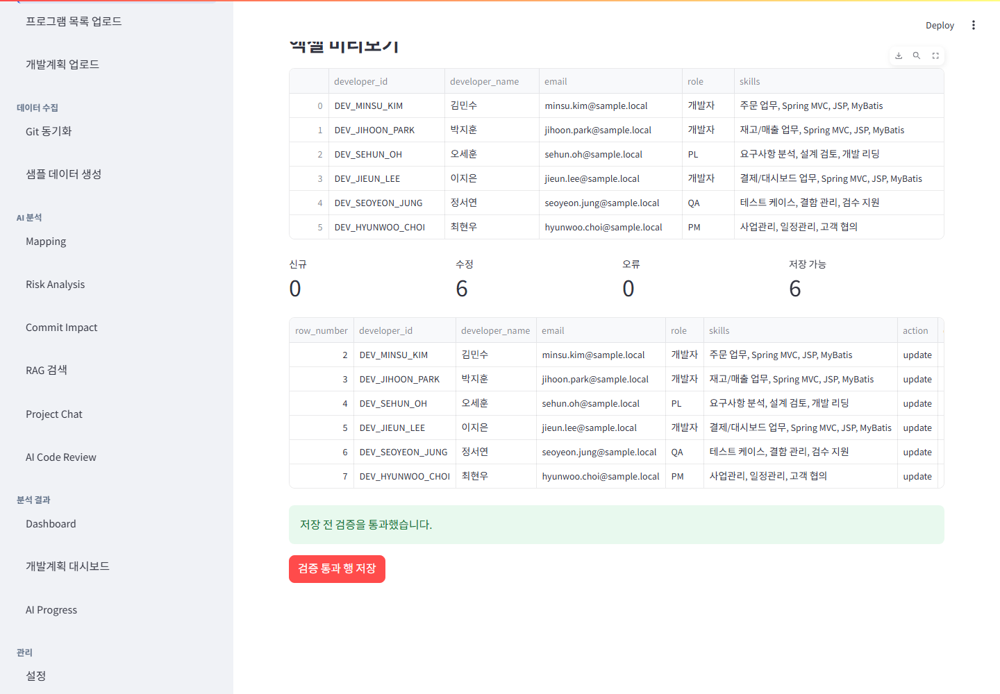
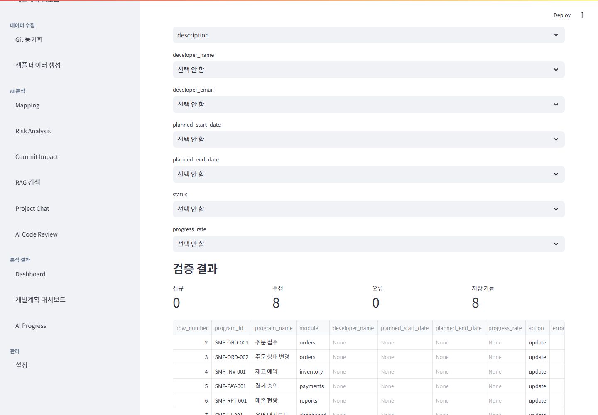
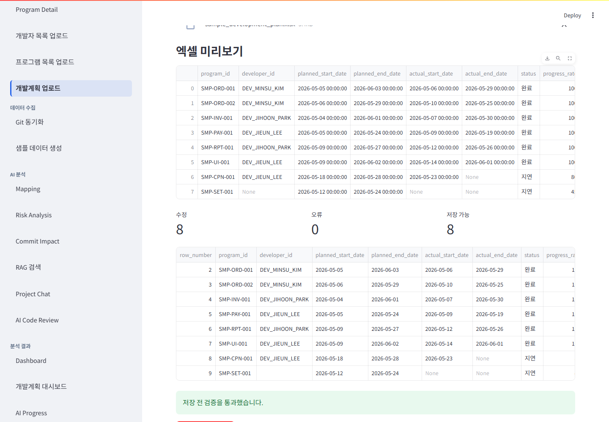
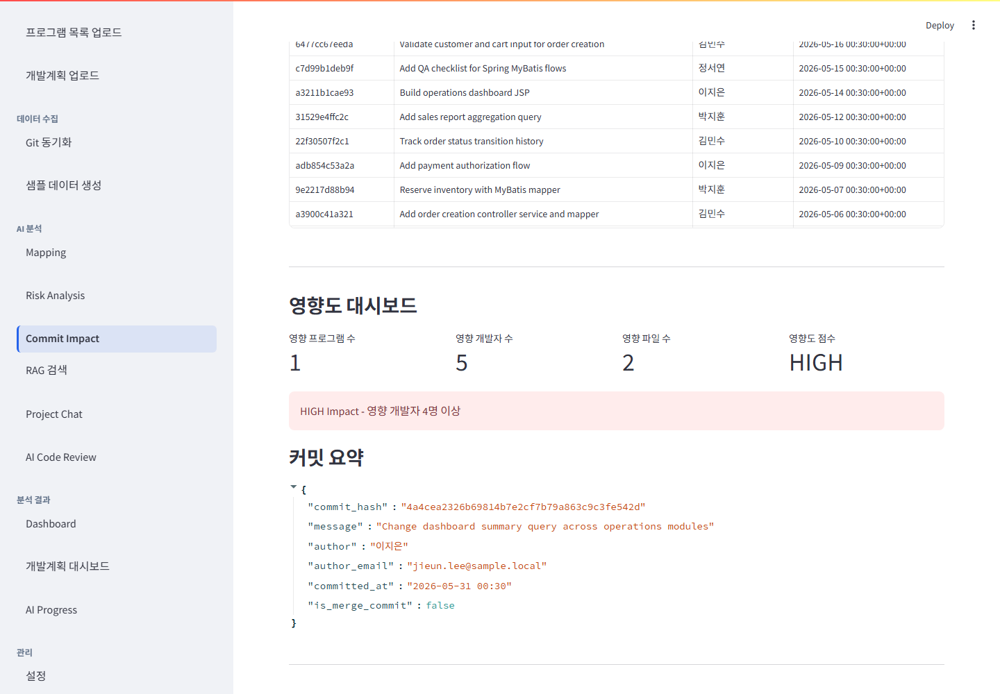
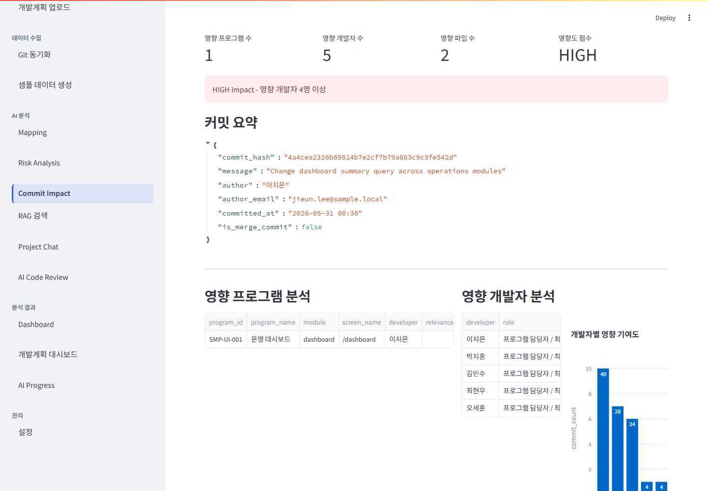
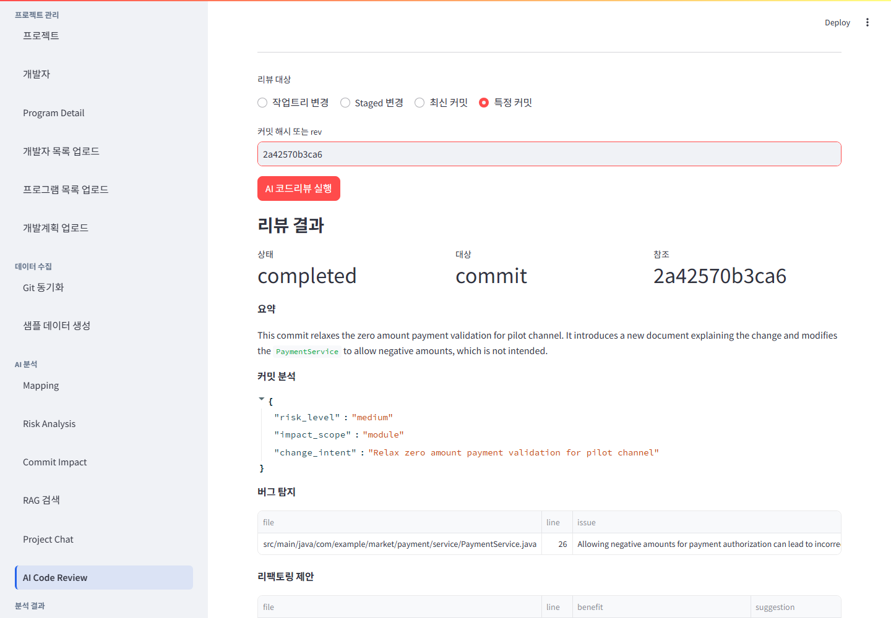
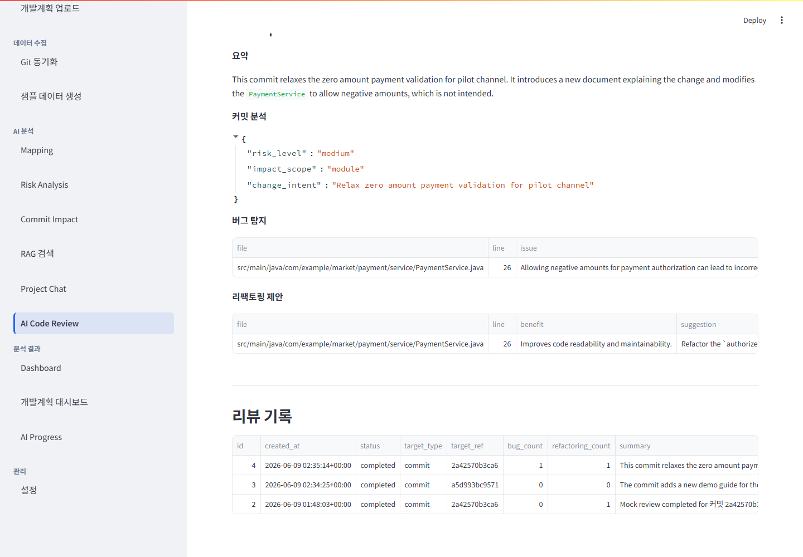

# Application Preview

이 문서는 README를 가볍게 유지하기 위해 주요 화면과 기능 상태를 미리 볼 수 있도록 정리한 Application Preview입니다. 캡처는 48개 commit 샘플 프로젝트 `AAA Sample Shop Rich Demo 48` 기준의 의미 있는 workflow 상태를 우선합니다.

## Preview Screens

Home

개발계획, Git 변경 이력, AI 매핑 결과, 리스크를 통합해 분석 상태를 확인하는 관제 화면입니다. 사이드바는 업무 영역 중메뉴와 하위 메뉴의 크기 차이로 현재 작업 흐름을 훑기 쉽게 보여주며, 본문에는 분석 파이프라인 상태와 다음 권장 작업을 함께 표시합니다.

Project

개발자 현황

Program Detail

개발자 목록

현재 개발자 데이터

업로드 검증 결과

프로그램 목록

현재 프로그램 데이터

업로드 검증 결과

개발계획

현재 개발계획

업로드 검증 결과

Git 동기화

Git History

현재 프로젝트의 커밋 목록, 작성자/날짜/파일 필터, 변경 파일, 저장된 diff preview를 한 화면에서 확인하는 Git History 상태입니다.

커밋 목록과 활동 그래프

커밋 상세와 diff preview

샘플 데이터 생성

표준용어/표준단어

Mapping

Risk Analysis

Commit Impact

커밋 선택

영향도 요약

상세 분석

RAG 검색

Project Chat

정리된 대화 관리 영역, 저장된 대화 선택, 현재 소스 근거가 포함된 답변, 근거 복사용 Markdown을 함께 보여주는 Project Chat 상태입니다.

AI Code Review

커밋 이력 중심 리뷰 대상 선택

리뷰 결과 요약

리뷰 상세

Dashboard

프로젝트 계획/AI/Git 활동 요약과 함께 개발자별 업무량·난이도, 예상 지연 프로그램, PoC 고객가치 KPI를 확인하는 운영 대시보드입니다. 자원관리 지표는 개인 성과 확정값이 아니라 PL이 병목과 일정 리스크를 먼저 볼 수 있도록 돕는 planning signal이며, 사용자가 저장한 snapshot으로 추세 분석을 확인할 수 있습니다.

개발계획 대시보드

AI Progress

설정

