# Application Preview

이 문서는 README를 가볍게 유지하기 위해 주요 화면과 기능 상태를 미리 볼 수 있도록 정리한 Application Preview입니다. 캡처는 샘플 프로젝트 기준의 의미 있는 workflow 상태를 우선합니다.

## Preview Screens

### Home

개발계획, Git 변경 이력, AI 매핑 결과, 리스크를 통합해 현재 프로젝트의 핵심 지표와 다음 권장 작업을 먼저 확인하는 관제 화면입니다. 프로젝트/Git/프로그램/Mapping/소스 근거/검색 준비/Knowledge Graph 중 비어 있는 준비 상태가 있으면 현재 값, 다음 조치, 이동할 화면을 같이 보여줍니다. 사이드바는 업무 영역을 접이식 그룹으로 묶어 현재 작업 흐름을 훑기 쉽게 보여주며, 본문에는 분석 파이프라인 상태도 함께 표시합니다.

### Dashboard

Dashboard는 프로젝트 진행 상황을 한눈에 보는 화면입니다. 계획, AI 분석, Git 활동을 모아 지연 가능성이 있는 프로그램과 개발자별 업무 부담 신호를 보여줍니다. `AI Resource Radar`는 PL이 먼저 확인할 프로그램, 주요 이유, 권장 action을 우선순위로 보여주고, 필요하면 LLM 기반 PL Briefing으로 회의용 요약을 생성합니다. 이 값은 개인 평가나 확정 절감액이 아니라 PL이 병목과 일정 리스크를 빨리 찾기 위한 참고 지표입니다. 필요하면 현재 상태를 snapshot으로 저장해 추세를 비교할 수 있습니다.

프로젝트 현황과 Git 활동

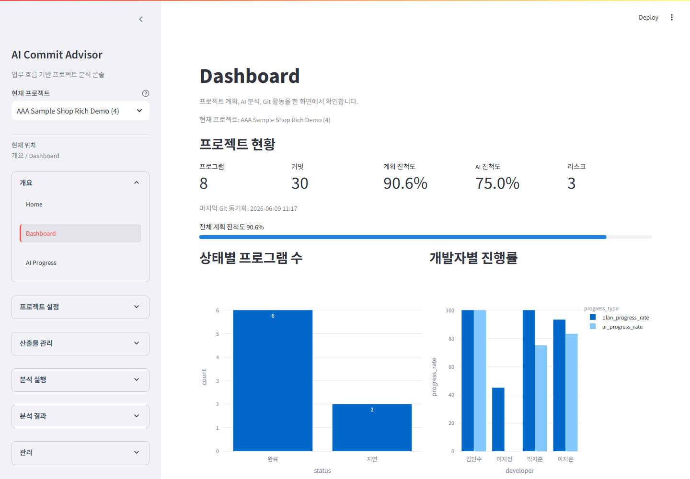

AI Resource Radar 우선순위와 PL Briefing action

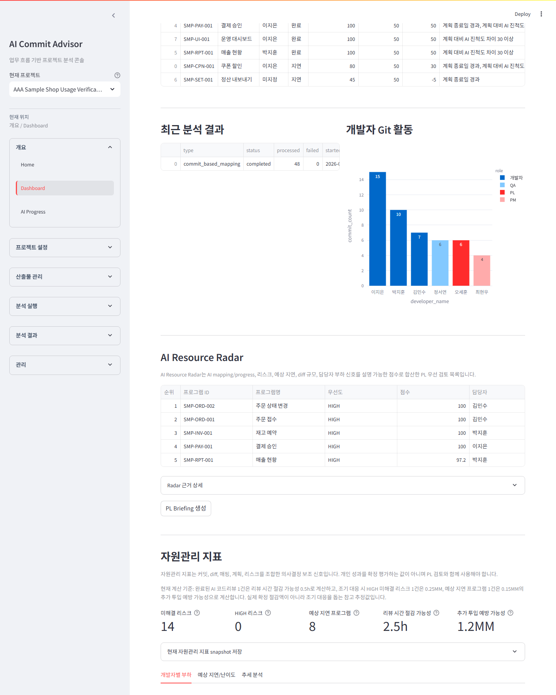

local LLM이 생성하고 저장한 PL Briefing 결과

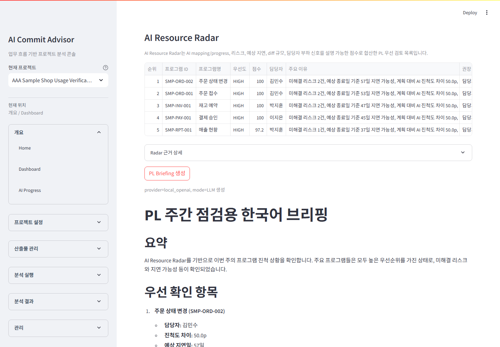

PL Briefing 회의 질문, 다음 action, 이력 확인

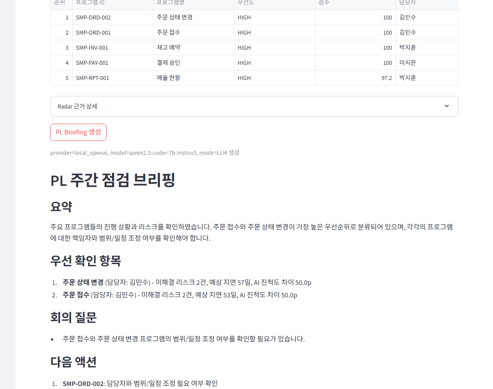

자원관리 참고 지표

### AI Progress

진척도 요약과 리스크 프로그램

프로그램별 비교와 관련 커밋 상세

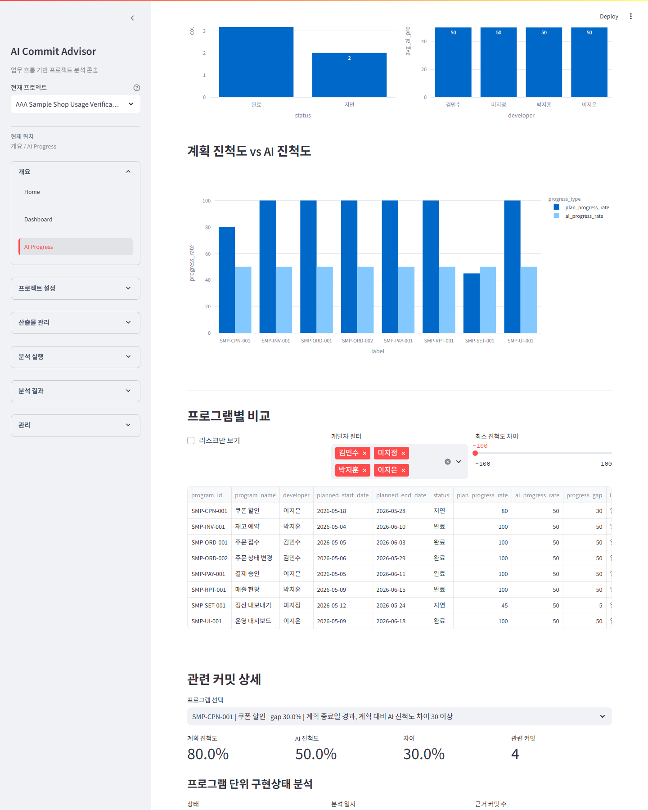

### AI 운영 현황

연결된 LLM/embedding/Neo4j 설정, Knowledge Graph 최신성, Project Chat GraphRAG 준비 상태, 최근 AI 호출, 검색 준비 상태를 먼저 확인하고 필요한 AI 실행을 바로 시작하는 화면입니다. 준비 상태와 프로젝트 AI 품질 점검은 요약 지표와 `주의/실패 우선 확인` 영역으로 먼저 보여주며, Mapping 품질 신호, Project Chat 근거 사용률, PL Briefing validation/fallback, AI Code Review 결과, Knowledge Graph 신선도를 같은 화면에서 추적할 수 있습니다. `주간 보고서` 탭은 Radar, 리스크, AI Progress gap, Knowledge Graph impact path, Project Chat GraphRAG 사용 metadata를 Markdown으로 묶고, `실제 LLM 검증` 탭에서는 mock이 아닌 local provider로 실행한 최근 기능 범위와 fallback/failed 여부를 확인합니다.

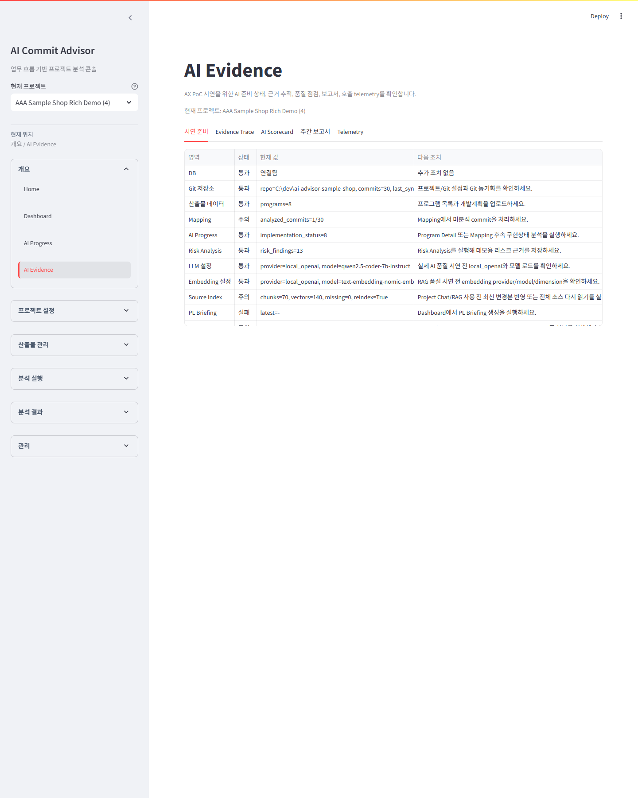

### Project

프로젝트 기본 정보와 앱 서버 Git 저장소 경로를 저장하고, 같은 화면에서 서버 저장소 준비와 반복 검증용 분석 데이터 초기화를 이어서 실행할 수 있습니다.

서버 저장소 상태, `서버 저장소 clone/fetch`, `분석 데이터 초기화`, `프로젝트 삭제`가 함께 보이는 운영 action 구간입니다.

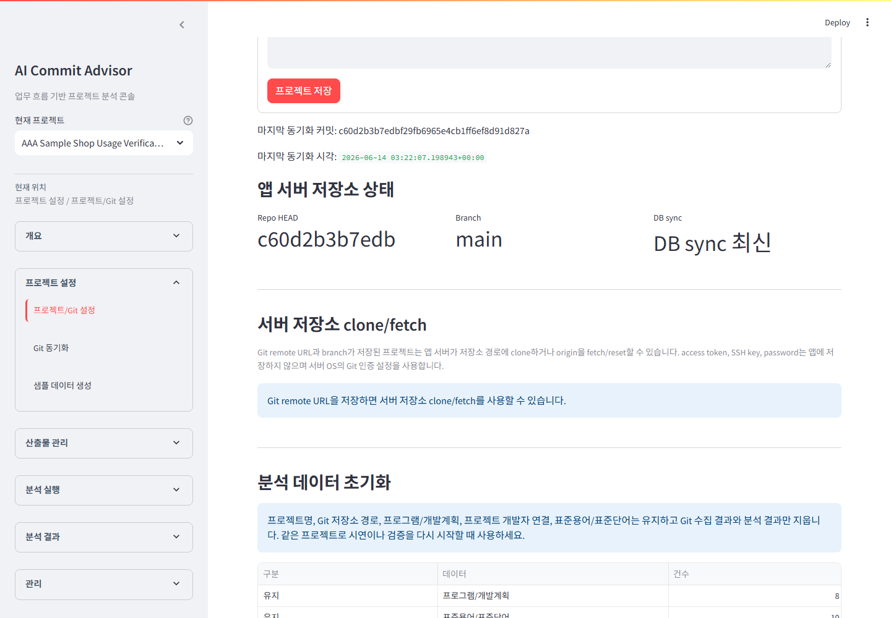

### Git 동기화

앱 서버 Git 저장소 상태와 DB 동기화 상태를 확인하고, Git Sync 이후 현재 소스 근거·검색 준비·Mapping·Risk Analysis·Knowledge Graph 갱신 순서를 이어서 확인하는 화면입니다.

### 샘플 데이터 생성

### 개발자 현황

### 개발자 목록

현재 개발자 데이터

### 프로그램 목록

현재 프로그램 데이터

### 개발계획

현재 개발계획

### 표준용어/표준단어

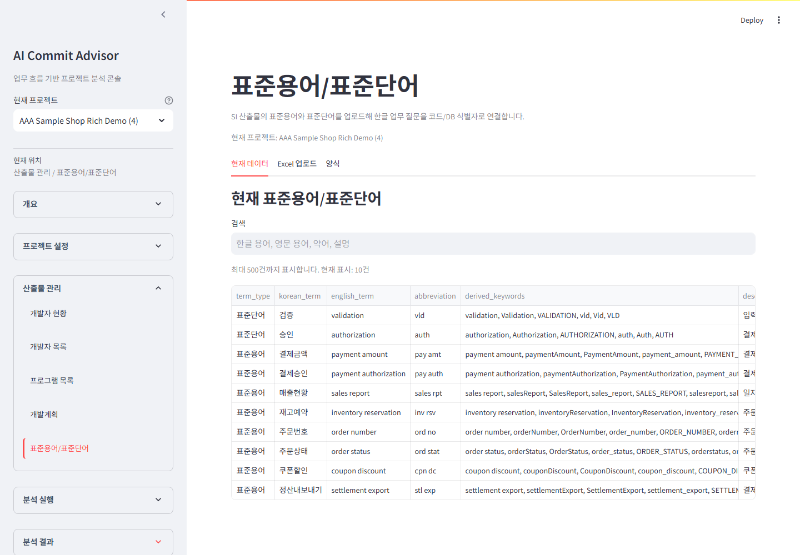

### Mapping

### Risk Analysis

리스크 요약과 유형별 현황

리스크 목록과 resolved 처리

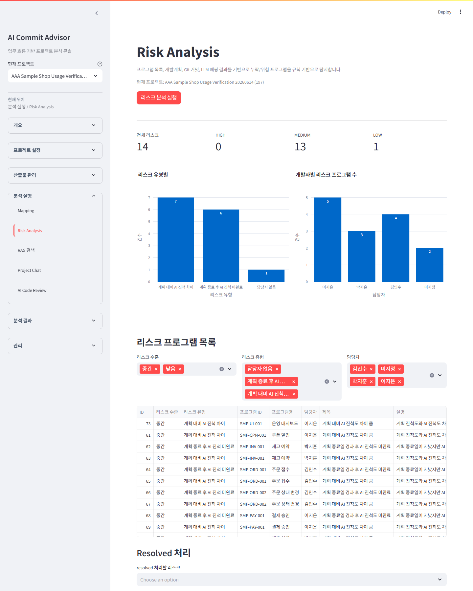

### RAG 검색

근거 조각과 검색 데이터 준비 상태, 검색 품질 확인 결과, 조회된 근거 목록을 함께 보여주는 RAG 검색 상태입니다. `TOP K`, 근거 조각 크기, 검색 준비 수량처럼 판단이 필요한 control은 물음표 도움말로 의미와 사용 기준을 확인할 수 있습니다.

검색 준비와 품질 확인

조회된 근거 목록

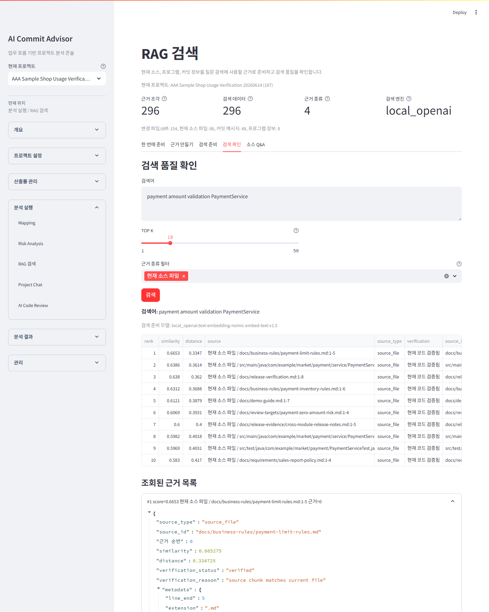

### Project Chat

답변 근거 상태에서 소스 근거, 검색 준비, 코드 반영 상태를 확인하고, 최신 변경분 반영과 전체 소스 다시 읽기 중 필요한 작업을 바로 선택할 수 있는 Project Chat 상태입니다. 실제 답변에는 provider/model/fallback 상태가 함께 표시되어 local LLM 결과인지 확인할 수 있습니다. Neo4j graph가 준비된 프로젝트에서는 답변 아래에서 소스 근거와 그래프 관계 근거를 분리해 확인할 수 있습니다. `TOP K`, 커밋 이력 참고, 저장된 대화, 새 대화 시작은 물음표 도움말로 동작을 확인할 수 있습니다.

답변 근거 상태와 대화 관리

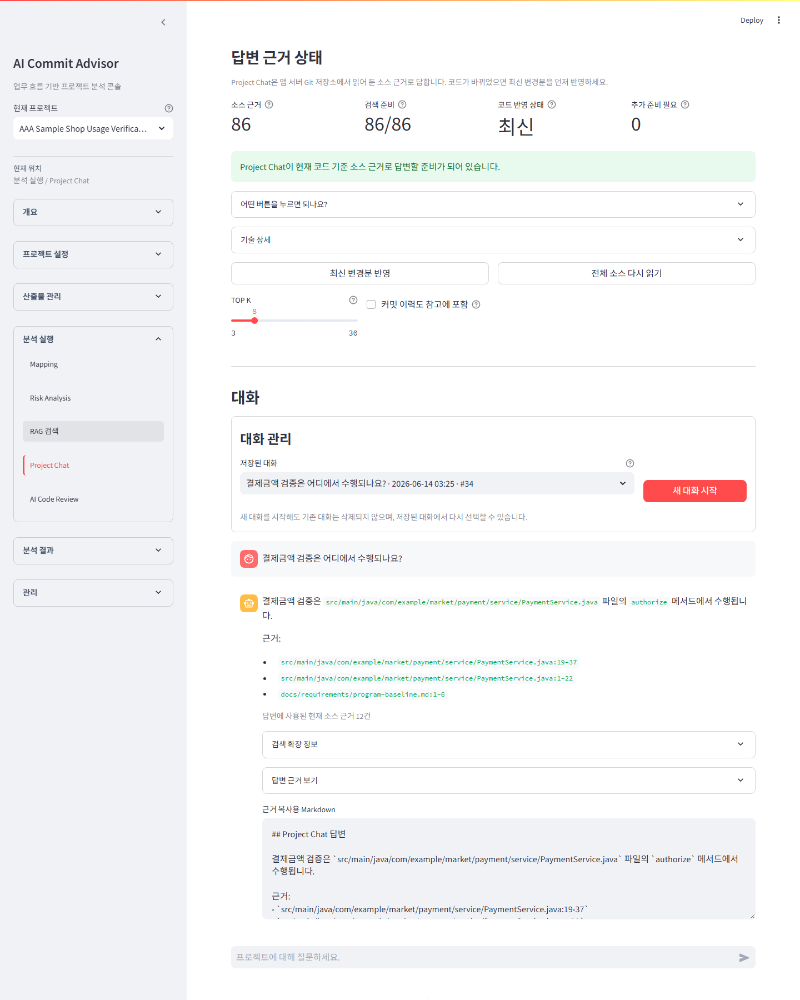

답변과 근거 파일

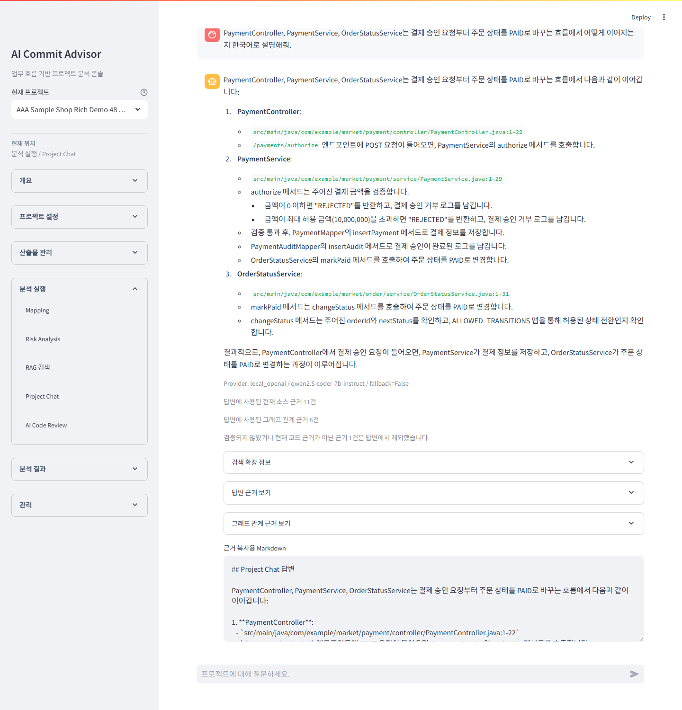

Neo4j Knowledge Graph가 최신이면 Project Chat 답변 아래에서 그래프 관계 근거를 따로 펼쳐 볼 수 있습니다. 이 예시는 실제 local LLM으로 아래 질문을 다시 실행한 상태입니다.

질문: `반드시 한국어로만 답해줘. 결제 승인 흐름을 PaymentController, PaymentService, OrderStatusService, OrderStatusMapper 순서로 설명해줘. 각 단계에서 authorize, markPaid, updateStatus, insertStatusHistory가 어디서 호출되는지와 관련 프로그램/커밋/파일 GraphRAG 근거를 함께 설명해줘.`

`GraphRAG 관계도`와 기본 관계 표는 class import 관계와 program-commit-file-class 영향 경로를 함께 보여주되, 같은 소스 대상을 가리키는 file/class 노드는 그래프에서 접어 보여줍니다. 단독 덩어리처럼 보이기 쉬운 `domain_summary`는 필요할 때 `원본 메타데이터 표시`에서 확인합니다.

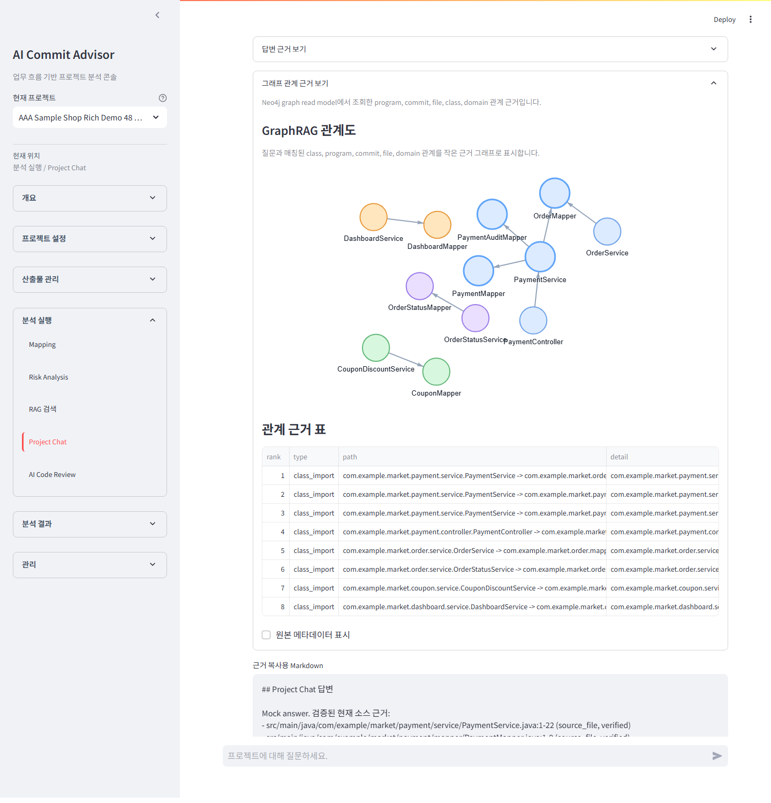

### AI Code Review

샘플 프로젝트의 결제 검증 완화 커밋을 `local_openai` provider로 실제 리뷰한 결과입니다. 화면은 특정 커밋의 상태, provider/model, 영향 범위, 위험도, 버그 후보, 권장 수정, 리팩토링 제안을 함께 보여줘 AI Code Review가 단순 실행 버튼이 아니라 실제 local LLM 검토 근거를 남기는 흐름임을 확인할 수 있습니다.

AI Code Review를 직접 확인할 때는 아래 커밋을 selected commit으로 리뷰하면 결과 차이를 보기 좋습니다.

| 용도 | Commit | 기대 리뷰 포인트 |
|---|---|---|
| high-risk bug 후보 | `2325182 Relax partner payment validation for pilot channel` | `amount == 0` 허용이 결제 승인과 `orderStatusService.markPaid(orderId)` 흐름으로 이어질 수 있는지 확인 |
| 금액 한도 방어 | `5999f24 Reject excessive payment amount requests` | 단일 결제 한도 방어와 기존 금액 검증과의 경계 확인 |
| cross-module 집계 회귀 | `7e5e41 Change dashboard summary query across operations modules` | 여러 module join이 운영 지표를 과대 집계할 가능성 확인 |
| 회귀 수정 비교 | `95562a1 Fix dashboard summary over-counting` | 이전 집계 위험을 줄이는 수정인지, 테스트 근거가 충분한지 확인 |
| partial feature 확인 | `3cb54de Add coupon mapper draft without policy enforcement` | mapper/source는 생겼지만 정책 검증이 없어 완료 기능처럼 보기 어려운 점 확인 |

### Program Detail

기본 정보와 관련 커밋 요약

저장된 리스크와 구현상태 분석 상세

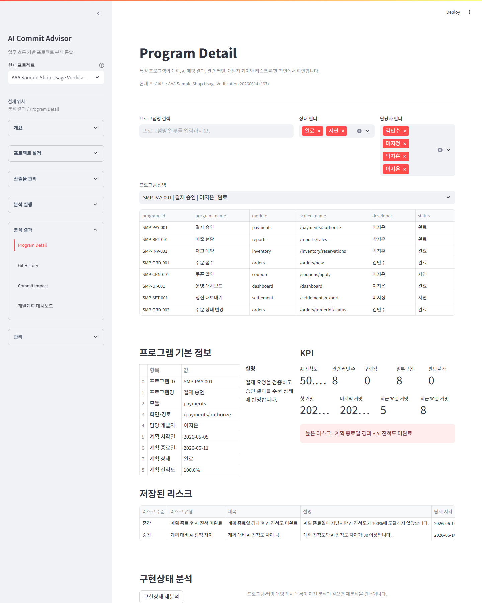

### Git History

현재 프로젝트의 커밋 목록, 작성자/날짜/파일 필터, 변경 파일, 저장된 diff preview를 한 화면에서 확인하는 Git History 상태입니다.

커밋 목록과 활동 그래프

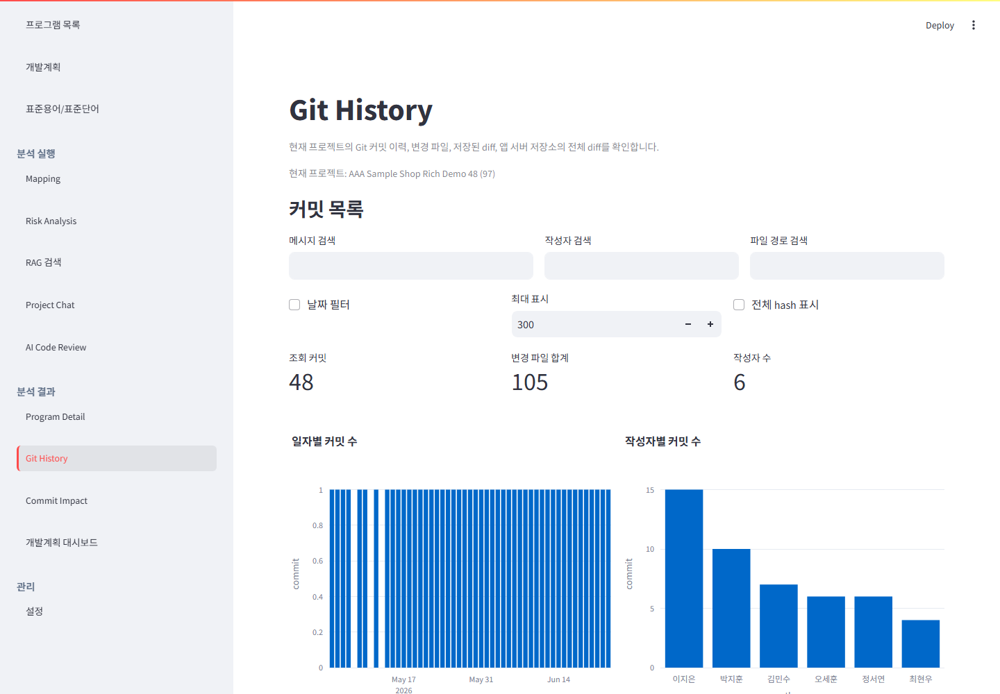

커밋 상세와 diff preview

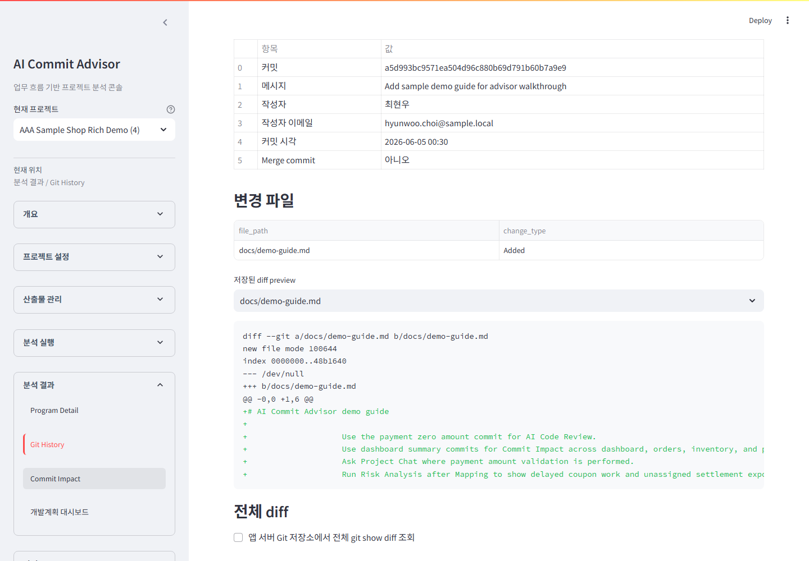

### Commit Impact

커밋 선택과 영향도 요약

### Knowledge Graph

프로젝트, 프로그램, 커밋, 파일, 클래스, 도메인을 Neo4j 관계 그래프로 동기화한 상태입니다. 화면 상단에서 Neo4j 연결, 사용 설정, Graph HEAD 최신성을 확인하고, `최신 변경분만 Neo4j 반영` 또는 `전체 재동기화` 실행 결과와 Neo4j에서 다시 조회한 저장 node/edge 수를 확인합니다. 아래 탭에서는 선택 node 주변 관계, 클래스 관계도, 커밋-프로그램-클래스 영향 경로, node/edge 저장 상태를 Neo4j에 저장된 그래프 기준으로 이어서 볼 수 있습니다.

Neo4j 연결, 동기화, 저장 확인

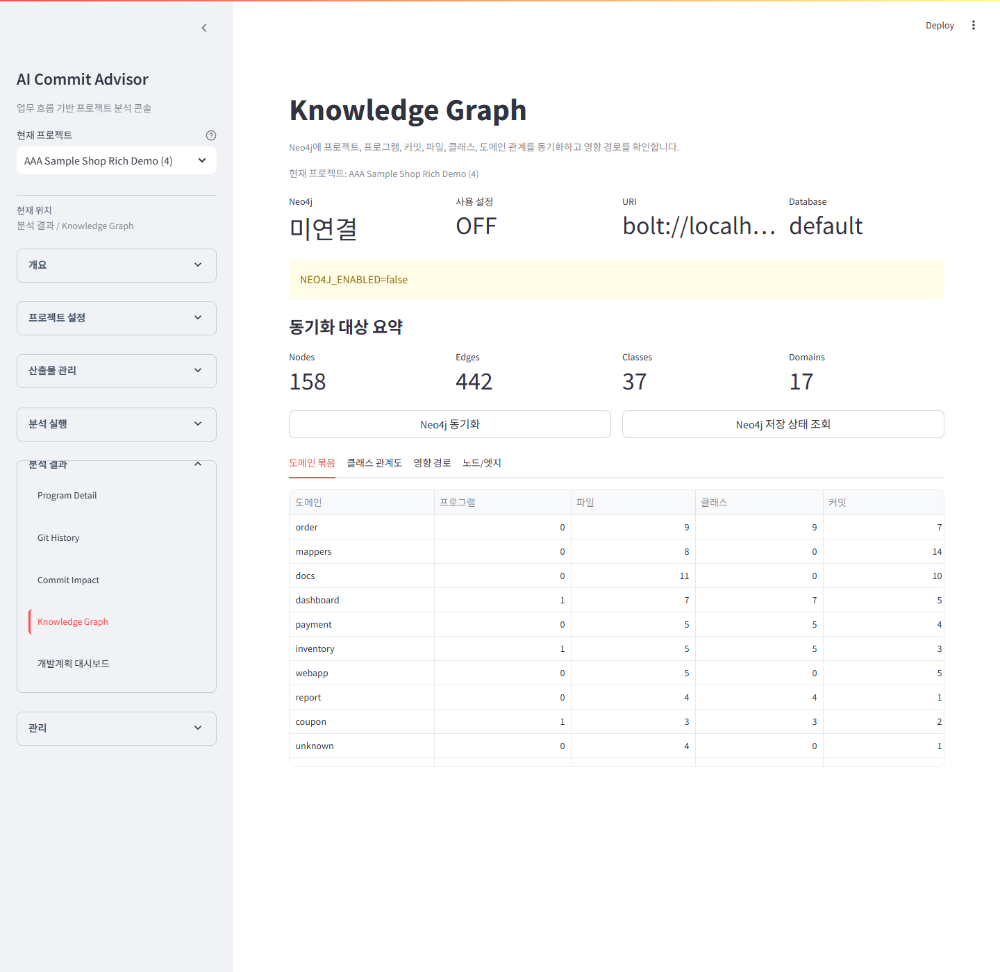

클래스 관계도

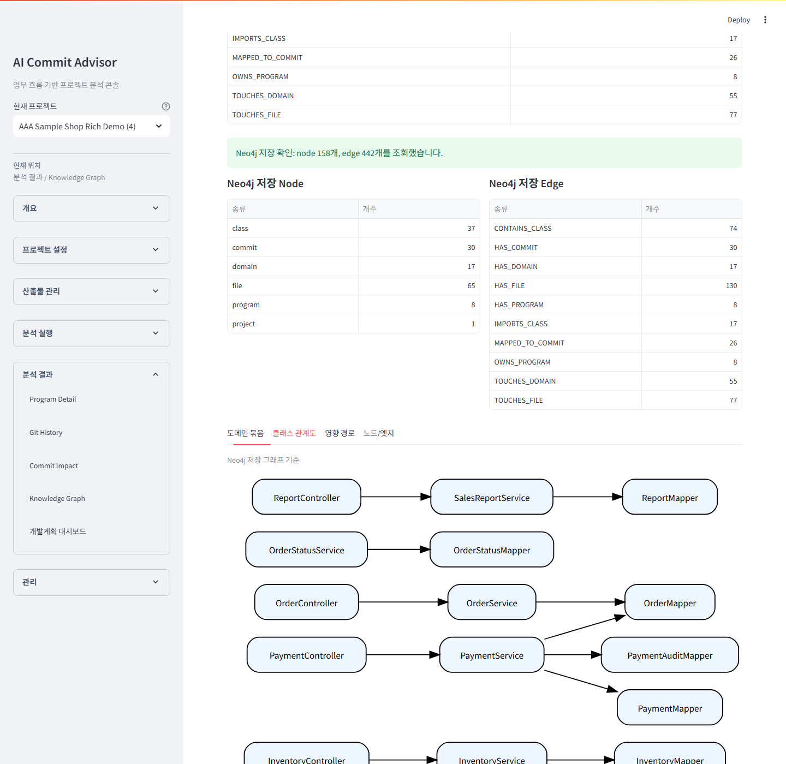

커밋 영향 경로

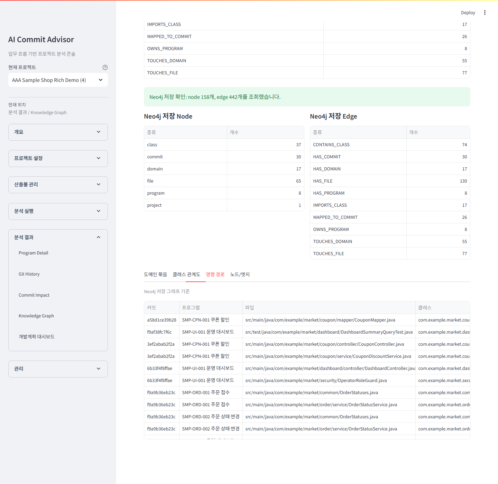

노드/엣지 저장 상태

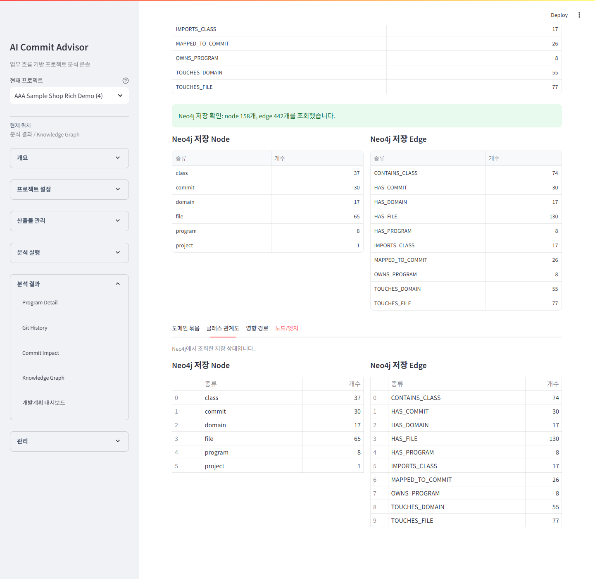

### 개발계획 대시보드

### 설정

