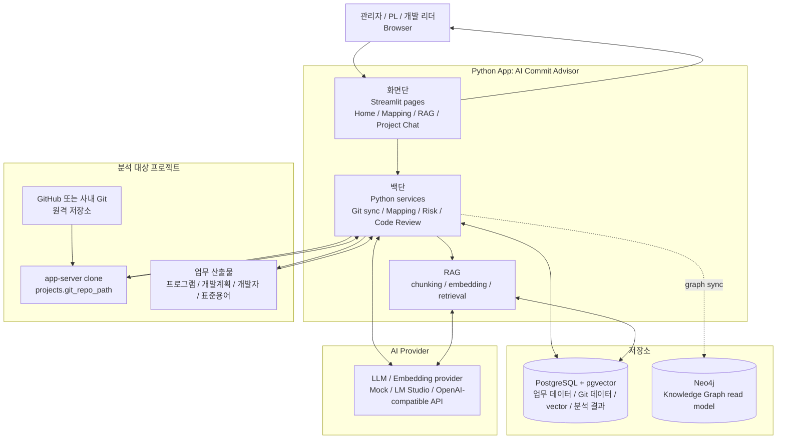
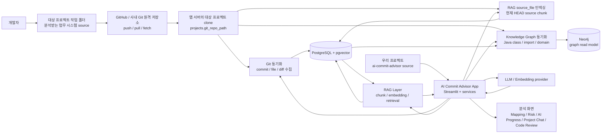
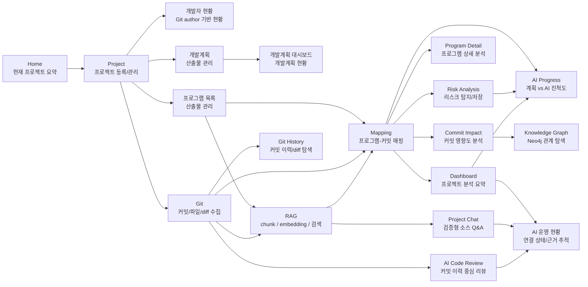
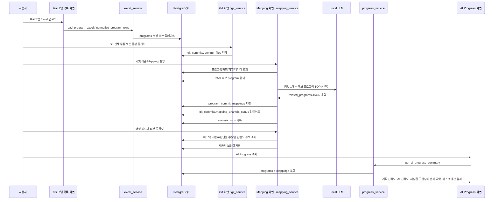
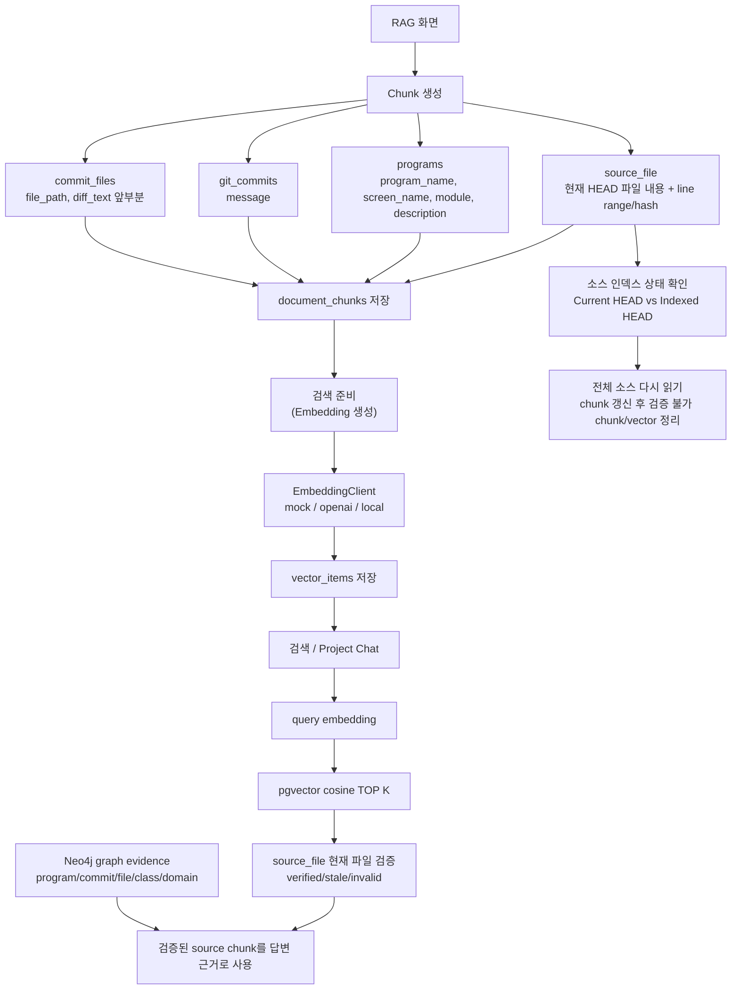
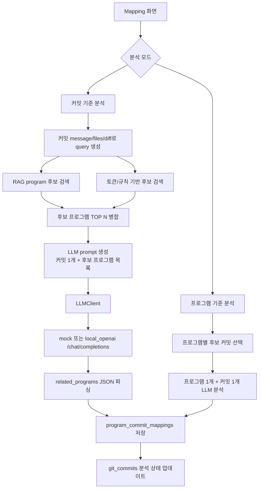
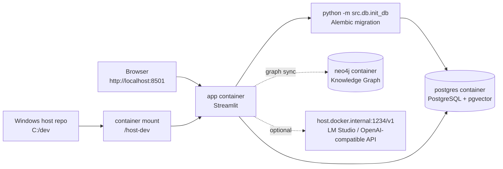
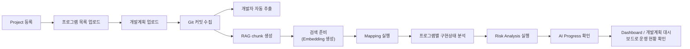

# AI Commit Advisor 아키텍처

이 문서는 `ai-commit-advisor` 프로젝트 작성자가 전체 구조와 처리 흐름을 빠르게 이해할 수 있도록 정리한 아키텍처 문서입니다.

## 0. Architecture at a glance

AI Commit Advisor는 Streamlit 앱을 중심으로 업무 산출물과 대상 프로젝트 Git 저장소를 모으고, DB/RAG/Graph/LLM 계층을 거쳐 분석 결과를 보여주는 구조입니다. 처음 볼 때는 아래 여섯 영역만 잡으면 됩니다.



큰 구조는 다음처럼 읽으면 됩니다.

- 사용자는 브라우저에서 Python App의 `화면단`을 사용합니다.
- `화면단`은 Streamlit page 묶음이고, 실제 수집·분석·저장은 `백단` Python service가 처리합니다.
- `분석 대상 프로젝트`는 이 앱이 분석하는 별도 업무 시스템입니다. GitHub/사내 Git에서 앱 서버 clone으로 내려온 source와 업무 산출물이 입력이 됩니다.
- `저장소`는 PostgreSQL + pgvector와 선택적 Neo4j로 나뉩니다. PostgreSQL은 업무 데이터, Git 수집 데이터, RAG vector, 분석 결과의 source of truth이고, Neo4j는 프로젝트 관계 탐색용 read model입니다.
- `AI Provider`는 LLM 판단과 embedding 생성을 담당하고, 백단 service와 RAG가 필요할 때 호출합니다.

## 0.1 우리 프로젝트와 대상 프로젝트의 관계

이 저장소(`ai-commit-advisor`)는 분석 도구 자체이고, 대상 프로젝트는 분석을 받는 별도 Git 프로젝트입니다. GitHub는 대상 프로젝트의 원격 저장소일 수 있지만, 앱은 GitHub API를 직접 분석 대상으로 삼지 않고 앱 서버에 clone/fetch된 대상 프로젝트의 Git 저장소를 읽습니다.



관계는 다음처럼 나뉩니다.

- `ai-commit-advisor`: 이 앱의 source code와 문서가 있는 우리 프로젝트입니다.
- 대상 프로젝트: 사용자가 분석하려는 업무 시스템 source입니다. 샘플 검증에서는 `C:\dev\ai-advisor-sample-shop` 같은 별도 Git 저장소가 이 역할을 합니다.
- GitHub/사내 Git: 대상 프로젝트의 원격 저장소입니다. 운영자가 앱 서버 저장소를 fetch/reset해서 최신 상태로 맞춥니다.
- 앱 서버 clone: AI Commit Advisor가 실제로 읽는 Git 저장소입니다. `projects.git_repo_path`에 이 경로를 등록합니다.
- RAG: 앱 서버 clone의 현재 source, 프로그램/commit/diff 데이터를 chunk와 embedding으로 만들어 Project Chat과 검색, Mapping 후보 검색에 사용합니다.

## 1. 전체 아키텍처 다이어그램

```mermaid
flowchart TB
    User["회사 관리자 / PL / 개발 리더"] --> Streamlit["Streamlit App<br/>app.py"]

    Streamlit --> ProjectContext["project_context.py<br/>현재 프로젝트 선택/검증"]
    Streamlit --> Home["Home"]
    Streamlit --> ProjectUI["프로젝트/Git 설정 / 개발자 현황"]
    Streamlit --> ArtifactUI["산출물 관리"]
    Streamlit --> GitUI["Git 동기화"]
    Streamlit --> MappingUI["Mapping / Risk / Impact / Code Review"]
    Streamlit --> RagUI["RAG 검색 / Project Chat"]
    Streamlit --> GraphUI["Knowledge Graph"]
    Streamlit --> DashboardUI["Dashboard / 개발계획 / AI Progress"]
    Streamlit --> SettingsUI["설정"]

    ProjectContext --> DB
    ProjectUI --> ExcelService["excel_service.py"]
    ArtifactUI --> ExcelService
    GitUI --> GitService["git_service.py"]
    GitUI --> GitStatusService["git_repository_status_service.py"]
    MappingUI --> MappingService["mapping_service.py"]
    MappingUI --> MappingFeedbackService["mapping_feedback_service.py"]
    MappingUI --> RiskService["risk_service.py"]
    MappingUI --> ImpactService["commit_impact_service.py"]
    MappingUI --> GitHistoryService["git_history_service.py"]
    MappingUI --> CodeReviewService["code_review_service.py"]
    GraphUI --> Neo4jGraphService["neo4j_graph_service.py"]
    RagUI --> RagLayer["RAG Layer"]
    RagUI --> ChatService["chat_service.py"]
    DashboardUI --> ProgressService["progress_service.py"]
    DashboardUI --> DeveloperService["developer_service.py"]
    DashboardUI --> ProgramAnalysisService["program_analysis_service.py"]
    DashboardUI --> ResourceMetricsService["resource_metrics_service.py"]
    DashboardUI --> ResourceRadarService["ai_resource_radar_service.py"]

    MappingService --> LLMClient["llm_client.py"]
    MappingFeedbackService --> DB
    CodeReviewService --> LLMClient
    ProgramAnalysisService --> ImplementationAnalyzer["program_implementation_analyzer.py"]
    ImplementationAnalyzer --> LLMClient
    MappingService --> Retriever["retriever.py"]
    Retriever --> EmbeddingClient["embedding_client.py"]
    Retriever --> VectorStore["vector_store.py"]
    ChatService --> Retriever
    ChatService --> LLMClient
    ChatService --> SourceVerifier["source_verifier.py"]
    RagUI --> SourceIndexService["source_index_service.py"]
    SourceIndexService --> SourceVerifier
    RagLayer --> Chunker["chunker.py"]
    RagLayer --> EmbeddingClient
    RagLayer --> VectorStore

    LLMClient --> LocalLLM["LM Studio / OpenAI-compatible Chat API"]
    EmbeddingClient --> EmbeddingAPI["Mock / OpenAI / Local Embedding API"]
    GitService --> ServerGit["App-server Git Repository"]
    GitStatusService --> ServerGit
    Neo4jGraphService --> ServerGit
    ExcelService --> ExcelFiles["Excel Files"]

    ExcelService --> DB[(PostgreSQL + pgvector)]
    GitService --> DB
    MappingService --> DB
    RiskService --> DB
    ImpactService --> DB
    GitHistoryService --> DB
    CodeReviewService --> DB
    Neo4jGraphService --> DB
    Neo4jGraphService -. sync .-> GraphDB[(Neo4j<br/>Knowledge Graph)]
    ProgressService --> DB
    DeveloperService --> DB
    ProgramAnalysisService --> DB
    ResourceMetricsService --> DB
    ResourceRadarService --> ResourceMetricsService
    ResourceRadarService --> LLMClient
    ResourceRadarService --> DB
    AIEvidenceService --> DB
    AIInvocationService --> DB
    ImplementationAnalyzer --> DB
    VectorStore --> DB

    DB --> Tables["projects, developers, project_developers, programs,<br/>git_commits, commit_files,<br/>program_commit_mappings, project_graph_sync_state,<br/>analysis_runs, program_implementation_status,<br/>code_review_results, resource_metric_snapshots,<br/>pl_briefing_history, ai_invocation_logs,<br/>risk_findings, project_chat_sessions,<br/>project_chat_messages, document_chunks, vector_items"]
```



## 2. 화면 흐름도



### 주요 화면 역할

- `Home`: 사이드바에서 선택한 현재 프로젝트의 핵심 지표, AI 진척도, 리스크 프로그램, 다음 작업 요약.
- `Project`: 프로젝트 이름, 설명, 앱 서버에서 접근 가능한 Git 저장소 경로, Git remote URL/branch 관리, 서버 저장소 clone/fetch, 분석 데이터 초기화, 프로젝트 삭제. 프로젝트 저장 후 사이드바 현재 프로젝트 선택과 동기화하고, 프로젝트 삭제 후에는 남은 프로젝트로 현재 선택을 복구한다.
- `개발자 현황`: Git author 기반 개발자 자동 추출, 통계, role/skills 관리. 자동 추출된 author는 전역 개발자 마스터에 저장하고 현재 프로젝트 연결도 함께 생성한다.
- `개발자 목록`: 현재 프로젝트에 연결된 개발자 조회를 기본으로 제공하고, 전역 개발자 마스터 조회, 직접 추가/수정/삭제, Excel 양식 다운로드, 업로드 전 검증/미리보기를 지원한다.
- `Program`: 프로그램 현재 데이터 조회, 직접 추가/수정/삭제, Excel 양식 다운로드, 업로드 전 검증/미리보기, 컬럼 매핑, 저장.
- `개발계획`: 개발계획 현재 데이터 조회, 직접 수정, 일괄 업데이트, Excel 양식 다운로드, 업로드 전 검증/미리보기.
- `Program Detail`: 특정 프로그램의 계획, AI 구현상태, 관련 커밋, 파일 diff, 리스크를 상세 조회.
- `Git`: 앱 서버 Git 저장소에서 커밋, 변경 파일, diff 수집.
- `Mapping`: 프로그램과 커밋의 관련성을 LLM으로 분석해 `program_commit_mappings`에 저장하고, 피드백 리뷰 큐로 검토가 필요한 매핑을 보정.
- `Risk Analysis`: 계획, 매핑, 커밋 활동, 예상 종료일 기반 리스크를 탐지하고 `risk_findings`에 저장/해결 처리.
- `Git History`: 현재 프로젝트의 커밋 목록, 작성자/날짜/파일 필터, 변경 파일, 저장 diff preview, 앱 서버 저장소의 전체 `git show` diff를 조회.
- `Commit Impact`: 특정 커밋이 영향을 주는 프로그램, 파일, 개발자 범위를 요약.
- `Knowledge Graph`: PostgreSQL 분석 데이터와 앱 서버 Git 저장소의 Java class/import 구조를 Neo4j graph read model로 동기화하고, 저장된 Neo4j graph에서 클래스 관계도, 커밋 영향 경로, node/edge 저장 상태를 다시 조회.
- `AI Code Review`: 앱 서버 Git 저장소의 최근 커밋과 특정 커밋을 중심으로 LLM 리뷰를 실행하고 결과를 저장. 서버 clone에 local 변경이 남아 있을 때만 서버 작업트리/staged 변경 리뷰를 보조 옵션으로 사용.
- `Dashboard`: 프로젝트별 계획/AI/Git 활동 요약, AI Resource Radar, PL Briefing, 개발자별 업무량·난이도, 예상 지연 프로그램, 고객가치 참고 지표 표시.
- `AI 운영 현황`: LLM/embedding 연결 상태, AI 분석 준비 상태, AI 실행 바로가기, AI 근거 추적, sample project 품질 점검, 주간 보고서 export, AI 호출 기록 표시.
- `개발계획 대시보드`: 개발계획 기준 일정, 담당자, 완료/지연 현황 표시.
- `AI Progress`: 계획 진척도와 매핑 기반 AI 진척도 비교, 저장된 프로그램 단위 구현상태 분석 요약, 리스크 프로그램 추적.
- `RAG`: 현재 소스 파일, 프로그램 정보, 커밋/파일 diff chunk 생성, embedding 생성, pgvector 검색 테스트, 현재 소스 인덱스 상태 확인/재생성.
- `Project Chat`: 검증된 현재 소스 파일 chunk를 근거로 프로젝트 질의응답하고, 답변 전 현재 소스 인덱스 상태를 확인하며, 프로젝트별 대화 session/message와 근거를 저장.

대부분의 프로젝트 단위 화면은 각 화면 안에서 프로젝트를 다시 고르지 않고, 사이드바의 현재 프로젝트 컨텍스트를 사용합니다. `프로젝트/Git 설정`은 프로젝트 생성, 수정, 삭제를 담당하므로 자체 선택 UI를 유지하고, `프로그램 목록`은 현재 프로젝트에 프로그램을 조회·추가·업로드하는 흐름만 담당합니다.

프로젝트 분석 데이터 초기화는 프로젝트 record, Git 저장소 경로, 프로그램/개발계획, 표준용어/표준단어, 프로젝트 개발자 연결을 보존하고 Git commit, 변경 파일, 매핑, graph sync 상태, 분석 실행 이력, 구현상태 분석, 리스크, 자원관리 snapshot, PL Briefing 이력, AI 호출 telemetry, RAG chunk/vector, Project Chat, AI Code Review 결과를 삭제합니다. Neo4j가 활성화되어 있으면 같은 프로젝트의 graph read model도 best-effort로 정리합니다. 같은 프로젝트 shell과 산출물을 유지한 채 수집/분석을 다시 실행하기 위한 흐름입니다.

프로젝트 삭제는 프로젝트 소유 데이터 전체를 정리합니다. 프로그램, Git commit, 변경 파일, 매핑, graph sync 상태, 분석 실행 이력, 구현상태 분석, 리스크, 자원관리 snapshot, PL Briefing 이력, AI 호출 telemetry, RAG chunk/vector, Project Chat, AI Code Review, 표준용어/표준단어, 프로젝트 개발자 연결, Neo4j graph read model은 삭제 대상입니다. `developers`는 전역 개발자 마스터이므로 프로젝트 삭제 시 자동 삭제하지 않습니다.

## 2.1 Git 저장소 접근 모델

AI Commit Advisor는 브라우저 사용자 PC의 Git 저장소를 직접 읽지 않습니다. `projects.git_repo_path`는 앱 서버 프로세스가 접근 가능한 Git 저장소 경로를 의미합니다.

- 개인 PC에서 앱을 실행하면 개인 PC 경로가 앱 서버 기준 경로입니다.
- 사내 서버에서 앱을 실행하면 사내 서버에 clone된 저장소 경로가 앱 서버 기준 경로입니다.
- Docker 실행에서 host 경로와 container 경로가 다르면 `REPO_PATH_HOST_PREFIX`, `REPO_PATH_CONTAINER_PREFIX`로 실제 접근 경로를 변환합니다.
- 운영 서버에서는 `REPO_STORAGE_ROOT`를 설정해 프로젝트 Git 경로를 승인된 저장소 root 하위로 제한할 수 있습니다.

Git Sync, RAG source_file 인덱싱, Project Chat 현재 소스 검증, AI Code Review는 모두 이 앱 서버 기준 경로를 사용합니다. 사내 서버 운영의 자세한 기준은 [Git 저장소 운영 모델](git-repository-operating-model.md)을 참고합니다.

## 3. DB ERD

```mermaid
erDiagram
    PROJECTS ||--o{ PROGRAMS : has
    PROJECTS ||--o{ GIT_COMMITS : has
    PROJECTS ||--o{ ANALYSIS_RUNS : has
    PROJECTS ||--o{ PROJECT_DEVELOPERS : has
    DEVELOPERS ||--o{ PROGRAMS : assigned_to
    DEVELOPERS ||--o{ PROJECT_DEVELOPERS : linked_to
    GIT_COMMITS ||--o{ COMMIT_FILES : contains
    PROGRAMS ||--o{ PROGRAM_COMMIT_MAPPINGS : mapped
    PROGRAMS ||--o| PROGRAM_IMPLEMENTATION_STATUS : analyzed
    PROGRAMS ||--o{ RISK_FINDINGS : has
    GIT_COMMITS ||--o{ PROGRAM_COMMIT_MAPPINGS : mapped
    ANALYSIS_RUNS ||--o{ PROGRAM_COMMIT_MAPPINGS : produced
    PROJECTS ||--o{ CODE_REVIEW_RESULTS : has
    PROJECTS ||--o{ RESOURCE_METRIC_SNAPSHOTS : has
    PROJECTS ||--o{ PL_BRIEFING_HISTORY : has
    PROJECTS ||--o{ AI_INVOCATION_LOGS : has
    PROJECTS ||--o{ RISK_FINDINGS : has
    PROJECTS ||--o{ PROJECT_CHAT_SESSIONS : has
    PROJECT_CHAT_SESSIONS ||--o{ PROJECT_CHAT_MESSAGES : contains
    DOCUMENT_CHUNKS ||--o{ VECTOR_ITEMS : embedded

    PROJECTS {
        int id PK
        string name
        text description
        text git_repo_path
        string last_synced_commit_hash
        datetime last_synced_at
    }

    DEVELOPERS {
        int id PK
        string developer_key
        string developer_id
        string developer_name
        string email
        string role
        text skills
    }

    PROJECT_DEVELOPERS {
        int id PK
        int project_id FK
        string developer_id FK
        string source
        string project_role
        string active_yn
        datetime created_at
        datetime updated_at
    }

    PROGRAMS {
        int id PK
        int project_id FK
        string program_id
        string program_name
        string screen_name
        string module
        text description
        string developer
        string developer_id FK
        date planned_start_date
        date planned_end_date
        date actual_start_date
        date actual_end_date
        float progress_rate
        string status
        jsonb raw_metadata
    }

    GIT_COMMITS {
        int id PK
        int project_id FK
        string commit_hash
        text message
        string author
        string author_name
        string author_email
        datetime committed_at
        boolean is_merge_commit
        datetime mapping_analyzed_at
        string mapping_analysis_status
    }

    COMMIT_FILES {
        int id PK
        int commit_id FK
        int git_commit_id FK
        text file_path
        string change_type
        text diff_text
    }

    PROGRAM_COMMIT_MAPPINGS {
        int id PK
        int program_id FK
        int commit_id FK
        int analysis_run_id FK
        float relevance_score
        boolean is_related
        string implementation_status
        text reason
        jsonb raw_response
        boolean feedback_is_related
        float feedback_relevance_score
        string feedback_implementation_status
        text feedback_reason
        datetime feedback_updated_at
    }

    PROGRAM_IMPLEMENTATION_STATUS {
        int id PK
        int program_id FK
        string status
        text summary
        jsonb completed_features
        jsonb incomplete_features
        jsonb evidence_commits
        string commit_hash_signature
        datetime analyzed_at
        jsonb raw_response
    }

    ANALYSIS_RUNS {
        int id PK
        int project_id FK
        string run_type
        string status
        string analysis_type
        int total_count
        int processed_count
        int failed_count
        datetime started_at
        datetime finished_at
        text summary
        jsonb parameters
    }

    CODE_REVIEW_RESULTS {
        int id PK
        int project_id FK
        string target_type
        string target_ref
        string status
        text summary
        jsonb commit_analysis
        jsonb bug_findings
        jsonb refactoring_suggestions
        jsonb raw_response
        datetime started_at
        datetime finished_at
    }

    RESOURCE_METRIC_SNAPSHOTS {
        int id PK
        int project_id FK
        string snapshot_label
        datetime captured_at
        int unresolved_risk_count
        int high_risk_count
        int forecasted_delay_program_count
        int ai_code_review_count
        float estimated_review_hours_saved
        float estimated_extra_mm_avoidance
        float average_workload_score
        float average_difficulty_score
        jsonb raw_summary
    }

    PL_BRIEFING_HISTORY {
        int id PK
        int project_id FK
        datetime generated_at
        string provider
        string model
        string mode
        string title
        text summary
        jsonb priority_items
        jsonb meeting_questions
        jsonb next_actions
        text rendered_text
        jsonb evidence_payload
        jsonb raw_response
    }

    AI_INVOCATION_LOGS {
        int id PK
        int project_id FK
        string feature
        string provider
        string model
        string status
        string mode
        bool fallback_used
        string validation_status
        int duration_ms
        int prompt_length
        int response_length
        text error_message
        jsonb raw_metadata
    }

    RISK_FINDINGS {
        int id PK
        int project_id FK
        int program_id FK
        string risk_type
        string risk_level
        string title
        text description
        jsonb evidence
        datetime detected_at
        string resolved_yn
    }

    PROJECT_CHAT_SESSIONS {
        int id PK
        int project_id FK
        string title
        string status
        datetime last_message_at
        jsonb raw_metadata
    }

    PROJECT_CHAT_MESSAGES {
        int id PK
        int session_id FK
        string role
        text content
        int message_index
        jsonb sources
        jsonb expanded_queries
        jsonb matched_terms
        int excluded_count
        int used_source_count
        bool insufficient_evidence
        jsonb raw_metadata
    }

    DOCUMENT_CHUNKS {
        int id PK
        int project_id FK
        string source_type
        string source_id
        int chunk_index
        text chunk_text
        jsonb raw_metadata
    }

    VECTOR_ITEMS {
        int id PK
        int chunk_id FK
        string embedding_model
        vector embedding
        jsonb raw_metadata
    }
```



## 4. 테이블별 역할 설명

| 테이블 | 역할 |
|---|---|
| `projects` | 프로젝트 단위의 최상위 엔티티. Git 저장소 경로와 마지막 동기화 상태를 가지며, 삭제 시 프로젝트 소유 분석 데이터의 정리 기준이 된다. |
| `developers` | 전역 개발자 마스터. Git author 또는 업로드 데이터 기반으로 생성되며 role/skills를 관리한다. 프로젝트 삭제 시 자동 삭제하지 않는다. |
| `project_developers` | 프로젝트와 전역 개발자 마스터의 연결 테이블. 현재 프로젝트 개발자 목록의 기준이며, 같은 개발자를 여러 프로젝트에 연결할 수 있다. |
| `programs` | 프로그램 목록과 개발계획 정보를 저장한다. 계획 진척도(`progress_rate`)와 일정, 담당자 정보의 기준 테이블이다. |
| `git_commits` | Git 커밋 메타데이터를 저장한다. 커밋 기준 매핑 분석 상태도 가진다. |
| `commit_files` | 커밋별 변경 파일, 변경 유형, diff 일부를 저장한다. |
| `program_commit_mappings` | 프로그램-커밋 관련성 분석 결과. LLM 판단 결과, 관련도 점수, 구현 상태, 판단 근거를 저장한다. |
| `program_implementation_status` | 프로그램별 관련 커밋 묶음을 기반으로 LLM이 판단한 구현 상태, 완료/미완료 기능, 근거 커밋을 저장한다. |
| `analysis_runs` | Mapping 분석 실행 이력. 실행 상태, 처리 수, 실패 수, 파라미터, 요약을 저장한다. |
| `code_review_results` | AI Code Review 실행 결과. 리뷰 대상, 요약, 커밋 분석, 버그 발견, 리팩토링 제안을 저장한다. |
| `resource_metric_snapshots` | Dashboard 자원관리 지표의 수동 저장 snapshot. 핵심 지표, 평균 업무량/난이도, raw summary를 저장해 추세 분석에 사용한다. |
| `pl_briefing_history` | Dashboard AI Resource Radar에서 생성한 PL Briefing 이력. provider/model/mode, 구조화 섹션, rendered text, Radar evidence payload, raw response를 저장한다. |
| `ai_invocation_logs` | Mapping, Project Chat, AI Code Review, PL Briefing 같은 AI 호출의 provider/model, latency, prompt/response length, validation/fallback/error metadata를 저장한다. |
| `risk_findings` | 리스크 분석 결과. 리스크 유형/등급, 설명, 근거, 해결 여부를 저장한다. |
| `project_chat_sessions` | Project Chat의 프로젝트별 대화 session 제목, 상태, 마지막 메시지 시각을 저장한다. |
| `project_chat_messages` | Project Chat user/assistant message와 검색 근거, 확장 쿼리, 근거 부족 여부, graph evidence raw metadata, 복사용 citation metadata를 저장한다. |
| `document_chunks` | RAG 검색용 chunk 저장소. source_file, program, commit, commit_file 원문을 검색 가능한 텍스트 단위로 저장한다. |
| `vector_items` | `document_chunks`의 embedding vector를 저장한다. pgvector cosine 검색에 사용된다. |

## 5. 서비스별 역할 설명

| 서비스 | 역할 |
|---|---|
| `project_management_service.py` | 프로젝트 삭제 영향 건수 계산과 프로젝트 소유 데이터 삭제를 처리한다. 전역 개발자 마스터는 유지한다. |
| `excel_service.py` | 프로그램/개발자 Excel 파일 읽기, 컬럼 매핑, 정규화, DB 저장. |
| `git_service.py` | 앱 서버 Git 저장소에서 commit hash, message, author, changed files, diff 수집 및 DB 저장. |
| `git_repository_status_service.py` | 앱 서버 Git 저장소의 branch, HEAD, upstream, ahead/behind, working tree 변경, DB sync mismatch 상태를 읽기 전용으로 조회한다. |
| `developer_service.py` | Git author 기반 개발자 자동 추출, role/skills 추정, 현재 프로젝트 개발자 연결, 개발자 통계 생성. |
| `developer_management_service.py` | 개발자 직접 추가/수정/삭제, Excel 저장 결과, 삭제 영향, 전역 개발자 마스터 저장을 처리한다. 현재 프로젝트가 있으면 개발자 연결도 함께 만든다. |
| `project_developer_service.py` | 전역 개발자 마스터와 프로젝트 개발자 연결을 생성/갱신하고, 현재 프로젝트 개발자 목록과 전역 마스터 목록 조회를 분리한다. |
| `llm_client.py` | mock 또는 OpenAI-compatible local LLM 호출. `/chat/completions` 기반. |
| `mapping_service.py` | 프로그램-커밋 매핑 분석의 핵심 서비스. 프로그램 기준 분석과 커밋 기준 분석을 모두 지원한다. |
| `mapping_feedback_service.py` | 매핑 피드백 목록, 리뷰 큐 후보, 품질 KPI, 사용자 보정 저장을 처리한다. |
| `progress_service.py` | `programs.progress_rate`와 `program_commit_mappings.implementation_status`를 결합해 AI 진척도와 리스크를 계산한다. |
| `program_analysis_service.py` | 프로그램 상세 화면용 분석 데이터 구성. 관련 커밋, 파일 diff, 개발자 기여, 리스크 요약을 제공한다. |
| `program_implementation_analyzer.py` | 프로그램별 관련 커밋을 LLM으로 재분석해 구현 상태와 근거를 `program_implementation_status`에 저장한다. |
| `risk_service.py` | 계획 일정, 담당자, 커밋/매핑 상태를 기반으로 리스크를 탐지하고 `risk_findings`에 저장/해결 처리한다. |
| `git_history_service.py` | 프로젝트별 커밋 이력, 변경 파일, 저장 diff preview, 앱 서버 저장소의 전체 `git show` diff 조회를 처리한다. |
| `commit_impact_service.py` | 특정 커밋이 영향을 줄 가능성이 있는 프로그램, 파일, 개발자 범위를 계산한다. |
| `code_review_service.py` | 앱 서버 Git 저장소의 최근 커밋, 특정 커밋 diff를 중심으로 LLM 리뷰를 실행하고 `code_review_results`에 저장한다. 서버 clone local 변경 점검용으로 working tree/staged diff 리뷰도 지원한다. |
| `resource_metrics_service.py` | AX 자원관리 지표. 프로그램별 예상 종료일·난이도·업무량 근거, 개발자별 업무량·난이도 집계, 고객가치 참고 지표를 계산하고, 사용자가 요청한 기준 시점 snapshot을 저장/조회한다. |
| `ai_resource_radar_service.py` | AX 자원관리 Radar. `resource_metrics_service.py` 결과와 미해결 리스크, 관련 commit evidence를 조합해 PL 우선 검토 프로그램을 랭킹하고, LLM 또는 fallback으로 구조화된 PL Briefing을 생성해 `pl_briefing_history`에 저장한다. |
| `ai_invocation_service.py` | AI 호출 telemetry 저장과 조회를 담당한다. provider/model, feature, latency, prompt/response length, validation/fallback/error metadata를 `ai_invocation_logs`에 기록한다. |
| `ai_evidence_service.py` | AI 운영 현황 화면용 LLM/embedding 연결 상태, 운영 준비 상태, 근거 추적, sample project 품질 점검, 주간 보고서 Markdown, 검증용 AI 실행 shortcut 결과를 구성한다. |
| `chunker.py` | program, commit, commit_file 데이터를 `document_chunks`로 생성한다. |
| `embedding_client.py` | mock/openai/local embedding provider를 추상화한다. |
| `vector_store.py` | embedding 저장, 중복 방지, embedding 실패 기록, pgvector cosine 검색. |
| `retriever.py` | query embedding 생성 후 vector 검색 결과를 반환한다. Mapping 후보 프로그램 검색에도 사용된다. |
| `chat_history_service.py` | Project Chat session/message 저장, 조회, UI 변환, source/graph 답변 근거 Markdown export를 담당한다. |

## 6. 프로그램 업로드부터 AI 진척도 계산까지의 처리 흐름



### AI 진척도 계산 규칙

- `구현됨` 또는 `구현완료`: 100
- `일부구현`: 50
- `판단불가`: 0
- 매핑 결과 없음: 0

프로그램별 AI 진척도는 해당 프로그램의 mapping 중 가장 높은 구현 상태를 사용한다.

AI Progress 화면은 이 수치 계산과 별도로 `program_implementation_status`에 저장된 프로그램 단위 구현상태 분석 결과를 함께 표시한다. 저장된 분석 결과는 업무 검토용 요약 근거이며, AI 진척도/진척도 차이/리스크 조건 계산을 대체하지 않는다.

리스크 조건:

- 계획 종료일이 지났지만 AI 진척도 < 100
- 계획 진척도 - AI 진척도 >= 30
- mapping이 있지만 `판단불가`만 존재
- 관련 커밋이 없음

## 7. RAG 처리 흐름



### RAG 안전장치

- 이미 같은 `source_type + source_id + chunk_index` chunk가 있으면 생성하지 않는다.
- 같은 `chunk_id + embedding_model` vector가 있으면 중복 저장하지 않는다.
- `commit_files.diff_text`는 길이를 잘라 chunk로 만든다.
- `source_file` chunk에는 `file_path`, `line_start`, `line_end`, `content_hash`, `chunk_content_hash`, `indexed_head_hash`를 저장한다.
- Project Chat은 기본적으로 현재 파일 검증을 통과한 `source_file` chunk만 답변 근거로 사용한다.
- Neo4j가 활성화되고 graph가 동기화되어 있으면 Project Chat은 질문, 확장 쿼리, 검색된 source evidence에서 seed를 뽑아 graph relationship evidence를 보조 context로 붙인다.
- Graph evidence는 프로그램-커밋-파일-class-domain 관계 설명용이며, verified `source_file` evidence 없이 현재 코드 사실을 답변하게 만들지 않는다.
- Git HEAD가 바뀌었거나 line range hash가 달라진 chunk는 stale/invalid로 분류하고 현재 코드 근거에서 제외한다.
- RAG와 Project Chat 화면은 현재 HEAD와 인덱싱 HEAD, 불일치/검증 불가 chunk 수를 표시한다.
- `전체 소스 다시 읽기`는 현재 HEAD 기준 chunk를 먼저 갱신한 뒤 검증 불가 chunk/vector만 정리해 삭제된 파일의 근거도 제거한다.
- Project Chat의 답변 근거 갱신은 embedding을 자동 실행하지 않고, RAG 화면에서도 명시 선택한 경우에만 제한 수량으로 embedding을 생성한다.
- embedding 실패 시 chunk metadata에 실패 상태와 오류 메시지를 남기고 다음 chunk로 진행한다.

## 8. LLM 처리 흐름



LLM 출력 예시:

```json
{
  "related_programs": [
    {
      "program_id": "P001",
      "relevance_score": 85,
      "implementation_status": "일부구현",
      "reason": "커밋 메시지와 변경 파일이 해당 프로그램의 서비스/화면과 관련됨"
    }
  ]
}
```

## 9. 현재 구현된 기능

- Streamlit 기반 업무 흐름형 메뉴.
- 프로젝트 등록 및 앱 서버 Git 저장소 경로 관리.
- 프로그램 관리: 현재 데이터 조회, 직접 추가/수정/삭제, Excel 양식 다운로드, 업로드 전 검증/미리보기, 컬럼 매핑, DB 저장/업데이트.
- 개발자 관리: 현재 프로젝트 개발자 조회, 전역 개발자 마스터 조회, 직접 추가/수정/삭제, Excel 양식 다운로드, 업로드 전 검증/미리보기, DB 저장/업데이트.
- 개발계획 관리: 현재 계획 조회, 직접 수정, 일괄 업데이트, Excel 양식 다운로드, 업로드 전 검증/미리보기.
- Git 커밋 전체 수집 및 증분 동기화.
- 앱 서버 Git 저장소 branch/HEAD/upstream/working tree/DB sync mismatch 상태 표시.
- 커밋별 변경 파일과 diff 저장.
- Git author 기반 개발자 자동 추출 및 개발자 통계.
- 프로그램 상세 분석 화면.
- 프로그램 기준 Mapping 분석.
- 커밋 기준 Mapping 분석.
- 커밋 기준 Mapping에서 RAG 후보 + 토큰 후보 병합.
- Mapping 피드백 리뷰 큐와 품질 KPI.
- 프로그램별 관련 커밋 기반 AI 구현상태 분석 및 저장.
- LLM mock 및 OpenAI-compatible local chat 호출.
- Mapping 실행 이력 저장.
- 커밋별 mapping 분석 상태 저장.
- AI Progress 계산, 저장된 구현상태 분석 요약, 리스크 프로그램 표시.
- Risk Analysis 실행, 리스크 저장, 미해결 리스크 조회 및 해결 처리. 예상 종료일 기준 지연 가능성은 `FORECAST_DELAY` 리스크로 저장한다.
- Git History 커밋 이력과 diff 탐색.
- Commit Impact 분석.
- Neo4j Knowledge Graph preview와 전체/증분 동기화, Graph HEAD 최신성 표시, 저장 그래프 기준 클래스 관계도, 커밋 영향 경로, node/edge 저장 상태 표시.
- AI Code Review 실행 및 리뷰 이력 저장.
- Home/Dashboard/개발계획 대시보드/AI Progress 운영 대시보드.
- Dashboard 자원관리 지표: AI Resource Radar와 PL Briefing, 프로그램별 예상 종료일·난이도·업무량 근거, 개발자별 업무량·난이도 집계, 예상 지연 프로그램, 고객가치 참고 지표 표시, 수동 snapshot 저장과 추세 분석.
- RAG chunk 생성: source_file, program, commit, commit_file.
- mock/openai/local embedding client 구조.
- pgvector vector 저장 및 cosine 검색.
- RAG 검색 테스트 화면.
- Project Chat 대화형 프로젝트 질의응답.
- Project Chat GraphRAG 보조 근거: Neo4j 저장 graph에서 영향 경로, class import, domain summary를 조회해 source 근거와 분리 저장/표시.
- source_file 검색 결과 현재 파일 검증.
- source_file 인덱스 상태 표시와 원클릭 재인덱싱.
- Alembic 기반 DB migration.
- pytest 기반 핵심 서비스 테스트.
- 설정 화면에서 DB/LLM/Embedding 설정 확인.

## 10. 아직 미구현 기능

현재 코드 기준으로 아직 검증 또는 제한적인 부분은 다음과 같다.

- 인증/권한 관리가 없다.
- RAG 검색 품질은 embedding 모델에 크게 의존하며, mock embedding은 테스트용이다.
- local/openai embedding은 OpenAI-compatible `/embeddings` 형식을 가정하지만 실제 모델별 검증은 별도 필요하다.
- PL Briefing은 구조화 validation과 1회 repair retry를 사용하지만, Mapping 등 일부 LLM 응답 처리는 여전히 pragmatic parsing과 fallback 중심이다.
- Project Chat GraphRAG는 Neo4j 저장 graph를 보조 근거로 조회한다. Graph freshness/stale 상태는 Knowledge Graph 화면에서 확인하고, 오래된 graph는 증분 반영 또는 전체 재동기화로 갱신한다.
- Mapping 실패 재처리 정책은 기본 상태 기록 수준이며 상세 재시도 큐는 없다.
- 테스트는 핵심 순수 로직 중심이며, Streamlit UI/DB 통합 테스트는 아직 부족하다.
- 배포 설정, CI, 환경별 설정 분리는 제한적이다. AI 호출 telemetry는 앱 내부 관측용이며 외부 로그/모니터링 시스템 연계는 아직 없다.
- vector index 생성 튜닝(HNSW/IVFFlat 등)은 아직 없다.

## 11. 핵심 진입점

### `app.py`

- Streamlit 앱의 시작점.
- `PAGE_GROUPS`에서 업무 흐름 기준 메뉴를 정의한다.
- 각 메뉴 항목은 `src/ui/*_page.py`의 render 함수로 연결된다.
- 사이드바에서 현재 프로젝트를 한 번 선택하고, 프로젝트 단위 화면은 `src/ui/project_context.py`를 통해 같은 프로젝트 컨텍스트를 사용한다.
- 현재 프로젝트 ID는 Streamlit session state와 URL `project_id` query parameter에 함께 저장해 새로고침이나 공유 URL에서도 같은 프로젝트를 복원한다.
- 프로젝트별 프로그램, 커밋, 리스크, RAG 검색 조건처럼 현재 프로젝트 데이터에 묶인 widget state는 `project_context.project_scoped_key()`로 key를 만들고, 검색/선택값이 다른 프로젝트 화면에 섞이지 않게 한다.
- 사이드바 메뉴 그룹은 접이식 section으로 렌더링하고, 현재 위치의 그룹만 기본으로 펼친다.

주요 메뉴 그룹:

- `개요`: Home, Dashboard, AI Progress, AI 운영 현황
- `프로젝트 설정`: 프로젝트/Git 설정, Git 동기화, 샘플 데이터 생성
- `산출물 관리`: 개발자 현황, 개발자 목록, 프로그램 목록, 개발계획, 표준용어/표준단어
- `분석 실행`: Mapping, Risk Analysis, RAG 검색, Project Chat, AI Code Review
- `분석 결과`: Program Detail, Git History, Commit Impact, Knowledge Graph, 개발계획 대시보드
- `관리`: 설정

### 주요 UI 파일

| 파일 | 역할 |
|---|---|
| `src/ui/home_page.py` | 현재 프로젝트 기준 KPI, 분석 상태, 다음 작업, 리스크 요약. |
| `src/ui/display_utils.py` | 여러 분석 화면에서 공유하는 날짜 포맷과 `항목/값` 표시용 DataFrame helper. |
| `src/ui/project_context.py` | 현재 프로젝트 선택값 저장/조회, URL `project_id` 복원, 삭제된 선택 복구, 사이드바 전역 프로젝트 selector, 프로젝트별 widget key helper. |
| `src/ui/project_page.py` | 프로젝트 등록/수정. |
| `src/ui/developer_page.py` | Git author 기반 개발자 현황, 자동 추출, 개발자 통계. |
| `src/ui/developer_upload_page.py` | 현재 프로젝트 개발자 조회, 전역 개발자 마스터 조회, 직접 추가/수정/삭제, Excel 양식, 업로드 검증, 저장. |
| `src/ui/upload_page.py` | 프로그램 현재 데이터 조회, 직접 추가/수정/삭제, Excel 양식, 업로드 검증, 저장. |
| `src/ui/development_plan_upload_page.py` | 개발계획 조회, 직접 수정, 일괄 업데이트, Excel 양식, 업로드 검증, 저장. |
| `src/ui/program_detail_page.py` | 프로그램별 계획, AI 구현상태, 관련 커밋, diff, 리스크 상세 조회. |
| `src/ui/git_page.py` | 앱 서버 Git 저장소 상태 확인과 Git 커밋 수집. |
| `src/ui/mapping_page.py` | 프로그램-커밋 Mapping 분석 실행. |
| `src/ui/risk_page.py` | 프로젝트 리스크 분석, 미해결 리스크 조회 및 해결 처리. |
| `src/ui/git_history_page.py` | 프로젝트별 Git 커밋 이력, 변경 파일, diff 조회. |
| `src/ui/commit_impact_page.py` | 특정 커밋의 영향도 분석. |
| `src/ui/knowledge_graph_page.py` | Neo4j Knowledge Graph preview, Graph HEAD 최신성 표시, 전체/증분 동기화, 저장 그래프 기준 도메인/클래스/영향 경로/node-edge 조회. |
| `src/ui/rag_page.py` | RAG chunk/embedding/search 관리. |
| `src/ui/project_chat_page.py` | 검증된 현재 소스와 Neo4j graph evidence를 분리 표시하는 프로젝트 채팅. |
| `src/ui/code_review_page.py` | AI 코드 리뷰 실행 및 이력 조회. |
| `src/ui/dashboard_page.py` | 프로젝트 운영 요약. |
| `src/ui/planning_dashboard_page.py` | 개발계획 기준 일정/진척 현황. |
| `src/ui/ai_progress_page.py` | 계획 진척도와 AI 진척도 비교, 저장된 구현상태 분석 요약 표시. |
| `src/ui/settings_page.py` | DB/LLM/Embedding 설정 확인. |

### 주요 서비스

| 파일 | 핵심 함수/클래스 |
|---|---|
| `src/services/excel_service.py` | `read_program_excel`, `normalize_program_rows`, `save_programs_with_result` |
| `src/services/program_import_service.py` | `build_program_template_excel`, `validate_program_import` |
| `src/services/program_management_service.py` | `save_manual_program`, `update_program`, `delete_program`, `get_program_delete_impact` |
| `src/services/development_plan_management_service.py` | `update_program_plan`, `save_plan_rows`, `bulk_update_plan`, `validate_plan_import` |
| `src/services/git_service.py` | `sync_git_repository`, `collect_commits` |
| `src/services/git_remote_service.py` | `clone_or_update_project_repository`, `RepositorySyncLock` |
| `src/services/git_repository_status_service.py` | `get_repository_status` |
| `src/services/developer_service.py` | `extract_developers_from_git_commits`, `get_developer_stats` |
| `src/services/developer_management_service.py` | `save_manual_developer`, `update_developer`, `delete_developer`, `validate_developer_import` |
| `src/services/llm_client.py` | `LLMClient.generate` |
| `src/services/mapping_service.py` | `MappingService.analyze_commits`, `MappingService.analyze_project` |
| `src/services/mapping_feedback_service.py` | `summarize_mapping_feedback_quality`, `list_mapping_review_queue_rows`, `apply_mapping_feedback` |
| `src/services/progress_service.py` | `get_ai_progress_summary`, `get_program_commit_details`, `implementation_analysis_status_label` |
| `src/services/program_analysis_service.py` | `list_program_options`, `get_program_detail_analysis`, `get_commit_file_details` |
| `src/services/program_implementation_analyzer.py` | `ProgramImplementationAnalyzer.analyze_program`, `ProgramImplementationAnalyzer.analyze_project` |
| `src/services/risk_service.py` | `run_risk_analysis`, `get_unresolved_findings`, `resolve_findings` |
| `src/services/git_history_service.py` | `list_git_history_commits`, `get_git_history_detail`, `get_commit_full_diff` |
| `src/services/commit_impact_service.py` | `list_commit_options`, `get_commit_impact_analysis` |
| `src/services/neo4j_graph_service.py` | `build_project_graph_payload`, `sync_project_graph_to_neo4j`, `find_project_graph_evidence`, `get_neo4j_connection_status` |
| `src/services/code_review_service.py` | `get_review_target`, `CodeReviewService.review_project`, `get_recent_code_reviews` |
| `src/services/resource_metrics_service.py` | `get_resource_metrics_summary` |
| `src/services/ai_resource_radar_service.py` | `build_ai_resource_radar`, `generate_pl_briefing` |
| `src/rag/chunker.py` | `build_project_chunks` |
| `src/rag/embedding_client.py` | `EmbeddingClient.embed_text` |
| `src/rag/vector_store.py` | `embed_missing_chunks`, `search_similar` |
| `src/rag/retriever.py` | `retrieve`, `retrieve_program_ids` |
| `src/rag/source_verifier.py` | `verify_source_file_chunk`, `annotate_retrieval_result` |
| `src/rag/source_index_service.py` | `get_source_index_status`, `refresh_source_file_index` |
| `src/rag/chat_service.py` | `answer_source_question`, Project Chat prompt 구성과 GraphRAG 보조 context 결합 |

### 주요 DB 모델

모든 모델은 `src/db/models.py`에 정의되어 있다.

- `Project`: 프로젝트 기준 엔티티.
- `Developer`: 개발자 마스터.
- `Program`: 프로그램 목록 및 계획 정보.
- `GitCommit`: Git 커밋 메타데이터.
- `CommitFile`: 커밋별 변경 파일/diff.
- `ProgramCommitMapping`: LLM 매핑 분석 결과.
- `ProgramImplementationStatus`: 프로그램별 AI 구현상태 분석 결과.
- `AnalysisRun`: 분석 실행 이력.
- `CodeReviewResult`: AI 코드 리뷰 결과.
- `RiskFinding`: 프로젝트/프로그램 리스크 탐지 결과.
- `DocumentChunk`: RAG 원문 chunk.
- `VectorItem`: RAG embedding vector.

## 6. Docker 배포 구조

Docker 배포는 개발자별 Python 환경 차이를 줄이고 서버 기동 순서를 표준화하기 위해 추가되었습니다. Compose 기준 실행 단위는 `app`, `postgres`, `neo4j`입니다.



- `Dockerfile`은 Python 3.11 slim image에 `requirements.txt`를 설치하고 `app.py`를 Streamlit으로 실행합니다.
- 컨테이너 시작 command는 앱 실행 전에 `python -m src.db.init_db`를 호출해 DB 초기화와 Alembic migration을 적용합니다.
- `docker-compose.yml`의 `postgres` service는 `pgvector/pgvector:pg16` image를 사용하고, `neo4j` service는 `neo4j:5-community` image를 사용합니다. `app` service는 PostgreSQL healthcheck 통과와 Neo4j service 시작 후 기동합니다.
- Neo4j Browser는 host `7474`, Bolt는 host `7687`로 노출합니다. Docker app은 `bolt://neo4j:7687`로 접속합니다.
- Docker 내부 DB 접속 주소는 Compose service 이름인 `postgres`를 사용합니다. 로컬 Python 실행의 `127.0.0.1` DB 주소와 다릅니다.
- Docker 앱이 DB에 저장된 Windows Git 경로를 읽을 수 있도록 `C:/dev`를 `/host-dev`에 mount하고 `REPO_STORAGE_ROOT`, `REPO_PATH_HOST_PREFIX`, `REPO_PATH_CONTAINER_PREFIX`로 경로 제한과 변환을 적용합니다.
- 로컬 LM Studio를 컨테이너에서 호출할 때는 `host.docker.internal:1234/v1`을 사용합니다.
- 기본 provider는 `mock`이므로 외부 LLM 없이도 앱 기동과 DB 연결을 먼저 검증할 수 있습니다.

## 부록: 추천 운영 순서


