# 샘플 프로젝트 사용 가이드 검증 결과

이 문서는 [샘플 프로젝트 사용 가이드](demo-user-guide.md)를 실제 애플리케이션에서 처음부터 실행한 결과와 화면 증거를 기록합니다. 사용자용 가이드는 절차 중심으로 유지하고, 실행 환경과 검증 증거는 이 문서에서 관리합니다.

## 검증 개요

| 항목 | 값 |
|---|---|
| 검증일 | 2026-06-14 |
| 실행 surface | Local Python + local PostgreSQL + local LM Studio |
| 앱 URL | `http://localhost:8501` |
| 검증 프로젝트 | `AAA Sample Shop Usage Verification 20260614` |
| 샘플 프로젝트 경로 | `C:\dev\ai-advisor-sample-shop` |
| Git commit 수 | 48 |
| 변경 파일 수 | 105 |
| 프로그램 수 | 8 |
| 표준용어/표준단어 수 | 10 |
| `LLM_PROVIDER` | `local_openai` |
| `LLM_MODEL` | `qwen2.5-coder-7b-instruct` |
| `EMBEDDING_PROVIDER` | `local_openai` |
| `EMBEDDING_MODEL` | `text-embedding-nomic-embed-text-v1.5` |
| `PGVECTOR_DIMENSION` | `768` |

## 실행 결과 요약

| 단계 | 결과 |
|---|---|
| 프로젝트 등록 | 새 검증 프로젝트를 생성하고 앱 서버 Git 저장소 경로를 `C:\dev\ai-advisor-sample-shop`로 등록했습니다. |
| Git 동기화 | 48개 commit과 105개 변경 파일을 수집했습니다. |
| 개발자/프로그램/개발계획 업로드 | 개발자 6명, 프로그램 8개, 개발계획 8건을 저장했습니다. |
| 표준용어/표준단어 업로드 | 10건을 저장했고 Project Chat query expansion에 사용했습니다. |
| RAG chunk 생성 | `source_file`, `program`, `commit`, `commit_file` 기준 296개 chunk를 생성했습니다. |
| Embedding 생성 | local embedding provider로 296개 vector를 생성했고 실패는 0건이었습니다. |
| Mapping | 48개 commit 분석이 완료됐고 실패 commit은 0건이었습니다. 매핑 결과는 47건 생성됐습니다. |
| Program implementation analysis | 8개 프로그램의 구현상태 분석 결과가 저장됐습니다. |
| Risk Analysis | 14개 risk finding을 생성했습니다. |
| Project Chat | `결제금액 검증은 어디에서 수행되나요?` 질문에 `PaymentService.java` 근거가 포함된 답변을 생성했습니다. |
| AI Code Review | `Relax partner payment validation for pilot channel` commit을 실제 LLM으로 리뷰했고 결과를 저장했습니다. |

## 대표 화면 증거

### 1. 프로젝트 등록

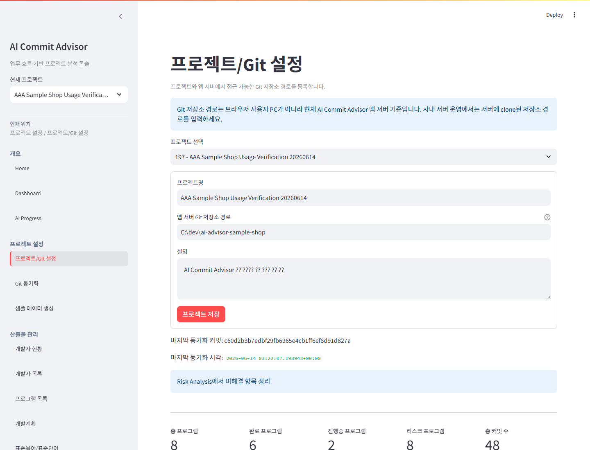

### 2. Git 동기화

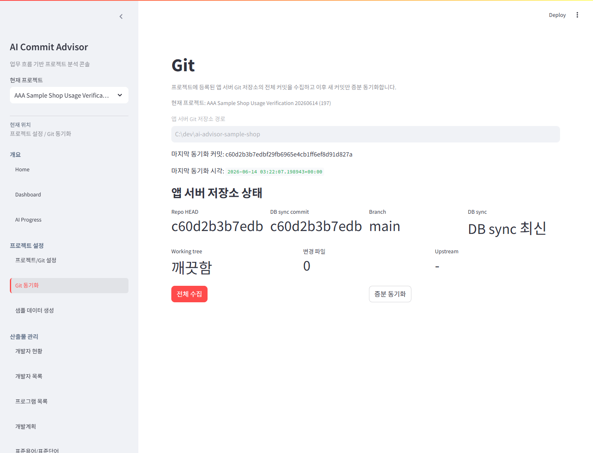

### 3. 프로그램 목록

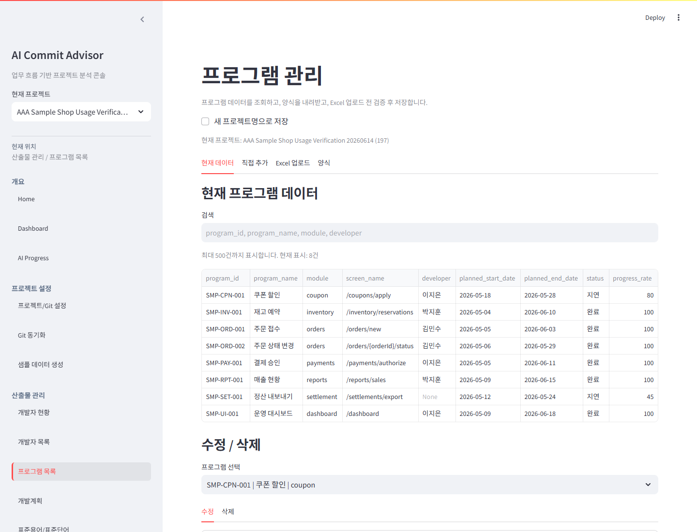

### 4. Home 상태

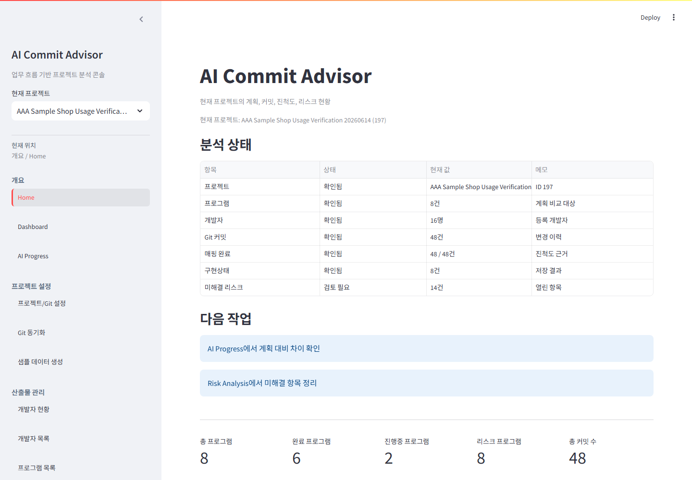

### 5. Mapping 결과

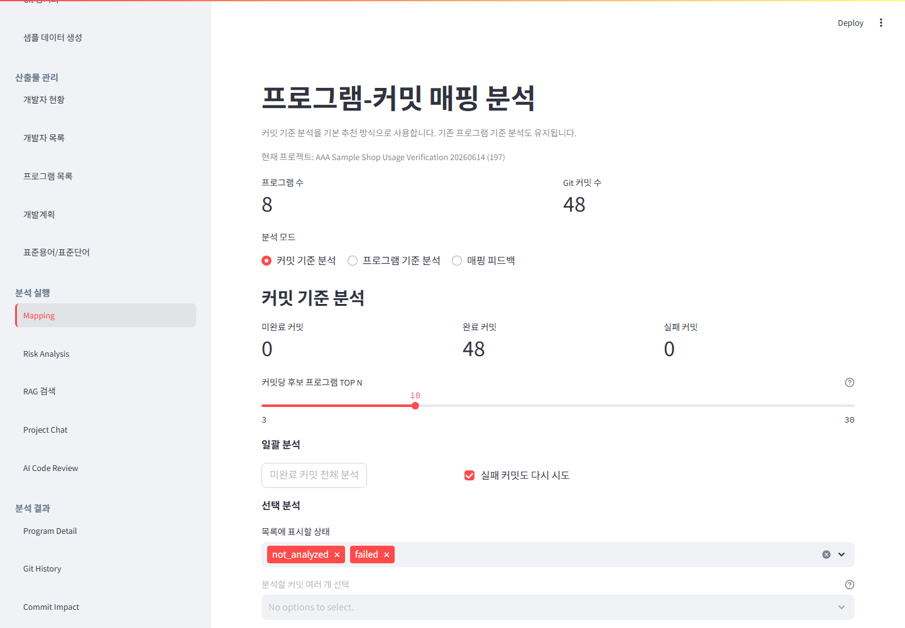

### 6. Risk Analysis

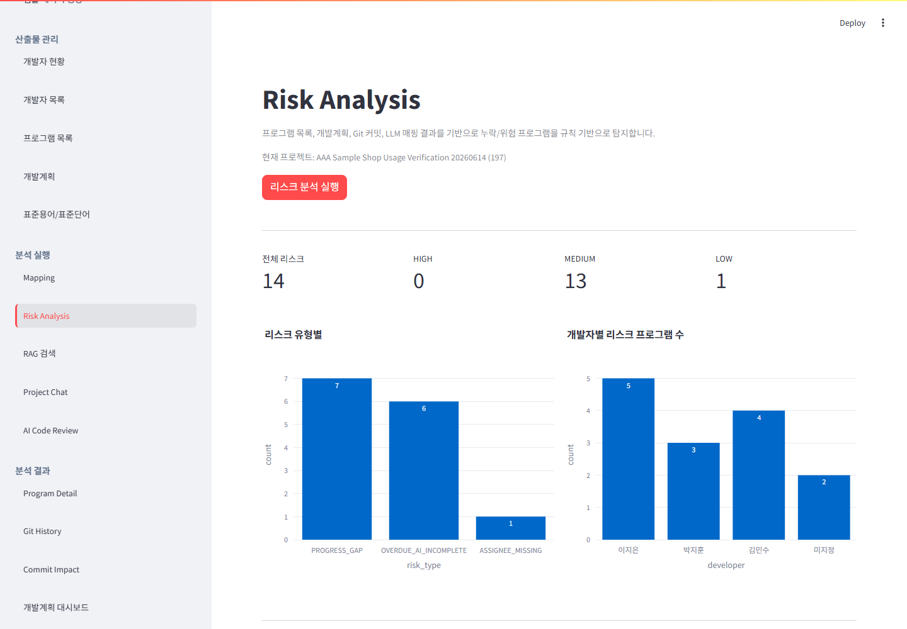

### 7. AI Progress

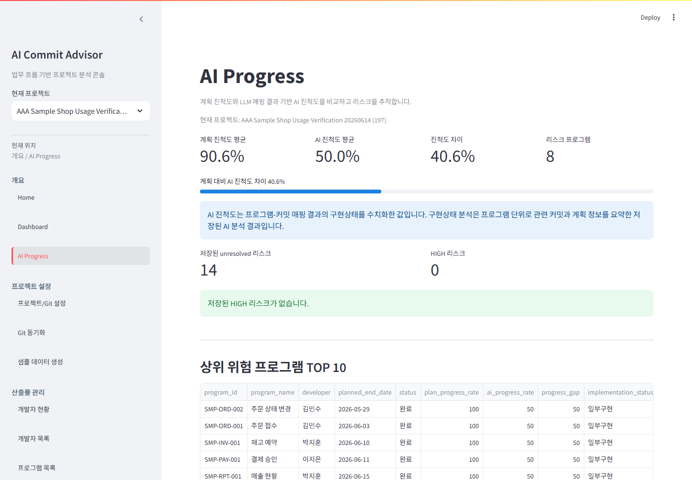

### 8. Program Detail

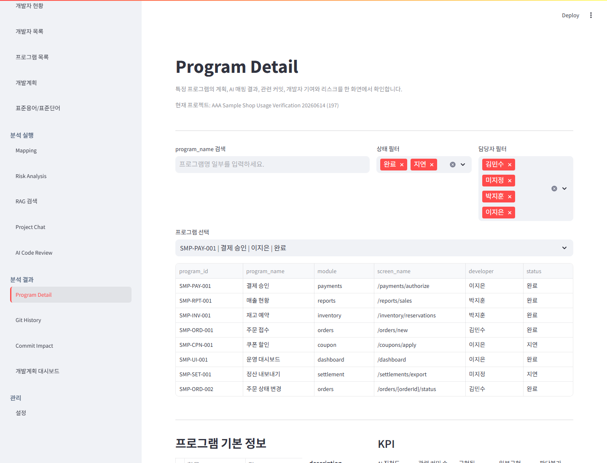

### 9. RAG Search

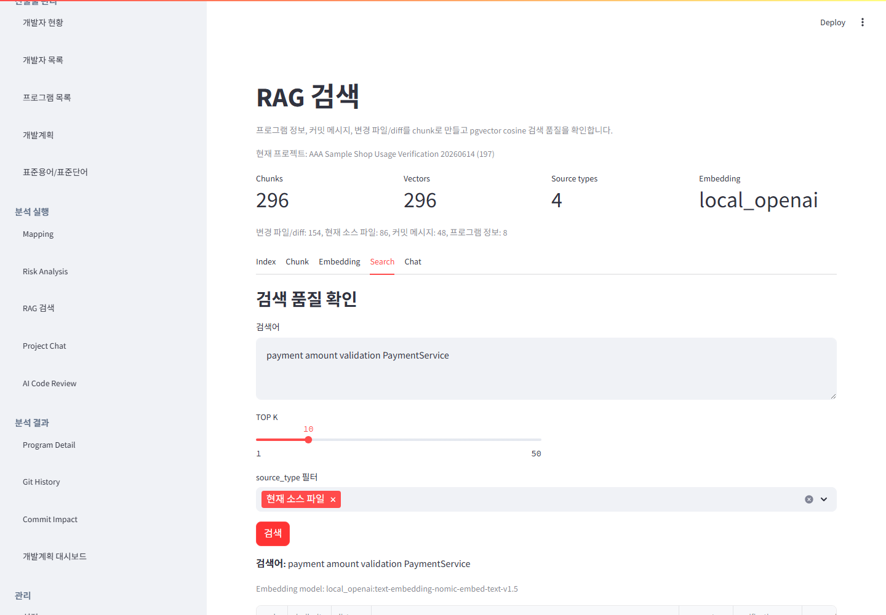

### 10. Project Chat

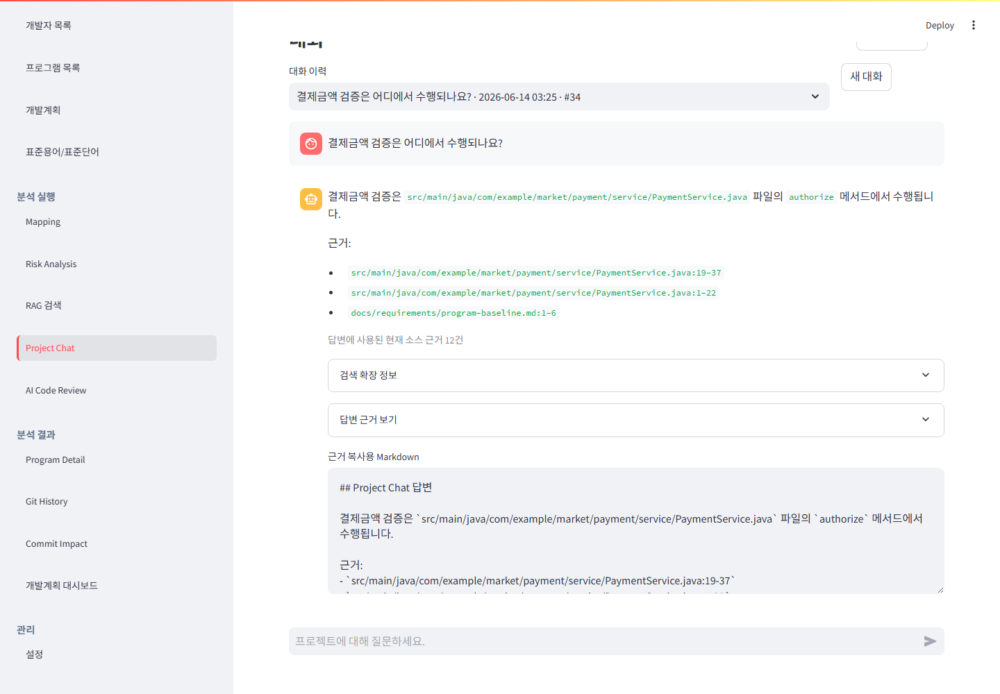

### 11. AI Code Review

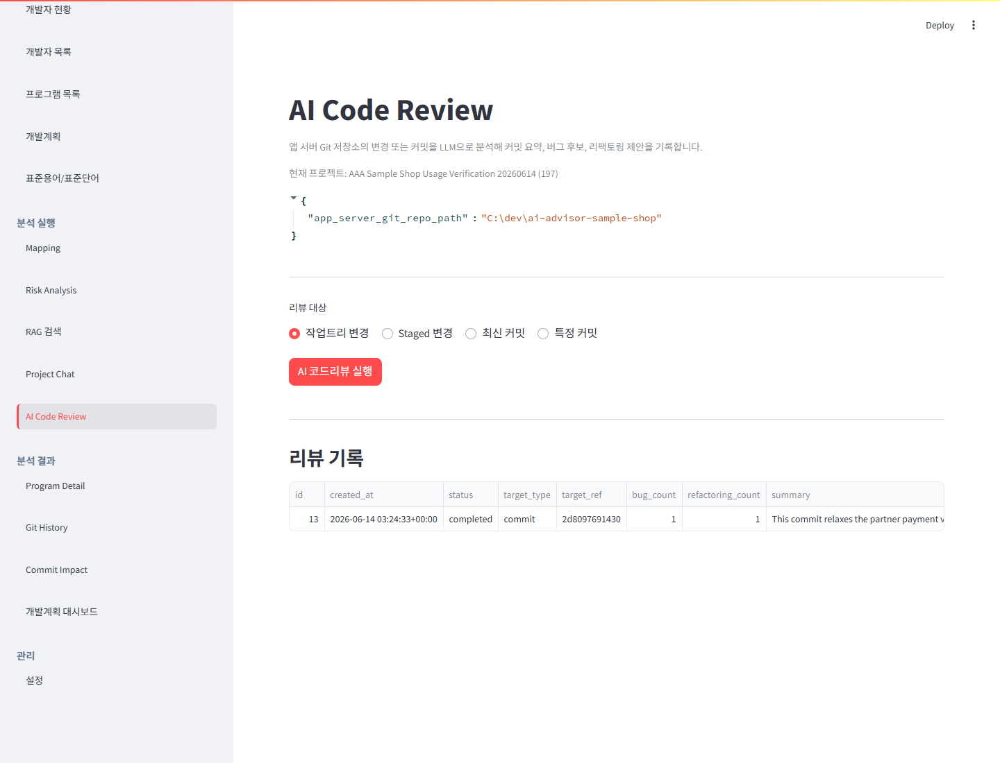

## 검증 명령

환경 확인:

```powershell
Invoke-RestMethod -Uri http://127.0.0.1:1234/v1/models -Method Get
docker compose ps
```

Mermaid/문서 검증과 화면 캡처:

```powershell
.\.venv\Scripts\python.exe scripts\capture_feature_screenshot.py --url http://localhost:8501 --feature home --project-name "AAA Sample Shop Usage Verification 20260614" --screenshot docs\images\usage-verification\04-home-status.png --surface local --expect-text "AAA Sample Shop Usage Verification 20260614"
.\.venv\Scripts\python.exe scripts\capture_feature_screenshot.py --url http://localhost:8501 --feature mapping --project-name "AAA Sample Shop Usage Verification 20260614" --screenshot docs\images\usage-verification\05-mapping-results.png --surface local --expect-text "완료 커밋" --expect-text "실패 커밋"
.\.venv\Scripts\python.exe scripts\capture_feature_screenshot.py --url http://localhost:8501 --feature risk-analysis --project-name "AAA Sample Shop Usage Verification 20260614" --screenshot docs\images\usage-verification\06-risk-analysis.png --surface local --expect-text "전체 리스크"
.\.venv\Scripts\python.exe scripts\capture_feature_screenshot.py --url http://localhost:8501 --feature ai-progress --project-name "AAA Sample Shop Usage Verification 20260614" --screenshot docs\images\usage-verification\07-ai-progress.png --surface local --expect-text "40.6"
.\.venv\Scripts\python.exe scripts\capture_feature_screenshot.py --url http://localhost:8501 --feature rag-search --project-name "AAA Sample Shop Usage Verification 20260614" --screenshot docs\images\usage-verification\09-rag-search.png --surface local --expect-text "PaymentService.java"
.\.venv\Scripts\python.exe scripts\capture_feature_screenshot.py --url http://localhost:8501 --feature project-chat --project-name "AAA Sample Shop Usage Verification 20260614" --screenshot docs\images\usage-verification\10-project-chat.png --surface local --expect-text "결제금액 검증은 어디에서 수행되나요?" --expect-text "PaymentService.java" --forbid-text "현재 검증된 소스 근거만으로는 답변하기 어렵습니다"
```

## 남은 제한 사항

- 검증은 local LM Studio의 현재 모델 응답에 의존합니다. 같은 코드라도 모델, prompt template, GPU/CPU 상태에 따라 Mapping reason, Code Review summary, Project Chat wording은 달라질 수 있습니다.
- 스크린샷은 local Python surface 기준입니다. Docker path mapping이나 사내 서버 storage root 정책은 별도 운영 검증이 필요합니다.
- `Project Chat` 검증은 저장된 대화 session을 화면에서 확인했습니다. 질문 실행 자동화는 별도 UI 자동화가 아니라 서비스 실행 후 DB history를 화면에서 캡처하는 방식입니다.
