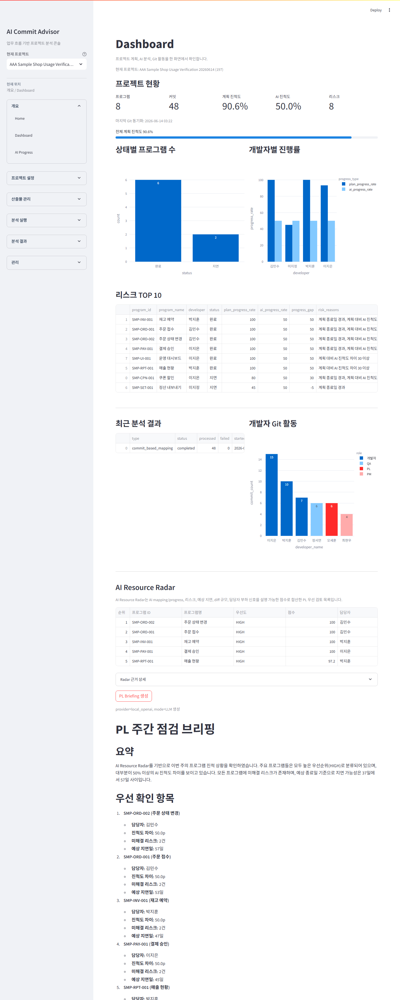
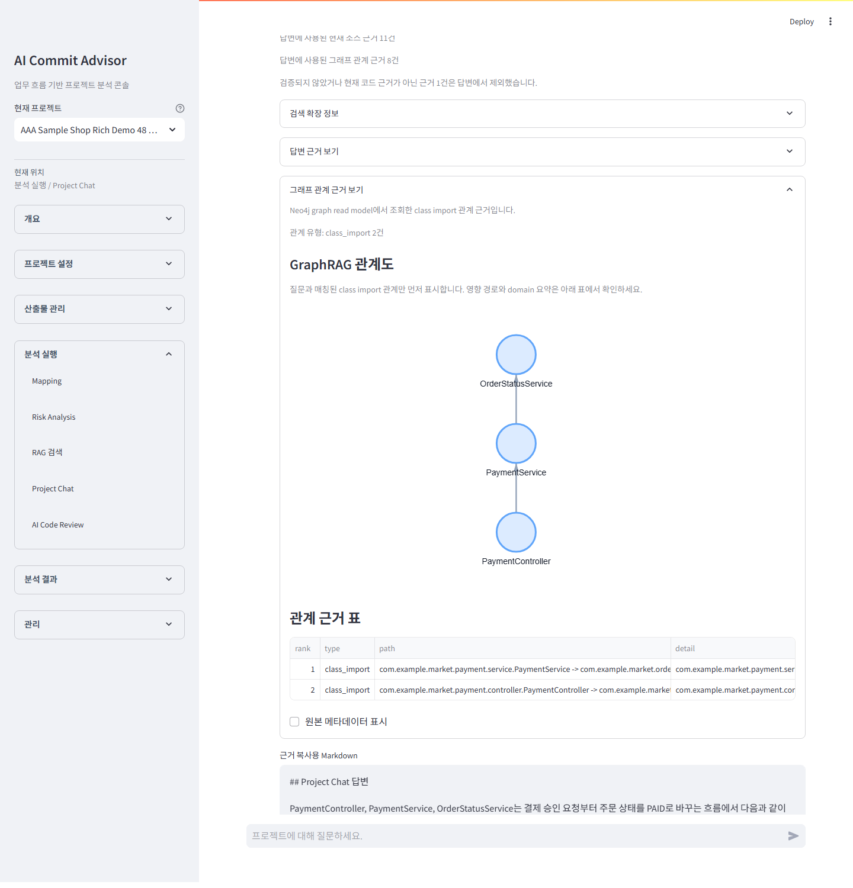
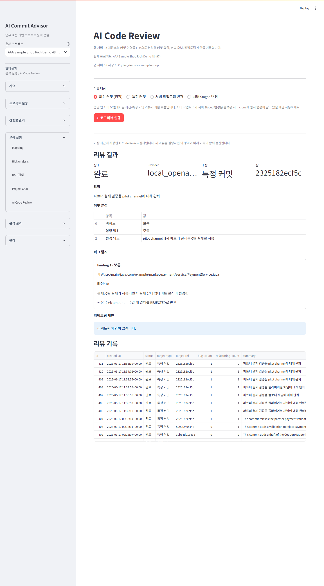

# 사용 가이드 검증 결과

이 문서는 [사용 가이드](demo-user-guide.md)를 실제 애플리케이션에서 처음부터 실행한 결과와 화면 증거를 기록합니다. 사용자용 가이드는 샘플 프로젝트를 예시로 절차를 설명하는 데 집중하고, 실행 환경과 검증 증거는 이 문서에서 관리합니다.

## 검증 개요

| 항목 | 값 |
|---|---|
| 검증일 | 2026-06-14 |
| 실행 surface | Local Python + local PostgreSQL + local LM Studio |
| 앱 URL | `http://localhost:8501` |
| 검증 프로젝트 | `AAA Sample Shop Usage Verification 20260614` |
| 샘플 프로젝트 경로 | `C:\dev\ai-advisor-sample-shop` |
| Git commit 수 | 48 |
| 변경 파일 수 | 105 |
| 프로그램 수 | 8 |
| 표준용어/표준단어 수 | 10 |
| `LLM_PROVIDER` | `local_openai` |
| `LLM_MODEL` | `qwen2.5-coder-7b-instruct` |
| `EMBEDDING_PROVIDER` | `local_openai` |
| `EMBEDDING_MODEL` | `text-embedding-nomic-embed-text-v1.5` |
| `PGVECTOR_DIMENSION` | `768` |

## 실행 결과 요약

| 단계 | 결과 |
|---|---|
| 프로젝트 등록 | 새 검증 프로젝트를 생성하고 앱 서버 Git 저장소 경로를 `C:\dev\ai-advisor-sample-shop`로 등록했습니다. |
| Git 동기화 | 48개 commit과 105개 변경 파일을 수집했습니다. |
| 개발자/프로그램/개발계획 업로드 | 개발자 6명, 프로그램 8개, 개발계획 8건을 저장했습니다. |
| 표준용어/표준단어 업로드 | 10건을 저장했고 Project Chat query expansion에 사용했습니다. |
| RAG chunk 생성 | `source_file`, `program`, `commit`, `commit_file` 기준 296개 chunk를 생성했습니다. |
| Embedding 생성 | local embedding provider로 296개 vector를 생성했고 실패는 0건이었습니다. |
| Mapping | 48개 commit 분석이 완료됐고 실패 commit은 0건이었습니다. 매핑 결과는 47건 생성됐습니다. |
| Program implementation analysis | 8개 프로그램의 구현상태 분석 결과가 저장됐습니다. |
| Risk Analysis | 14개 risk finding을 생성했습니다. |
| Project Chat | `결제금액 검증은 어디에서 수행되나요?` 질문에 `PaymentService.java` 근거가 포함된 답변을 생성했습니다. |
| AI Code Review | 2026-06-17에 선별 샘플 커밋 5개를 실제 `local_openai` LLM으로 리뷰했고, 최신 preview는 `2325182`의 `amount == 0` 허용 버그 후보를 보여줍니다. |
| PL Briefing 추가 리허설 | 2026-06-15에 Dashboard `AI Resource Radar`에서 `PL Briefing 생성`을 실행했고, `provider=local_openai`, `mode=LLM 생성` 상태, 저장된 최근 브리핑, 이력 표를 확인했습니다. |

## 대표 화면 증거

### 1. 프로젝트 등록


### 2. Git 동기화


### 3. 프로그램 목록


### 4. Home 상태


### 5. Mapping 결과


### 6. Risk Analysis


### 7. AI Progress


### 8. Program Detail


### 9. RAG Search


### 10. Project Chat


### 11. AI Code Review


### 12. PL Briefing



### 13. Project Chat 재현 검증




### 14. AI Code Review 선별 커밋 재현 검증



## 2026-06-17 AI Code Review 선별 커밋 검증

Application Preview의 AI Code Review 화면이 단순 추천 목록이나 mock 결과가 아니라 실제 local LLM 리뷰 결과를 보여주는지 확인했습니다. 이후 한국어 출력 prompt와 한글 상태 표시를 적용한 뒤 Project 97에서 `2325182`를 다시 실행해 최신 저장 리뷰가 한국어 결과를 보여주도록 갱신했습니다.

| 항목 | 값 |
|---|---|
| 검증일 | 2026-06-17 |
| 실행 surface | Local Python + local PostgreSQL + local LM Studio |
| 앱 URL | `http://localhost:8522/?project_id=97` |
| 검증 프로젝트 | `AAA Sample Shop Rich Demo 48` |
| 샘플 프로젝트 경로 | `C:\dev\ai-advisor-sample-shop` |
| `LLM_PROVIDER` | `local_openai` |
| `LLM_MODEL` | `qwen2.5-coder-7b-instruct` |
| `LLM_BASE_URL` | `http://127.0.0.1:1234/v1` |

| Commit | 실제 리뷰 결과 |
|---|---|
| `2325182 Relax partner payment validation for pilot channel` | `완료`, `보통` 위험도, bug finding 1건, refactoring suggestion 0건. `pilot channel` 원문을 유지하면서 `amount <= 0` 검증이 `amount < 0`으로 완화되어 `0원` 결제가 허용되는 문제를 한국어로 탐지했습니다. |
| `5999f24 Reject excessive payment amount requests` | `completed`, `low` risk, bug finding 0건. 최대 승인 금액 차단 규칙과 테스트 추가를 방어성 변경으로 요약했습니다. |
| `7e5e41 Change dashboard summary query across operations modules` | `completed`, `low` risk, bug finding 1건. dashboard summary query 변경의 집계 영향과 SQL 유지보수 제안을 남겼습니다. |
| `95562a1 Fix dashboard summary over-counting` | `completed`, `low` risk, bug finding 1건. 독립 subquery 기반 집계 보정과 테스트 추가를 리뷰했습니다. |
| `3cb54de Add coupon mapper draft without policy enforcement` | `completed`, `low` risk, bug finding 0건. coupon mapper 초안에 대한 후속 정책 적용/검증 보강 제안을 남겼습니다. |

통과 기준은 AI Code Review 화면이 `local_openai / qwen2.5-coder-7b-instruct`, `2325182`, `0원`, `pilot channel`, `완료`, `PaymentService.java`, `리팩토링 제안이 없습니다`, `리뷰 기록`을 포함하고, `플라이어널`, `PaymentPilotAuthorizationRiskTest 클래스 추가`, `Mock review`, `LLM 코드리뷰 호출 실패`, `Traceback`, `StreamlitAPIException`을 포함하지 않는 것입니다.

## 2026-06-17 Project Chat 재현 검증

Application Preview에 사용한 Project Chat 질문이 저장된 화면에서만 좋아 보이는지, 같은 질문을 실제 local LLM으로 다시 실행해도 핵심 답변이 재현되는지 별도로 확인했습니다.

| 항목 | 값 |
|---|---|
| 검증일 | 2026-06-17 |
| 실행 surface | Local Python + local PostgreSQL + local LM Studio |
| 앱 URL | `http://localhost:8521/?project_id=97` |
| 검증 프로젝트 | `AAA Sample Shop Rich Demo 48` |
| 샘플 프로젝트 경로 | `C:\dev\ai-advisor-sample-shop` |
| Git commit 수 | 48 |
| `LLM_PROVIDER` | `local_openai` |
| `LLM_MODEL` | `qwen2.5-coder-7b-instruct` |
| `LLM_BASE_URL` | `http://127.0.0.1:1234/v1` |
| `EMBEDDING_PROVIDER` | `local_openai` |
| `EMBEDDING_MODEL` | `text-embedding-nomic-embed-text-v1.5` |
| `EMBEDDING_BASE_URL` | `http://127.0.0.1:1234/v1` |
| `PGVECTOR_DIMENSION` | `768` |
| `NEO4J_ENABLED` | `true` |
| 질문 | `반드시 한국어로만 답해줘. 결제 승인 흐름을 PaymentController, PaymentService, OrderStatusService, OrderStatusMapper 순서로 설명해줘. 각 단계에서 authorize, markPaid, updateStatus, insertStatusHistory가 어디서 호출되는지와 관련 프로그램/커밋/파일 GraphRAG 근거를 함께 설명해줘.` |
| 저장 session | `367` |
| provider/model | `local_openai / qwen2.5-coder-7b-instruct` |
| fallback | `False` |
| insufficient evidence | `False` |
| used source 수 | 8 |
| graph evidence 수 | 8 |
| 핵심 graph evidence | `class_import PaymentService -> OrderStatusService`, `class_import OrderStatusService -> OrderStatusMapper`, `impact_path SMP-PAY-001 결제 승인 -> PaymentService.java` |
| 핵심 답변 근거 | `PaymentService.java`, `OrderStatusService.java`, `OrderStatusMapper.xml`, `markPaid`, `updateStatus`, `insertStatusHistory` |

이 검증의 통과 기준은 답변 문장 전체가 screenshot과 글자 단위로 같아지는 것이 아닙니다. 실제 provider가 verified `source_file`과 GraphRAG evidence를 사용해 `PaymentService`가 결제 저장과 감사 로그를 처리한 뒤 `OrderStatusService.markPaid(orderId)`를 호출하고, `OrderStatusService`가 `OrderStatusMapper`를 통해 `updateStatus`와 `insertStatusHistory`를 수행한다는 핵심 사실을 다시 설명해야 합니다. 기본 GraphRAG 화면은 `class_import`와 `impact_path`를 함께 보여주되, `domain_summary`는 원본 metadata로만 남깁니다.

## 2026-07-21 전체 흐름 재검증

기존 화면을 다시 여는 수준이 아니라, 기본 DB `ai_commit_advisor`에서 새 프로젝트를 등록하고 수집부터 AI 분석까지 다시 실행했습니다. 최종 시연 surface는 Docker 8501 하나로 정리했고, Cloudflare quick tunnel에서도 같은 프로젝트와 저장 결과가 보이는지 확인했습니다.

| 항목 | 값 |
|---|---|
| 실행 surface | Docker Streamlit + Docker PostgreSQL/Neo4j + local LM Studio |
| 앱 URL | `http://127.0.0.1:8501/?project_id=2716` |
| 검증 프로젝트 | `Sample Shop 전체 시연 검증 2026-07-21` (`project_id=2716`) |
| 샘플 저장소 | `C:\dev\ai-advisor-sample-shop` |
| 현재 repo HEAD | `221eb9ac9c83` |
| 저장 Git 분석 HEAD | `221eb9ac9c83` |
| program / commit | 8 / 48 |
| Mapping 분석 완료 commit / 관계 행 | 48 / 39 |
| 현재 source / vector | 79 / 79 |
| source 정리 결과 | 현재 저장소에 없는 과거 chunk 21건 제거 후 전체 재생성 |
| Knowledge Graph | node 213 / edge 591 / status `completed` |
| `LLM_PROVIDER` / model | `local_openai` / `qwen2.5-coder-7b-instruct` |
| `LLM_BASE_URL` | `http://127.0.0.1:12345/v1` |
| `EMBEDDING_PROVIDER` / model | `local_openai` / `text-embedding-nomic-embed-text-v1.5` |
| `PGVECTOR_DIMENSION` | 768 |
| LLM context length | 8192 |
| Project Chat | session `#429`, source 6, graph 4, `deterministic_repair`, insufficient evidence `False` |
| AI Code Review | commit `2325182`, bug finding 1, refactoring suggestion 0 |
| AI 호출 | total 52, failed 0, fallback 1 |

재검증에서 확인한 결과:

- Home 준비 상태는 Mapping 관계 행 39개가 아니라 `mapping_analyzed_at`이 있는 commit 48개를 기준으로 계산하며 `운영 점검 · 필수 준비 완료`가 표시됐습니다.
- 전체 source refresh 후 79개 source와 79개 vector가 현재 상태로 맞았습니다. session `#429`는 네 Java 파일을 지정한 질문에 직접 호출 다섯 단계, 결제 금액 조건 두 개, 정확한 파일·행을 제시합니다.
- 첫 local LLM 문장이 직접 호출 검증을 통과하지 못한 경우 현재 소스의 메서드 근거로 답변을 재구성하고, 화면에 `deterministic_repair`, `fallback=True`를 표시합니다.
- Knowledge Graph를 project 2716 기준으로 전체 동기화한 뒤 213 nodes와 591 edges가 저장됐고, Project Chat에서 `class_import`와 `impact_path`를 함께 조회했습니다.
- `2325182 Relax partner payment validation for pilot channel`을 실제 local LLM으로 다시 리뷰해 `amount == 0`이 새로 허용되는 경계값을 bug finding으로 저장했습니다.
- 이 PC에서는 Windows 제외 TCP port 범위에 `1234`가 포함돼 LM Studio server가 `EACCES`로 시작되지 않았습니다. local endpoint를 `12345`로 옮긴 뒤 chat과 embedding 실제 호출을 확인했습니다.
- Docker app은 기본 DB와 실제 local provider를 사용하며, 컨테이너 내부 chat completion과 768차원 embedding 호출을 확인했습니다.
- 저장 Git 분석 HEAD, Graph HEAD, 현재 repo HEAD가 모두 일치합니다.

프로젝트 등록 전부터 Docker 8501과 외부 접속 확인까지의 화면 40개와 단계별 설명은 [Sample Shop 전체 시연 E2E 검증 증적](end-to-end-demo-evidence-2026-07-21.md)에 분리했습니다. 진행 대본, 예상 질문, 장애별 대체 동선, 당일 체크리스트는 [시연 Runbook](demo-runbook.md)에 정리했습니다. 환경과 저장 결과는 `scripts/demo_preflight.ps1 -ProjectId 2716`으로 읽기 전용 점검할 수 있습니다.

## 검증 명령

환경 확인:

```powershell
Invoke-RestMethod -Uri http://127.0.0.1:1234/v1/models -Method Get
docker compose ps
```

Mermaid/문서 검증과 화면 캡처:

```powershell
.\.venv\Scripts\python.exe scripts\capture_feature_screenshot.py --url http://localhost:8501 --feature home --project-name "AAA Sample Shop Usage Verification 20260614" --screenshot docs\images\usage-verification\04-home-status.png --surface local --expect-text "AAA Sample Shop Usage Verification 20260614"
.\.venv\Scripts\python.exe scripts\capture_feature_screenshot.py --url http://localhost:8501 --feature mapping --project-name "AAA Sample Shop Usage Verification 20260614" --screenshot docs\images\usage-verification\05-mapping-results.png --surface local --expect-text "완료 커밋" --expect-text "실패 커밋"
.\.venv\Scripts\python.exe scripts\capture_feature_screenshot.py --url http://localhost:8501 --feature risk-analysis --project-name "AAA Sample Shop Usage Verification 20260614" --screenshot docs\images\usage-verification\06-risk-analysis.png --surface local --expect-text "전체 리스크"
.\.venv\Scripts\python.exe scripts\capture_feature_screenshot.py --url http://localhost:8501 --feature ai-progress --project-name "AAA Sample Shop Usage Verification 20260614" --screenshot docs\images\usage-verification\07-ai-progress.png --surface local --expect-text "40.6"
.\.venv\Scripts\python.exe scripts\capture_feature_screenshot.py --url http://localhost:8501 --feature rag-search --project-name "AAA Sample Shop Usage Verification 20260614" --screenshot docs\images\usage-verification\09-rag-search.png --surface local --expect-text "PaymentService.java"
.\.venv\Scripts\python.exe scripts\capture_feature_screenshot.py --url http://localhost:8501 --feature project-chat --project-name "AAA Sample Shop Usage Verification 20260614" --screenshot docs\images\usage-verification\10-project-chat.png --surface local --expect-text "결제금액 검증은 어디에서 수행되나요?" --expect-text "PaymentService.java" --forbid-text "현재 검증된 소스 근거만으로는 답변하기 어렵습니다"
```

2026-06-17 AI Code Review 선별 커밋 검증:

```powershell
$env:LLM_PROVIDER='local_openai'
$env:LLM_MODEL='qwen2.5-coder-7b-instruct'
$env:LLM_BASE_URL='http://127.0.0.1:1234/v1'
.\.venv\Scripts\python.exe scripts\capture_feature_screenshot.py --url "http://localhost:8524/?project_id=97" --feature ai-code-review --screenshot docs\images\usage-verification\ai-code-review-repro-2026-06-17.png --surface local --height 2600 --expect-text "리뷰 메타데이터" --expect-text "2325182" --expect-text "0원" --expect-text "pilot channel" --expect-text "완료" --expect-text "리팩토링 제안이 없습니다" --expect-text "리뷰 기록" --forbid-text "플라이어널" --forbid-text "PaymentPilotAuthorizationRiskTest 클래스 추가" --forbid-text "Mock review" --forbid-text "LLM 코드리뷰 호출 실패" --forbid-text "Traceback" --forbid-text "StreamlitAPIException"
```

2026-06-17 Project Chat 재현 검증:

```powershell
.\.venv\Scripts\python.exe scripts\capture_feature_screenshot.py --url "http://localhost:8521/?project_id=97" --feature project-chat-answer --screenshot docs\images\usage-verification\project-chat-repro-2026-06-17.png --surface local --height 1500 --expect-text "Provider: local_openai" --expect-text "fallback=False" --expect-text "markPaid" --expect-text "PAID" --expect-text "PaymentController.java" --expect-text "PaymentService.java" --expect-text "OrderStatusService.java" --forbid-text "Mock answer" --forbid-text "fallback=True" --forbid-text "StreamlitAPIException" --forbid-text "Traceback"
.\.venv\Scripts\python.exe scripts\capture_feature_screenshot.py --url "http://localhost:8521/?project_id=97" --feature project-chat-graph-evidence --screenshot docs\images\usage-verification\project-chat-graph-repro-2026-06-17.png --surface local --height 1800 --expect-text "Provider: local_openai" --expect-text "fallback=False" --expect-text "PaymentService" --expect-text "OrderStatusService" --expect-text "OrderStatusMapper" --expect-text "class_import" --expect-text "impact_path" --forbid-text "Mock answer" --forbid-text "fallback=True" --forbid-text "StreamlitAPIException" --forbid-text "Traceback" --forbid-text "domain_summary"
```

2026-06-15 PL Briefing 추가 리허설:

```powershell
Invoke-RestMethod -Uri http://127.0.0.1:1234/v1/models -Method Get
.\.venv\Scripts\python.exe scripts\capture_feature_screenshot.py --url http://localhost:8502 --feature dashboard-pl-briefing --project-name "AAA Sample Shop Usage Verification 20260614" --surface local --height 3600 --screenshot docs\images\usage-verification\12-pl-briefing.png --expect-text "provider=local_openai" --expect-text "mode=LLM 생성" --expect-text "최근 저장된 PL Briefing" --expect-text "PL Briefing 이력" --expect-text "PL 주간 점검 브리핑" --expect-text "요약" --expect-text "회의 질문" --forbid-text "```json" --forbid-text "한국어 브리핑" --forbid-text "本周" --forbid-text "기반으로이번"
```

## 2026-07-22 공개 GitHub 관리형 등록 검증

로컬에서만 사용하던 Sample Shop history를 공개 GitHub 저장소로 게시하고, Docker 8501 앱의 실제 `Git URL에서 가져오기` 화면에서 관리형 clone을 검증했습니다.

| 항목 | 값 |
|---|---|
| 공개 저장소 | `https://github.com/ino5/ai-advisor-sample-shop` |
| 공개 범위 / branch | `public` / `main` |
| 로컬·원격 HEAD | `221eb9ac9c83364f4450bdf4970196b51cb1f9e1` |
| 원격 commit 수 | 48 |
| 실행 surface | Docker Streamlit 8501 + Docker PostgreSQL |
| 앱 프로젝트 | `Sample Shop Demo (github)` (`project_id=393`) |
| 입력 clone URL | `https://github.com/ino5/ai-advisor-sample-shop.git` |
| 관리형 경로 | `C:\dev\ai-commit-advisor-managed-repos\project-393` |
| clone branch / HEAD / commit 수 | `main` / `221eb9ac9c83` / 48 |
| 기존 기준 프로젝트 | `Sample Shop Demo` (`project_id=1`), DB commit/file 48/106건 유지 |
| 새 프로젝트 Git 수집 | commit/file 48/106건, 오류 0건 |
| 새 프로젝트 재수집 | 저장 0건, 현재 프로젝트 중복 48건 건너뜀 |
| RAG source/vector | project `1` 79/79, project `393` 79/79 |
| Neo4j graph | project `1` node 213, project `393` node 202 / edge 533 |

검증 순서와 결과:

1. 로컬 샘플 저장소가 clean `main`, 48 commits인지 확인했습니다.
2. 전체 history의 작성자가 `sample.local` synthetic 계정인지 확인하고 private key, AWS key, password, token 형태의 민감정보 경로가 없음을 점검했습니다.
3. `ino5/ai-advisor-sample-shop` public repository를 만들고 `main`을 push했습니다.
4. 실제 브라우저 UI에서 `Sample Shop Demo (github)`, 공개 clone URL, `main`을 입력했습니다.
5. 화면의 `저장소 clone 완료`, `HEAD 221eb9ac9c83`, `프로젝트와 관리형 저장소를 준비했습니다`를 확인했습니다.
6. 서버 clone의 `origin`, branch, HEAD, 48개 history와 DB 저장값을 다시 확인했습니다.
7. Alembic revision `20260722_0011`을 적용한 뒤 `project_id=393`에서 전체 수집을 실행해 commit 48건과 변경 파일 106건을 저장했습니다.
8. `project_id=1`도 commit 48건과 변경 파일 106건을 유지하고, 두 프로젝트의 hash 집합 48개가 같지만 DB ID는 서로 다른지 확인했습니다.
9. `project_id=393`을 다시 전체 수집했을 때 저장 0건, 현재 프로젝트 중복 48건, 두 프로젝트 commit 각 48건으로 유지되는지 확인했습니다.
10. 공개 clone의 현재 소스 79건을 실제 `text-embedding-nomic-embed-text-v2-moe` 768차원 vector 79건으로 만들고, 기존 project `1`의 79/79가 바뀌지 않았는지 확인했습니다. 같은 query의 상위 5개 결과도 요청한 프로젝트의 chunk만 반환했습니다.
11. Neo4j 전체 동기화로 project `393`에 node 202개와 edge 533개를 저장했습니다. 같은 HEAD commit node는 `p1:commit:221eb9...`와 `p393:commit:221eb9...`로 분리되고 project `1`의 node 213개가 유지됐습니다.

`git_commits`는 이제 `(project_id, commit_hash)`만 unique로 유지합니다. RAG는 `document_chunks.project_id`와 프로젝트별 commit/file DB ID를 사용하고, vector는 chunk FK를 따릅니다. Neo4j node ID는 `p{project_id}:` 접두사를 사용하므로 PostgreSQL 외 저장소에 별도 schema migration은 필요하지 않았습니다. 이 검증 전 PostgreSQL custom dump를 `C:\dev\ai-commit-advisor-backups\ai_commit_advisor_pre_project_scope_20260722.dump`에 저장했습니다.

교차 프로젝트 무결성 조회 결과는 Mapping 0건, commit chunk 0건, commit_file chunk 0건이었고, Neo4j node ID 접두사 불일치도 0건이었습니다.

`demo_start.ps1 -CheckOnly`에서 Docker app과 외부 Quick Tunnel health, LM Studio, embedding, 기본 프로젝트의 program 8건·commit 48건·Mapping·source/vector·Knowledge Graph는 통과했습니다. 전체 preflight는 이번 clone과 무관하게 가장 최근 저장 AI Code Review 결과의 bug finding이 0건이라 `FAIL=1`이었습니다. 기존 실패 이력의 대표 리뷰 결과 선택 제한에 해당하므로 저장 결과를 임의로 바꾸지 않았습니다.

## 남은 제한 사항

- 검증은 local LM Studio의 현재 모델 응답에 의존합니다. 같은 코드라도 모델, prompt template, GPU/CPU 상태에 따라 Mapping reason, Code Review summary, Project Chat wording은 달라질 수 있습니다.
- PL Briefing 추가 리허설은 기존 검증 데이터 위에서 Dashboard 브리핑 생성 경로만 다시 확인했습니다. 전체 데이터 적재와 Mapping/RAG/Code Review 전 과정을 2026-06-15에 재실행한 것은 아닙니다.
- 스크린샷은 local Python surface 기준입니다. Docker path mapping이나 사내 서버 storage root 정책은 별도 검증이 필요합니다.
- `Project Chat` 2026-06-14 검증은 저장된 대화 session을 화면에서 확인했습니다. 2026-06-17 재현 검증은 같은 질문을 서비스로 다시 실행해 새 session을 저장한 뒤 화면을 캡처했습니다.
